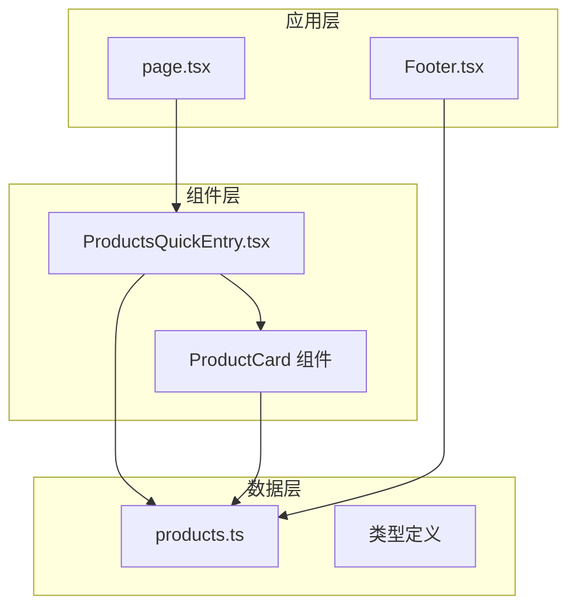
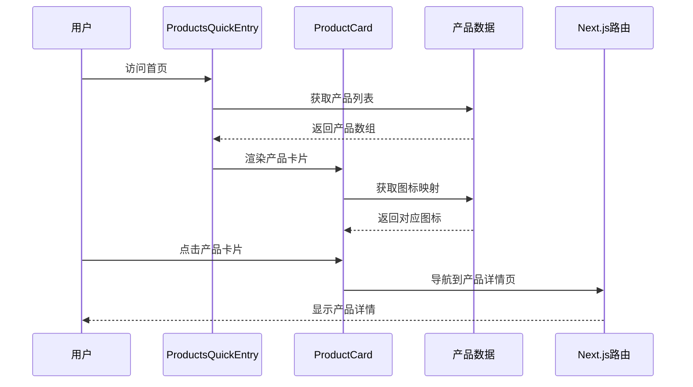
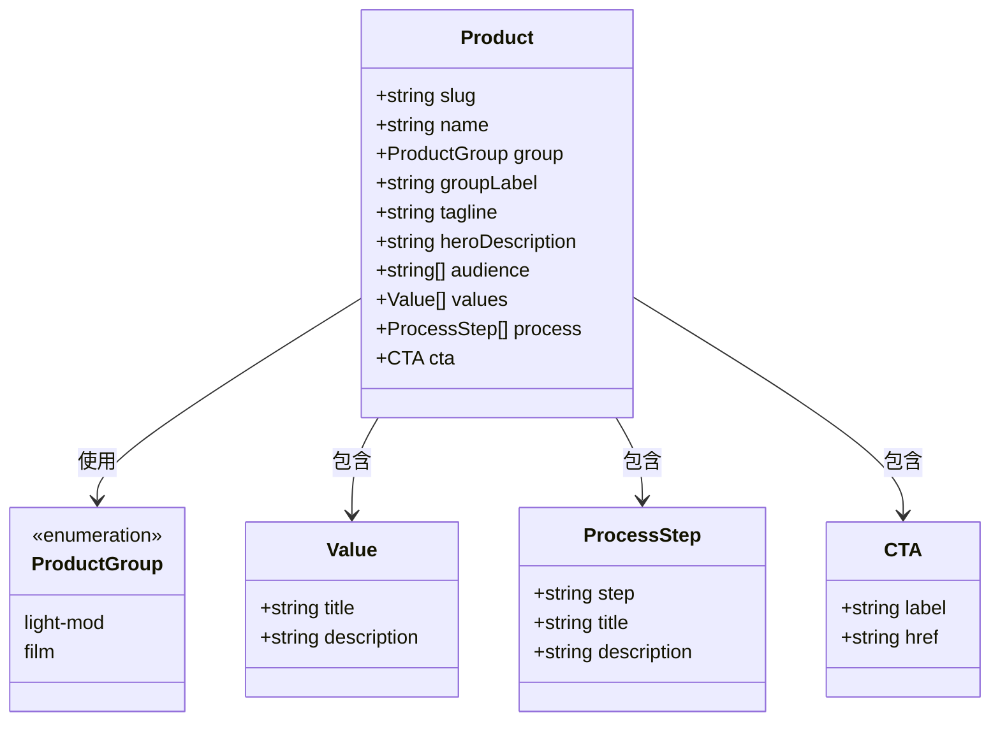
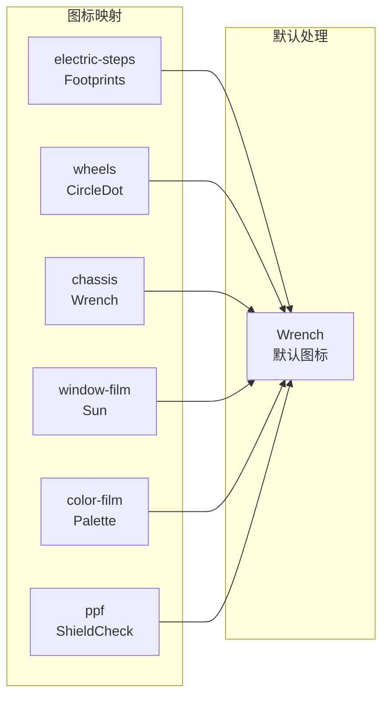
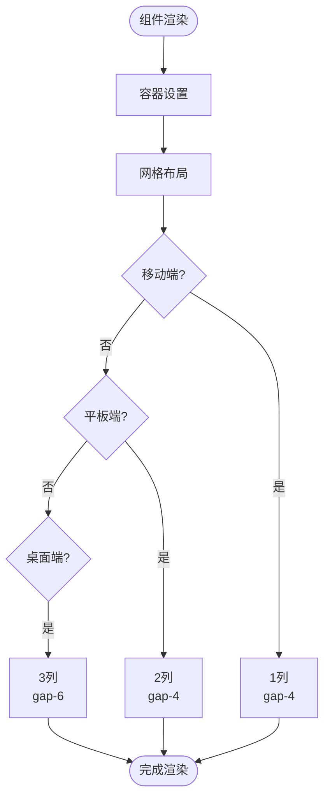
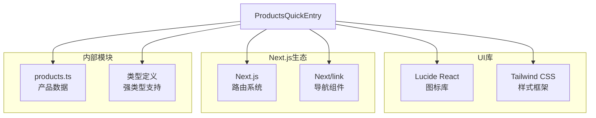
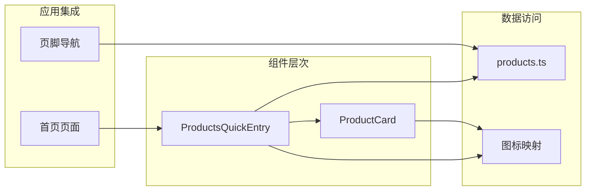
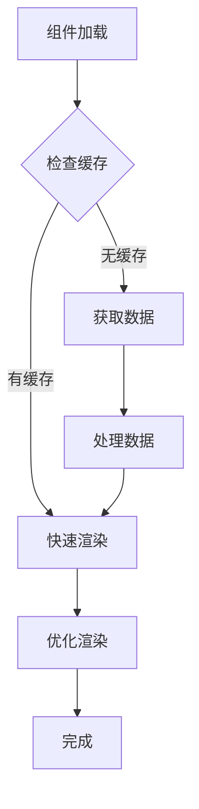

# 产品快速入口组件

<cite>
**本文档引用的文件**
- [ProductsQuickEntry.tsx](file://src/components/ProductsQuickEntry.tsx)
- [products.ts](file://src/lib/products.ts)
- [page.tsx](file://src/app/page.tsx)
- [Footer.tsx](file://src/components/Footer.tsx)
- [globals.css](file://src/app/globals.css)
</cite>

## 目录
1. [简介](#简介)
2. [项目结构](#项目结构)
3. [核心组件](#核心组件)
4. [架构概览](#架构概览)
5. [详细组件分析](#详细组件分析)
6. [依赖关系分析](#依赖关系分析)
7. [性能考虑](#性能考虑)
8. [故障排除指南](#故障排除指南)
9. [结论](#结论)

## 简介

ProductsQuickEntry产品快速入口组件是蓝辉轻改网站的核心导航组件，旨在为用户提供直观、高效的汽车产品浏览体验。该组件通过网格布局展示6个主要产品类别，每个产品都配有专属图标、标签行和简要描述，支持用户快速了解产品方向并跳转到详细页面。

组件采用深色主题设计，符合现代汽车改装行业的视觉风格，同时具备良好的响应式适配能力，确保在各种设备上的最佳用户体验。

## 项目结构

ProductsQuickEntry组件位于组件目录中，与产品数据管理模块分离，体现了清晰的关注点分离原则：

**图表来源**
- [ProductsQuickEntry.tsx:1-72](file://src/components/ProductsQuickEntry.tsx#L1-L72)
- [products.ts:1-304](file://src/lib/products.ts#L1-L304)

**章节来源**
- [ProductsQuickEntry.tsx:1-72](file://src/components/ProductsQuickEntry.tsx#L1-L72)
- [products.ts:1-304](file://src/lib/products.ts#L1-L304)

## 核心组件

### 组件架构设计

ProductsQuickEntry组件采用函数式组件设计，包含两个主要部分：
1. **主容器组件**：负责整体布局和标题区域
2. **产品卡片组件**：渲染单个产品的展示信息

组件支持以下核心功能：
- 动态产品列表渲染
- 分组色彩区分（轻改装备 vs 汽车膜系）
- 图标映射系统
- 响应式网格布局
- 导航链接集成

**章节来源**
- [ProductsQuickEntry.tsx:6-35](file://src/components/ProductsQuickEntry.tsx#L6-L35)
- [ProductsQuickEntry.tsx:37-71](file://src/components/ProductsQuickEntry.tsx#L37-L71)

## 架构概览

组件采用分层架构设计，实现了清晰的职责分离：

**图表来源**
- [ProductsQuickEntry.tsx:27-31](file://src/components/ProductsQuickEntry.tsx#L27-L31)
- [products.ts:293-303](file://src/lib/products.ts#L293-L303)

## 详细组件分析

### 数据结构设计

组件使用强类型数据结构来确保数据完整性：

**图表来源**
- [products.ts:18-31](file://src/lib/products.ts#L18-L31)
- [products.ts:33-54](file://src/lib/products.ts#L33-L54)

### 产品分组系统

组件支持两种产品分组，每组具有独特的视觉标识：

| 分组类型 | ID | 标签 | 颜色方案 | 视觉特征 |
|---------|----|------|----------|----------|
| 轻改装备 | light-mod | 轻改装备 | 蓝色调 | 代表功能性升级 |
| 汽车膜系 | film | 汽车膜系 | 橙色调 | 代表外观和保护 |

**章节来源**
- [products.ts:18](file://src/lib/products.ts#L18)
- [products.ts:263-274](file://src/lib/products.ts#L263-L274)

### 图标映射系统

组件使用Lucide React图标库，为每个产品提供专属视觉标识：

**图表来源**
- [products.ts:293-303](file://src/lib/products.ts#L293-L303)

**章节来源**
- [ProductsQuickEntry.tsx:38](file://src/components/ProductsQuickEntry.tsx#L38)
- [products.ts:293-303](file://src/lib/products.ts#L293-L303)

### 响应式布局设计

组件采用Tailwind CSS实现响应式设计，支持多种屏幕尺寸：

**图表来源**
- [ProductsQuickEntry.tsx:27](file://src/components/ProductsQuickEntry.tsx#L27)

**章节来源**
- [ProductsQuickEntry.tsx:27](file://src/components/ProductsQuickEntry.tsx#L27)

### 交互体验设计

组件提供丰富的交互反馈：

| 交互元素 | 触发条件 | 反馈效果 | 动画时长 |
|---------|----------|----------|----------|
| 卡片悬停 | 鼠标悬停 | 边框颜色变化 | 默认过渡 |
| 箭头动画 | 链接悬停 | 向右平移动画 | 0.15s |
| 背景色变化 | 状态改变 | 颜色渐变 | 默认过渡 |
| 图标显示 | 加载完成 | 图标出现 | 即时 |

**章节来源**
- [ProductsQuickEntry.tsx:43](file://src/components/ProductsQuickEntry.tsx#L43)
- [ProductsQuickEntry.tsx:65](file://src/components/ProductsQuickEntry.tsx#L65)

## 依赖关系分析

### 外部依赖

组件依赖以下外部库：

**图表来源**
- [ProductsQuickEntry.tsx:1-4](file://src/components/ProductsQuickEntry.tsx#L1-L4)

### 内部依赖关系

**图表来源**
- [ProductsQuickEntry.tsx:3](file://src/components/ProductsQuickEntry.tsx#L3)
- [page.tsx:5](file://src/app/page.tsx#L5)

**章节来源**
- [ProductsQuickEntry.tsx:1-4](file://src/components/ProductsQuickEntry.tsx#L1-L4)
- [page.tsx:5](file://src/app/page.tsx#L5)

## 性能考虑

### 渲染优化策略

组件采用以下性能优化措施：

1. **虚拟DOM最小化**：仅渲染必要的DOM节点
2. **事件委托**：利用React事件冒泡减少监听器数量
3. **CSS类名复用**：通过Tailwind CSS实现样式复用
4. **图标懒加载**：使用动态导入避免不必要的包体积

### 内存管理

组件在渲染过程中遵循以下内存管理原则：
- 产品数据通过props传递，避免重复计算
- 图标组件按需渲染，减少内存占用
- 使用React.memo模式避免不必要的重新渲染

### 加载性能

**章节来源**
- [ProductsQuickEntry.tsx:27-31](file://src/components/ProductsQuickEntry.tsx#L27-L31)

## 故障排除指南

### 常见问题及解决方案

| 问题类型 | 症状 | 可能原因 | 解决方案 |
|---------|------|----------|----------|
| 图标显示异常 | 显示默认图标 | 产品slug不匹配 | 检查slug值是否正确 |
| 样式错乱 | 卡片布局异常 | Tailwind类名冲突 | 检查CSS优先级 |
| 导航失效 | 点击无反应 | 路由配置错误 | 验证Next.js路由 |
| 数据缺失 | 卡片内容为空 | 产品数据加载失败 | 检查数据源连接 |

### 调试技巧

1. **开发者工具检查**：使用浏览器开发者工具检查DOM结构
2. **网络请求监控**：观察产品数据的加载状态
3. **控制台日志**：添加必要的console.log进行调试
4. **组件状态检查**：验证props传递的正确性

**章节来源**
- [ProductsQuickEntry.tsx:38](file://src/components/ProductsQuickEntry.tsx#L38)

## 结论

ProductsQuickEntry产品快速入口组件是一个设计精良、功能完整的导航组件。它成功地将复杂的产品信息简化为直观的视觉元素，为用户提供了高效的产品浏览体验。

组件的主要优势包括：
- **清晰的视觉层次**：通过颜色和布局区分产品类型
- **优秀的响应式设计**：适应各种设备和屏幕尺寸
- **良好的可扩展性**：模块化设计便于功能扩展
- **强类型支持**：TS类型定义确保代码质量

未来可以考虑的改进方向：
- 添加产品筛选和搜索功能
- 实现懒加载以提升首屏性能
- 增加用户个性化推荐
- 扩展移动端手势操作支持