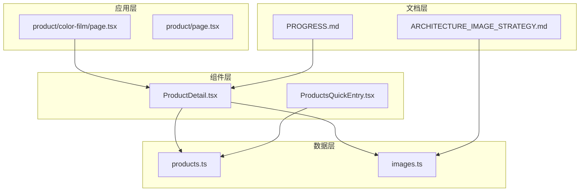
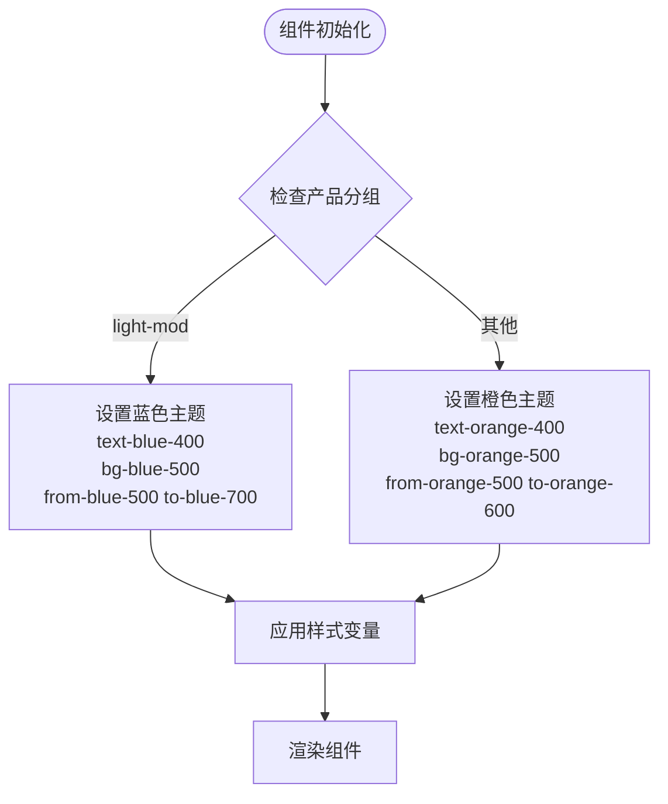
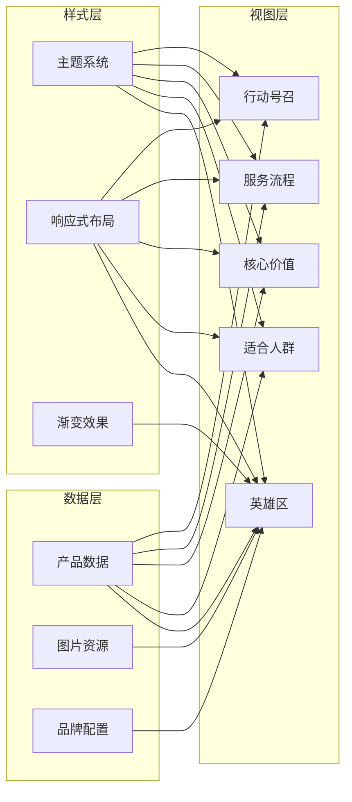
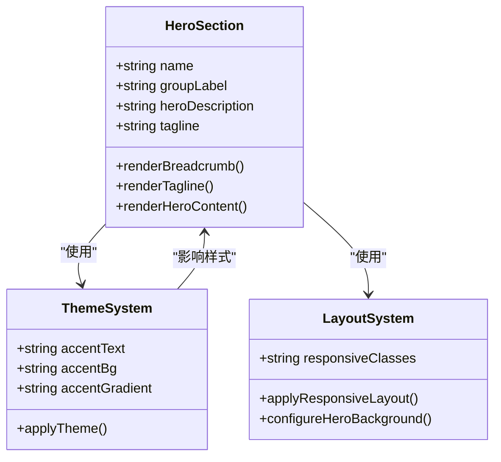
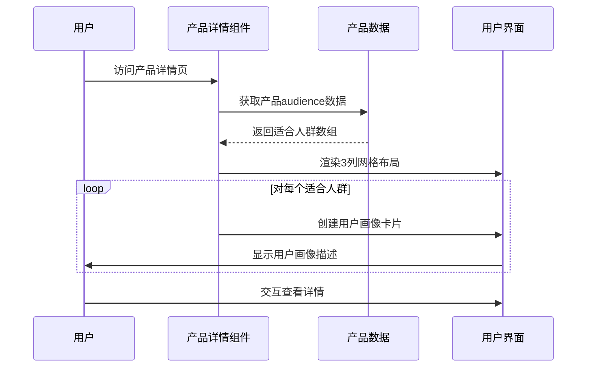
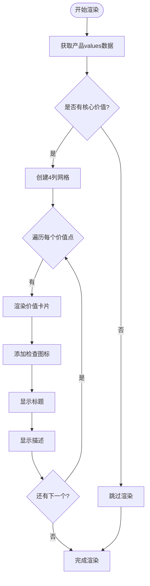
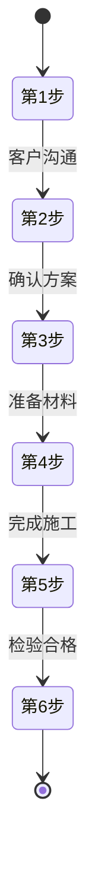
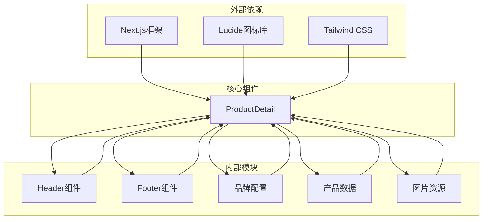
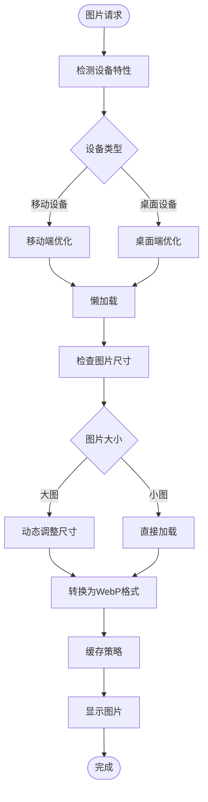
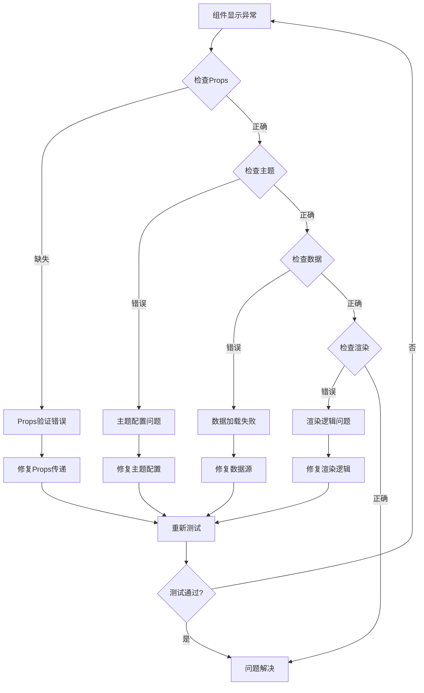

# 产品详情组件

<cite>
**本文档引用的文件**
- [ProductDetail.tsx](file://src/components/ProductDetail.tsx)
- [products.ts](file://src/lib/products.ts)
- [images.ts](file://src/lib/images.ts)
- [page.tsx](file://src/app/product/color-film/page.tsx)
- [ARCHITECTURE_IMAGE_STRATEGY.md](file://docs/ARCHITECTURE_IMAGE_STRATEGY.md)
- [PROGRESS.md](file://docs/PROGRESS.md)
</cite>

## 目录
1. [简介](#简介)
2. [项目结构](#项目结构)
3. [核心组件](#核心组件)
4. [架构概览](#架构概览)
5. [详细组件分析](#详细组件分析)
6. [依赖关系分析](#依赖关系分析)
7. [性能考虑](#性能考虑)
8. [故障排除指南](#故障排除指南)
9. [结论](#结论)

## 简介

产品详情组件（ProductDetail）是蓝辉轻改官网的核心展示组件，专为展示汽车轻改产品信息而设计。该组件采用统一的设计语言和响应式布局，为用户提供一致的产品体验。组件支持多种产品类型，包括轻改装备和汽车膜系产品，并根据产品组别自动调整视觉主题。

该组件不仅展示了产品的基本信息，还包含了适合人群、核心价值、服务流程等全方位的产品介绍内容，为潜在客户提供了完整的产品认知框架。

## 项目结构

产品详情组件在项目中的组织结构如下：



**图表来源**
- [ProductDetail.tsx:1-184](file://src/components/ProductDetail.tsx#L1-L184)
- [products.ts:17-100](file://src/lib/products.ts#L17-L100)
- [images.ts:36-91](file://src/lib/images.ts#L36-L91)

**章节来源**
- [ProductDetail.tsx:1-184](file://src/components/ProductDetail.tsx#L1-L184)
- [products.ts:17-100](file://src/lib/products.ts#L17-L100)

## 核心组件

### 组件接口定义

产品详情组件采用简洁的Props接口设计，主要包含以下参数：

```typescript
type ProductDetailProps = {
  product: Product;
};
```

其中`Product`类型定义包含以下关键字段：
- `name`: 产品名称
- `group`: 产品分组（light-mod 或 film）
- `groupLabel`: 分组标签
- `heroDescription`: 英雄区描述
- `tagline`: 标语
- `audience`: 适合人群数组
- `values`: 核心价值对象数组
- `process`: 服务流程对象数组
- `cta`: 行动号召按钮配置

### 主题系统

组件实现了智能的主题切换机制，根据产品分组自动调整视觉风格：



**图表来源**
- [ProductDetail.tsx:12-18](file://src/components/ProductDetail.tsx#L12-L18)

**章节来源**
- [ProductDetail.tsx:8-18](file://src/components/ProductDetail.tsx#L8-L18)
- [products.ts:17-100](file://src/lib/products.ts#L17-L100)

## 架构概览

产品详情组件采用了模块化的设计架构，确保了代码的可维护性和扩展性：



**图表来源**
- [ProductDetail.tsx:20-179](file://src/components/ProductDetail.tsx#L20-L179)
- [products.ts:263-303](file://src/lib/products.ts#L263-L303)

## 详细组件分析

### 英雄区设计

英雄区是产品详情页的核心视觉焦点，采用了深色背景和渐变效果的设计理念：



**图表来源**
- [ProductDetail.tsx:25-52](file://src/components/ProductDetail.tsx#L25-L52)
- [ProductDetail.tsx:12-18](file://src/components/ProductDetail.tsx#L12-L18)

### 适合人群区域

该区域采用网格布局展示产品的目标用户群体，每个用户画像都以卡片形式呈现：



**图表来源**
- [ProductDetail.tsx:67-93](file://src/components/ProductDetail.tsx#L67-L93)

### 核心价值展示

核心价值区域通过图标和文字的组合，清晰地传达产品的核心优势：



**图表来源**
- [ProductDetail.tsx:95-131](file://src/components/ProductDetail.tsx#L95-L131)

### 服务流程展示

服务流程区域采用步骤化的设计，清晰地展示从咨询到交付的完整流程：



**图表来源**
- [ProductDetail.tsx:133-159](file://src/components/ProductDetail.tsx#L133-L159)

### 行动号召区域

行动号召区域提供了明确的转化路径，引导用户进行预约：

```mermaid
sequenceDiagram
participant User as 用户
participant Component as 产品详情组件
participant Brand as 品牌配置
participant Link as 预约链接
User->>Component : 浏览产品详情
Component->>Brand : 获取当前门店信息
Brand-->>Component : 返回门店配置
Component->>User : 显示预约CTA区域
User->>Link : 点击预约按钮
Link-->>User : 导航至预约页面
```

**图表来源**
- [ProductDetail.tsx:161-179](file://src/components/ProductDetail.tsx#L161-L179)

**章节来源**
- [ProductDetail.tsx:20-179](file://src/components/ProductDetail.tsx#L20-L179)

## 依赖关系分析

产品详情组件的依赖关系体现了清晰的分层架构：



**图表来源**
- [ProductDetail.tsx:1-6](file://src/components/ProductDetail.tsx#L1-L6)

**章节来源**
- [ProductDetail.tsx:1-6](file://src/components/ProductDetail.tsx#L1-L6)
- [products.ts:263-303](file://src/lib/products.ts#L263-L303)

## 性能考虑

### 图片优化策略

组件采用了多层次的图片优化策略，确保在不同设备上都能获得最佳的用户体验：



**图表来源**
- [images.ts:36-91](file://src/lib/images.ts#L36-L91)
- [ARCHITECTURE_IMAGE_STRATEGY.md:1-49](file://docs/ARCHITECTURE_IMAGE_STRATEGY.md#L1-L49)

### 响应式设计

组件实现了完整的响应式设计，适配从移动端到桌面端的各种屏幕尺寸：

| 设备类型 | 断点 | 布局特点 | 样式类 |
|----------|------|----------|--------|
| 移动设备 | < 768px | 单列布局，紧凑设计 | `grid-cols-1` |
| 平板设备 | 768px-1024px | 双列布局，适度间距 | `grid-cols-1 md:grid-cols-2` |
| 桌面设备 | > 1024px | 四列布局，宽屏优化 | `grid-cols-1 sm:grid-cols-2 lg:grid-cols-4` |

**章节来源**
- [images.ts:36-91](file://src/lib/images.ts#L36-L91)
- [ARCHITECTURE_IMAGE_STRATEGY.md:1-49](file://docs/ARCHITECTURE_IMAGE_STRATEGY.md#L1-L49)

## 故障排除指南

### 常见问题诊断



### 性能监控指标

| 指标类型 | 正常范围 | 监控方法 | 优化建议 |
|----------|----------|----------|----------|
| 首屏渲染时间 | < 2秒 | Lighthouse Performance | 优化图片加载，减少阻塞资源 |
| TTFB | < 500ms | WebPageTest | 使用CDN，优化服务器响应 |
| FCP | < 1.5秒 | Chrome DevTools | 延迟加载非关键资源 |
| CLS | < 0.1 | Lighthouse Cumulative | 为图片预留空间，避免布局偏移 |

**章节来源**
- [ProductDetail.tsx:12-18](file://src/components/ProductDetail.tsx#L12-L18)

## 结论

产品详情组件展现了现代React应用的最佳实践，通过模块化设计、响应式布局和性能优化，为用户提供了优质的浏览体验。组件的设计理念体现了以下核心原则：

1. **一致性**：统一的设计语言和交互模式
2. **可扩展性**：模块化的架构便于功能扩展
3. **性能优化**：多层次的优化策略确保快速加载
4. **SEO友好**：合理的结构和元数据配置
5. **无障碍访问**：符合WCAG标准的可用性设计

该组件的成功实施为整个蓝辉轻改官网奠定了坚实的技术基础，为未来的功能扩展和业务发展提供了良好的支撑。