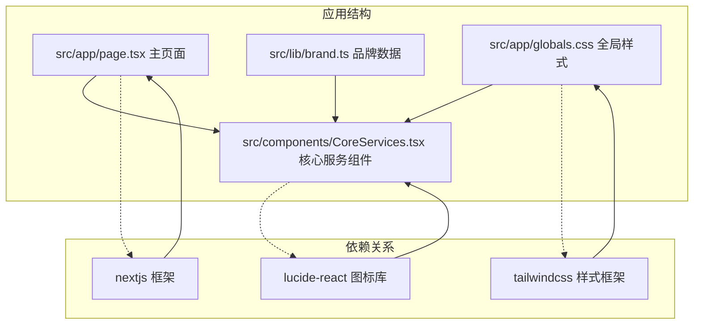
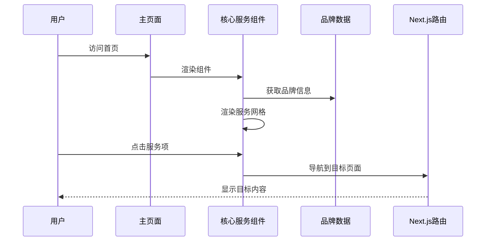
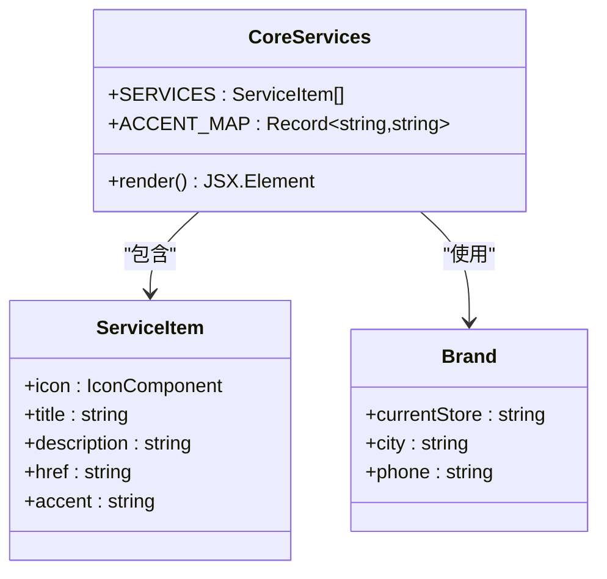
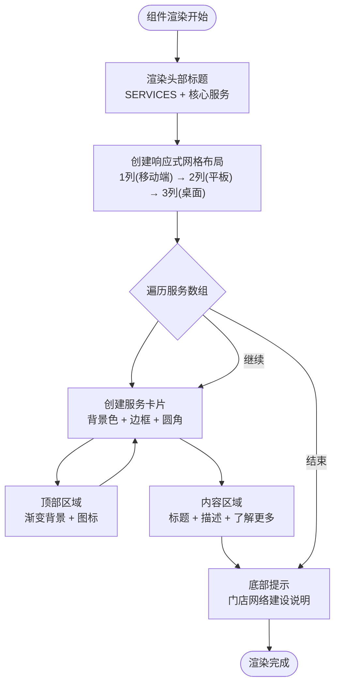
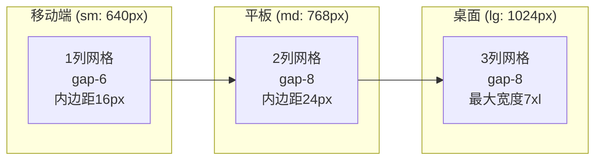
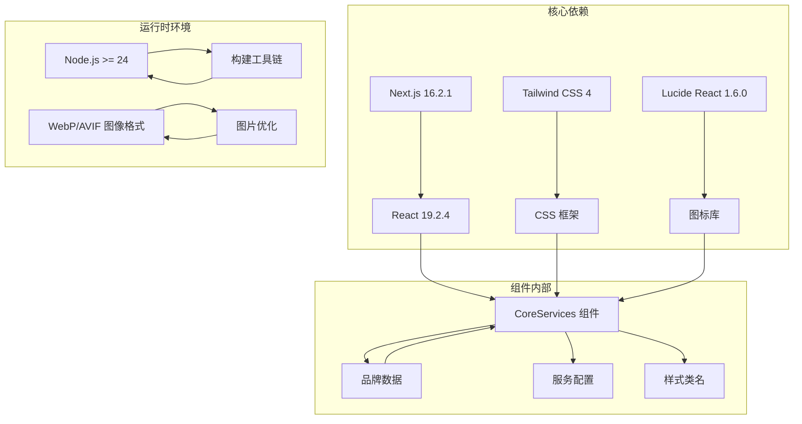

# 核心服务组件

<cite>
**本文档引用的文件**
- [CoreServices.tsx](file://src/components/CoreServices.tsx)
- [page.tsx](file://src/app/page.tsx)
- [brand.ts](file://src/lib/brand.ts)
- [globals.css](file://src/app/globals.css)
- [next.config.ts](file://next.config.ts)
- [package.json](file://package.json)
</cite>

## 目录
1. [简介](#简介)
2. [项目结构](#项目结构)
3. [核心组件](#核心组件)
4. [架构概览](#架构概览)
5. [详细组件分析](#详细组件分析)
6. [依赖分析](#依赖分析)
7. [性能考虑](#性能考虑)
8. [故障排除指南](#故障排除指南)
9. [结论](#结论)
10. [附录](#附录)

## 简介

CoreServices核心服务组件是蓝辉轻改网站的核心展示模块，负责向用户展示品牌提供的三大核心服务：轻改装备、汽车膜系和线下交付服务。该组件采用现代化的响应式设计，结合渐变色彩主题和流畅的交互动画，为用户提供直观的服务导航体验。

组件设计理念基于以下核心原则：
- **服务导向**：清晰展示三大核心业务领域
- **视觉层次**：通过色彩渐变和阴影营造深度感
- **交互友好**：提供平滑的悬停效果和过渡动画
- **响应式适配**：在不同设备上保持一致的用户体验

## 项目结构

CoreServices组件位于组件库目录中，作为页面布局的一部分被主页面引用。项目采用Next.js框架，使用Tailwind CSS进行样式管理，Lucide React图标库提供矢量图标支持。

**图表来源**
- [CoreServices.tsx:1-89](file://src/components/CoreServices.tsx#L1-L89)
- [page.tsx:1-21](file://src/app/page.tsx#L1-L21)
- [brand.ts:1-28](file://src/lib/brand.ts#L1-L28)

**章节来源**
- [CoreServices.tsx:1-89](file://src/components/CoreServices.tsx#L1-L89)
- [page.tsx:1-21](file://src/app/page.tsx#L1-L21)

## 核心组件

CoreServices组件是一个无状态函数组件，直接导出用于页面渲染。组件内部定义了三个服务条目，每个条目包含图标、标题、描述、链接和强调色配置。

### 服务数据模型

组件使用静态数组存储服务配置，每项服务包含以下属性：
- **icon**: Lucide React图标组件
- **title**: 服务标题（中文）
- **description**: 服务描述文本
- **href**: 导航链接
- **accent**: 强调色标识（blue/orange/yellow）

### 样式系统

组件采用Tailwind CSS类名系统，结合品牌自定义色彩变量实现统一的视觉风格。Accent映射表将颜色标识转换为对应的CSS类组合。

**章节来源**
- [CoreServices.tsx:5-36](file://src/components/CoreServices.tsx#L5-L36)
- [CoreServices.tsx:32-36](file://src/components/CoreServices.tsx#L32-L36)

## 架构概览

CoreServices组件在整个应用架构中的位置和职责如下：

**图表来源**
- [page.tsx:8-21](file://src/app/page.tsx#L8-L21)
- [CoreServices.tsx:38-88](file://src/components/CoreServices.tsx#L38-L88)
- [brand.ts:8-25](file://src/lib/brand.ts#L8-L25)

### 组件关系图

**图表来源**
- [CoreServices.tsx:5-36](file://src/components/CoreServices.tsx#L5-L36)
- [brand.ts:8-25](file://src/lib/brand.ts#L8-L25)

## 详细组件分析

### 组件结构设计

CoreServices组件采用卡片式布局设计，每个服务项都是一个独立的可点击卡片：

**图表来源**
- [CoreServices.tsx:40-88](file://src/components/CoreServices.tsx#L40-L88)

### 交互状态管理

组件实现了多层次的交互状态：

#### 悬停状态
- 卡片边框颜色从深灰变为浅灰
- 整体阴影和边框过渡动画
- 内容区域的微妙变换效果

#### 点击状态
- 使用Next.js Link组件实现客户端导航
- 无障碍的键盘导航支持
- 触摸设备上的优化点击区域

#### 动画效果
- 过渡持续时间为300毫秒
- 图标和箭头的平滑移动动画
- 渐变背景的色彩变化

### 响应式设计实现

组件采用Tailwind CSS的响应式断点系统：

**图表来源**
- [CoreServices.tsx:52-79](file://src/components/CoreServices.tsx#L52-L79)

### 可访问性支持

组件实现了多项可访问性特性：

- **语义化HTML**: 使用适当的标题层级和段落结构
- **键盘导航**: 支持Tab键导航和Enter键激活
- **屏幕阅读器**: 正确的aria标签和描述
- **焦点管理**: 清晰的焦点指示器
- **色彩对比**: 确保文本与背景有足够的对比度

### 国际化处理

虽然当前版本主要支持中文，但组件设计考虑了国际化扩展：

- 文本内容集中在组件内部，便于翻译
- 品牌信息通过brand模块统一管理
- 图标系统不依赖文本内容
- 结构化数据便于本地化

**章节来源**
- [CoreServices.tsx:38-88](file://src/components/CoreServices.tsx#L38-L88)

## 依赖分析

### 外部依赖关系

CoreServices组件依赖于多个外部库和框架：

**图表来源**
- [package.json:37-48](file://package.json#L37-L48)
- [next.config.ts:3-11](file://next.config.ts#L3-L11)

### 内部依赖关系

组件之间的依赖关系相对简单，主要体现在数据流向：

- **页面依赖组件**: 主页面导入并渲染CoreServices
- **组件依赖品牌数据**: 使用brand模块提供的品牌信息
- **样式依赖全局配置**: 使用全局Tailwind CSS配置

**章节来源**
- [package.json:1-60](file://package.json#L1-L60)
- [next.config.ts:1-14](file://next.config.ts#L1-L14)

## 性能考虑

### 渲染性能

- **静态数据**: 服务配置为静态数组，避免不必要的重新计算
- **纯函数组件**: 无状态设计，减少渲染开销
- **CSS类名复用**: 使用Tailwind CSS类名，避免内联样式的重复计算

### 图像优化

项目配置了多种图像格式支持：
- WebP和AVIF格式提供更好的压缩比
- 多种设备像素比的图片尺寸
- 30天的缓存策略提升加载速度

### 代码分割

- 组件按需加载，不阻塞主页面渲染
- 图标组件通过Tree Shaking移除未使用的图标
- 样式按需生成，避免全局样式污染

## 故障排除指南

### 常见问题及解决方案

#### 图标显示异常
**症状**: 服务图标不显示或显示为占位符
**原因**: Lucide React图标导入问题
**解决方案**: 
- 确认lucide-react版本兼容性
- 检查图标组件的正确导入
- 验证SVG渲染是否正常

#### 样式不生效
**症状**: 组件样式混乱或颜色异常
**原因**: Tailwind CSS配置问题
**解决方案**:
- 检查globals.css文件的导入顺序
- 验证CSS变量定义是否正确
- 确认暗色模式切换逻辑

#### 响应式布局问题
**症状**: 在某些设备上布局错乱
**原因**: 断点设置或媒体查询问题
**解决方案**:
- 检查Tailwind CSS断点配置
- 验证容器宽度设置
- 测试不同设备的视口尺寸

#### 导航功能异常
**症状**: 点击服务项无法跳转
**原因**: Next.js Link组件配置错误
**解决方案**:
- 确认href属性的正确性
- 检查路由配置
- 验证客户端导航设置

**章节来源**
- [CoreServices.tsx:1-89](file://src/components/CoreServices.tsx#L1-L89)

## 结论

CoreServices核心服务组件成功实现了现代化的响应式设计，通过精心设计的交互效果和统一的视觉语言，为用户提供了优秀的服务导航体验。组件的设计充分考虑了可维护性、性能和可访问性，在保持简洁的同时提供了足够的灵活性。

组件的主要优势包括：
- **清晰的信息架构**: 三大核心服务一目了然
- **优秀的用户体验**: 流畅的交互动画和响应式设计
- **良好的可维护性**: 模块化的代码结构和明确的数据流
- **完善的可访问性**: 符合WCAG标准的无障碍设计

未来可以考虑的改进方向：
- 添加动态服务数据加载能力
- 增强多语言支持
- 实现服务分类和筛选功能
- 添加用户反馈和评价系统

## 附录

### 组件扩展指南

#### 添加新服务
1. 在SERVICES数组中添加新的服务对象
2. 选择合适的Lucide React图标
3. 设置服务标题和描述
4. 配置目标链接和强调色

#### 自定义样式
1. 扩展ACCENT_MAP以支持新的颜色主题
2. 修改网格布局参数以适应不同内容长度
3. 调整动画时长和缓动函数
4. 添加新的交互状态

#### 国际化扩展
1. 将所有文本内容提取到国际化文件
2. 创建多语言版本的服务描述
3. 实现动态语言切换
4. 支持RTL布局

### 最佳实践建议

- **保持组件单一职责**: 专注于服务展示，避免过度复杂化
- **遵循设计系统**: 使用统一的颜色、字体和间距规范
- **测试跨设备兼容性**: 确保在各种设备和浏览器上的表现一致
- **监控性能指标**: 定期检查组件的渲染性能和加载速度
- **文档化变更**: 详细记录任何功能增强或bug修复