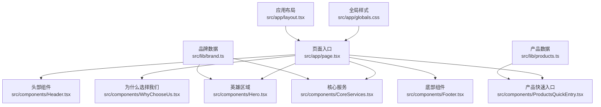
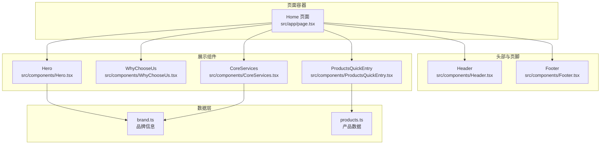
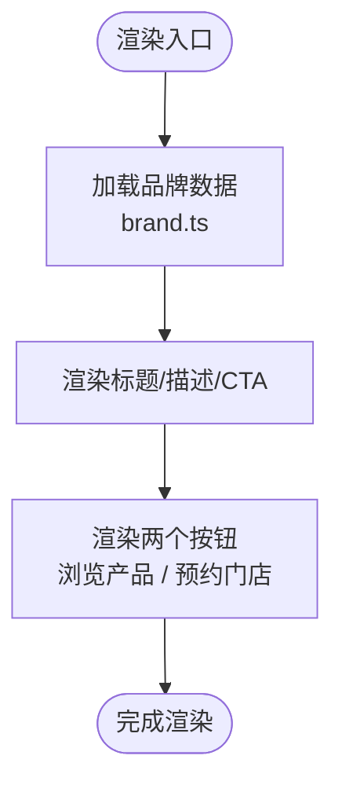
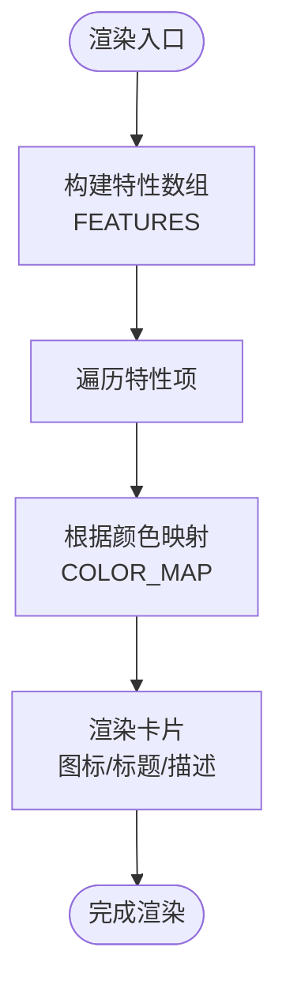
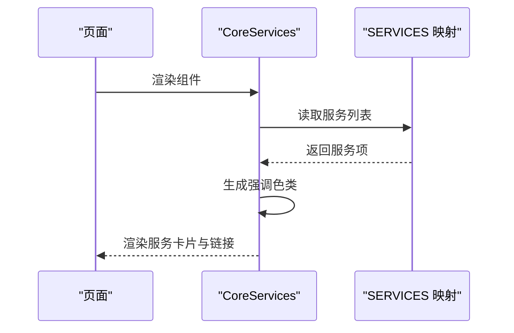
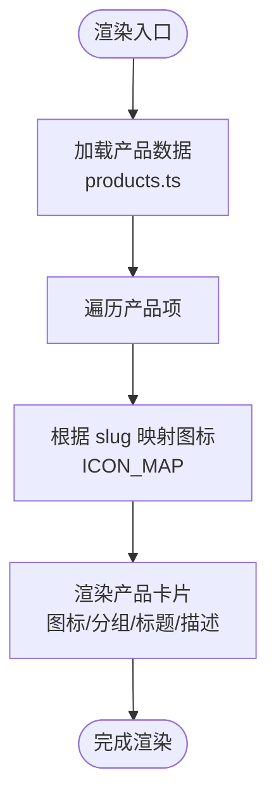
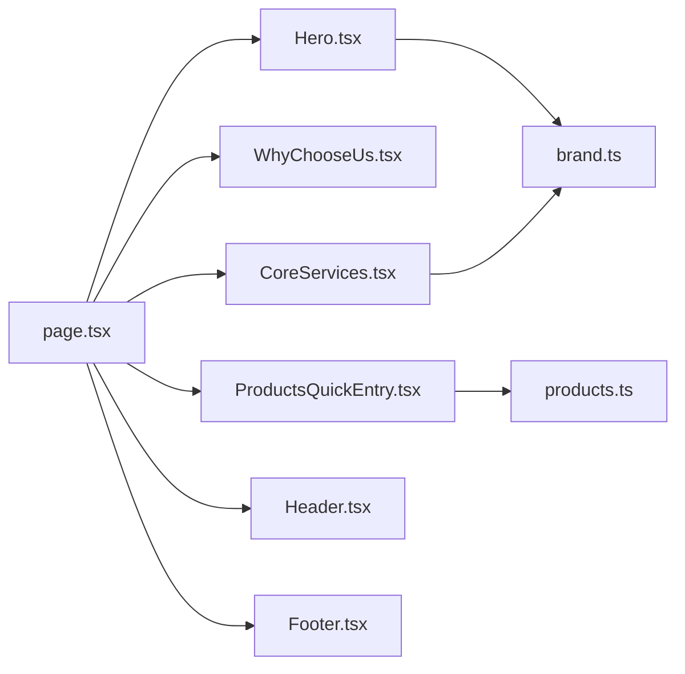

# 自定义组件开发

<cite>
**本文档引用的文件**
- [src/app/page.tsx](file://src/app/page.tsx)
- [src/app/layout.tsx](file://src/app/layout.tsx)
- [src/app/globals.css](file://src/app/globals.css)
- [src/components/Hero.tsx](file://src/components/Hero.tsx)
- [src/components/WhyChooseUs.tsx](file://src/components/WhyChooseUs.tsx)
- [src/components/CoreServices.tsx](file://src/components/CoreServices.tsx)
- [src/components/ProductsQuickEntry.tsx](file://src/components/ProductsQuickEntry.tsx)
- [src/components/Header.tsx](file://src/components/Header.tsx)
- [src/components/Footer.tsx](file://src/components/Footer.tsx)
- [src/components/ui/button.tsx](file://src/components/ui/button.tsx)
- [src/lib/brand.ts](file://src/lib/brand.ts)
- [src/lib/products.ts](file://src/lib/products.ts)
- [package.json](file://package.json)
</cite>

## 目录
1. [引言](#引言)
2. [项目结构](#项目结构)
3. [核心组件](#核心组件)
4. [架构总览](#架构总览)
5. [详细组件分析](#详细组件分析)
6. [依赖关系分析](#依赖关系分析)
7. [性能考量](#性能考量)
8. [故障排查指南](#故障排查指南)
9. [结论](#结论)
10. [附录](#附录)

## 引言
本文件面向蓝辉轻改网站的自定义组件开发，系统梳理并深入解析以下核心展示组件的设计与实现：Hero 英雄区域、WhyChooseUs 为什么选择我们、CoreServices 核心服务、ProductsQuickEntry 产品快速入口。文档将从组件 Props 接口、状态管理与事件处理、视觉设计原则与用户体验、响应式与移动端适配、可访问性与国际化、以及扩展与定制最佳实践等方面进行全方位说明，并提供使用示例与集成方法。

## 项目结构
该网站基于 Next.js 16，采用 App Router 结构，组件位于 src/components 下，页面入口在 src/app/page.tsx 中组合使用各组件。全局样式通过 src/app/globals.css 定义，品牌与产品数据分别在 src/lib/brand.ts 与 src/lib/products.ts 中集中管理。

**图表来源**
- [src/app/page.tsx:1-22](file://src/app/page.tsx#L1-L22)
- [src/components/Hero.tsx:1-56](file://src/components/Hero.tsx#L1-L56)
- [src/components/WhyChooseUs.tsx:1-84](file://src/components/WhyChooseUs.tsx#L1-L84)
- [src/components/CoreServices.tsx:1-89](file://src/components/CoreServices.tsx#L1-L89)
- [src/components/ProductsQuickEntry.tsx:1-81](file://src/components/ProductsQuickEntry.tsx#L1-L81)
- [src/components/Header.tsx:1-292](file://src/components/Header.tsx#L1-L292)
- [src/components/Footer.tsx:1-113](file://src/components/Footer.tsx#L1-L113)
- [src/lib/brand.ts:1-28](file://src/lib/brand.ts#L1-L28)
- [src/lib/products.ts:1-282](file://src/lib/products.ts#L1-L282)
- [src/app/globals.css:1-130](file://src/app/globals.css#L1-L130)
- [src/app/layout.tsx:1-32](file://src/app/layout.tsx#L1-L32)

**章节来源**
- [src/app/page.tsx:1-22](file://src/app/page.tsx#L1-L22)
- [src/app/layout.tsx:1-32](file://src/app/layout.tsx#L1-L32)
- [src/app/globals.css:1-130](file://src/app/globals.css#L1-L130)

## 核心组件
本节概述四个核心展示组件的职责与交互关系，便于整体把握组件生态。

- Hero 英雄区域：首页首屏视觉焦点，承载品牌信息、行动号召与门店预约入口。
- WhyChooseUs 为什么选择我们：以特性卡片网格呈现品牌优势，强调“轻改方案整合”“本地门店交付”“兼顾颜值与实用”。
- CoreServices 核心服务：以卡片链接形式展示“轻改装备”“汽车膜系”“顺德大良店”，提供服务导向的导航。
- ProductsQuickEntry 产品快速入口：基于产品数据渲染产品卡片，支持按组分类与图标映射，引导用户进入产品详情。

**章节来源**
- [src/components/Hero.tsx:1-56](file://src/components/Hero.tsx#L1-L56)
- [src/components/WhyChooseUs.tsx:1-84](file://src/components/WhyChooseUs.tsx#L1-L84)
- [src/components/CoreServices.tsx:1-89](file://src/components/CoreServices.tsx#L1-L89)
- [src/components/ProductsQuickEntry.tsx:1-81](file://src/components/ProductsQuickEntry.tsx#L1-L81)

## 架构总览
下图展示了页面级的组件装配关系与数据流向，体现从页面容器到各展示组件的组合方式及数据来源。

**图表来源**
- [src/app/page.tsx:1-22](file://src/app/page.tsx#L1-L22)
- [src/components/Hero.tsx:1-56](file://src/components/Hero.tsx#L1-L56)
- [src/components/WhyChooseUs.tsx:1-84](file://src/components/WhyChooseUs.tsx#L1-L84)
- [src/components/CoreServices.tsx:1-89](file://src/components/CoreServices.tsx#L1-L89)
- [src/components/ProductsQuickEntry.tsx:1-81](file://src/components/ProductsQuickEntry.tsx#L1-L81)
- [src/lib/brand.ts:1-28](file://src/lib/brand.ts#L1-L28)
- [src/lib/products.ts:1-282](file://src/lib/products.ts#L1-L282)

## 详细组件分析

### Hero 英雄区域
- 组件职责：首页首屏视觉与信息传达，包含品牌标识、标语、描述与两个主要行动按钮。
- 数据来源：品牌数据来自品牌模块，用于动态显示品牌中英文名、标语与当前门店信息。
- 视觉设计：深色背景叠加渐变与装饰圆环，营造科技感；标题采用渐变文字突出重点；按钮采用渐变与阴影增强层级。
- 交互与事件：两个按钮均为外链跳转，无内部状态变化；通过 Link 组件实现路由跳转。
- 可访问性：背景装饰元素设置 aria-hidden；品牌标识与导航均提供可读的 aria-label。
- 响应式：标题与段落在小屏与大屏间调整字号与行高，按钮在小屏下垂直堆叠，大屏下水平排列。

**图表来源**
- [src/components/Hero.tsx:1-56](file://src/components/Hero.tsx#L1-L56)
- [src/lib/brand.ts:1-28](file://src/lib/brand.ts#L1-L28)

**章节来源**
- [src/components/Hero.tsx:1-56](file://src/components/Hero.tsx#L1-L56)
- [src/lib/brand.ts:1-28](file://src/lib/brand.ts#L1-L28)

### WhyChooseUs 为什么选择我们
- 组件职责：以三列网格展示品牌优势，每列包含图标、标题与描述，并通过色彩主题区分。
- 数据来源：特性列表与颜色映射集中定义，便于统一风格与扩展。
- 视觉设计：卡片采用悬停边框与阴影过渡，图标区域以主题色背景与描边强调；标题与描述采用层级化排版。
- 交互与事件：卡片为静态展示，无交互事件；颜色主题通过映射表统一管理。
- 可访问性：标题语义明确，描述文本具备可读性；整体布局使用语义化标签。
- 响应式：在小屏下单列，在中屏及以上为三列布局，间距与内边距随屏幕宽度调整。

**图表来源**
- [src/components/WhyChooseUs.tsx:1-84](file://src/components/WhyChooseUs.tsx#L1-L84)

**章节来源**
- [src/components/WhyChooseUs.tsx:1-84](file://src/components/WhyChooseUs.tsx#L1-L84)

### CoreServices 核心服务
- 组件职责：展示三大核心服务板块，提供服务概览与入口链接。
- 数据来源：服务列表包含图标、标题、描述、链接与强调色；强调色通过映射表统一生成渐变与边框类。
- 视觉设计：卡片顶部使用渐变背景与图标，中部为内容区，底部为“了解更多”链接；整体采用悬停边框与过渡动画。
- 交互与事件：卡片为链接块，点击跳转至对应页面；强调色通过映射表集中管理，便于扩展与统一。
- 可访问性：链接具备可读文本，图标使用语义化组件；整体布局清晰，对比度良好。
- 响应式：在小屏为单列，在中屏为双列，在大屏为三列，间距与内边距随屏幕宽度调整。

**图表来源**
- [src/components/CoreServices.tsx:1-89](file://src/components/CoreServices.tsx#L1-L89)

**章节来源**
- [src/components/CoreServices.tsx:1-89](file://src/components/CoreServices.tsx#L1-L89)

### ProductsQuickEntry 产品快速入口
- 组件职责：展示产品快速入口，支持查看全部产品与按组分类展示。
- 数据来源：产品数据来自产品模块，包含产品分组、名称、标语、服务流程模板等；图标映射根据产品 slug 动态选择。
- 视觉设计：卡片包含图标徽章、分组标签、标题与描述；链接块采用悬停过渡与图标动画。
- 交互与事件：卡片为链接块，点击跳转至产品详情页；分组标签根据产品组动态着色。
- 可访问性：链接具备可读文本，图标使用语义化组件；整体布局清晰，对比度良好。
- 响应式：在小屏为单列，在中屏为两列，在大屏为三列，间距与内边距随屏幕宽度调整。

**图表来源**
- [src/components/ProductsQuickEntry.tsx:1-81](file://src/components/ProductsQuickEntry.tsx#L1-L81)
- [src/lib/products.ts:1-282](file://src/lib/products.ts#L1-L282)

**章节来源**
- [src/components/ProductsQuickEntry.tsx:1-81](file://src/components/ProductsQuickEntry.tsx#L1-L81)
- [src/lib/products.ts:1-282](file://src/lib/products.ts#L1-L282)

## 依赖关系分析
- 组件依赖：页面入口组合四个展示组件；Hero 与 CoreServices 依赖品牌数据；ProductsQuickEntry 依赖产品数据；Header 与 Footer 提供导航与联系信息。
- 外部依赖：Next.js 路由与 Link 组件、Lucide React 图标库、Tailwind CSS 样式系统。
- 数据耦合：品牌与产品数据集中管理，便于跨组件共享与统一更新。

**图表来源**
- [src/app/page.tsx:1-22](file://src/app/page.tsx#L1-L22)
- [src/components/Hero.tsx:1-56](file://src/components/Hero.tsx#L1-L56)
- [src/components/WhyChooseUs.tsx:1-84](file://src/components/WhyChooseUs.tsx#L1-L84)
- [src/components/CoreServices.tsx:1-89](file://src/components/CoreServices.tsx#L1-L89)
- [src/components/ProductsQuickEntry.tsx:1-81](file://src/components/ProductsQuickEntry.tsx#L1-L81)
- [src/lib/brand.ts:1-28](file://src/lib/brand.ts#L1-L28)
- [src/lib/products.ts:1-282](file://src/lib/products.ts#L1-L282)
- [src/components/Header.tsx:1-292](file://src/components/Header.tsx#L1-L292)
- [src/components/Footer.tsx:1-113](file://src/components/Footer.tsx#L1-L113)

**章节来源**
- [package.json:1-60](file://package.json#L1-L60)

## 性能考量
- 渲染优化：组件采用纯函数式渲染，避免不必要的状态更新；图标与背景使用 CSS 渐变与模糊效果，减少图片资源依赖。
- 路由与懒加载：使用 Next.js 的 Link 组件进行客户端导航，减少页面刷新；产品数据集中管理，避免重复请求。
- 样式优化：全局样式采用 Tailwind CSS，通过原子类组合减少样式体积；深色模式变量集中定义，便于维护。
- 可访问性：组件提供 aria-label 与语义化标签，确保键盘导航与屏幕阅读器可用性。

## 故障排查指南
- 链接失效：检查 Link 的 href 是否正确指向目标路由；确认路由文件是否存在。
- 图标不显示：确认 Lucide React 已安装且版本兼容；检查图标组件是否正确导入。
- 样式异常：检查 Tailwind CSS 配置与全局样式文件；确认深色模式变量是否正确生效。
- 数据未更新：确认品牌与产品数据模块导出是否正确；检查数据结构与键名是否一致。
- 移动端布局错乱：检查断点与栅格类是否正确；确认媒体查询与响应式属性设置。

**章节来源**
- [package.json:1-60](file://package.json#L1-L60)
- [src/app/globals.css:1-130](file://src/app/globals.css#L1-L130)

## 结论
本文档系统梳理了蓝辉轻改网站的四个核心展示组件，从设计原则、数据流、交互与可访问性、响应式与移动端适配、到扩展与定制的最佳实践进行了全面阐述。通过集中管理品牌与产品数据，组件实现了高内聚、低耦合的架构，便于后续迭代与扩展。

## 附录

### 使用示例与集成方法
- 在页面中引入并组合组件：参考页面入口文件，将各组件按顺序渲染。
- 动态数据注入：通过品牌与产品数据模块向组件注入品牌信息与产品列表。
- 导航与跳转：使用 Next.js Link 组件进行页面跳转，确保客户端导航体验。

**章节来源**
- [src/app/page.tsx:1-22](file://src/app/page.tsx#L1-L22)
- [src/lib/brand.ts:1-28](file://src/lib/brand.ts#L1-L28)
- [src/lib/products.ts:1-282](file://src/lib/products.ts#L1-L282)

### 响应式设计与移动端适配
- 断点策略：小屏单列、中屏两列、大屏三列；标题与段落在不同断点下调整字号与行高。
- 交互适配：移动端提供汉堡菜单与下拉子菜单，桌面端提供悬停下拉与活跃态指示。
- 触控优化：按钮与链接具备合适的触控目标尺寸，确保移动端易用性。

**章节来源**
- [src/components/Header.tsx:1-292](file://src/components/Header.tsx#L1-L292)
- [src/components/ProductsQuickEntry.tsx:1-81](file://src/components/ProductsQuickEntry.tsx#L1-L81)
- [src/components/CoreServices.tsx:1-89](file://src/components/CoreServices.tsx#L1-L89)

### 可访问性与国际化
- 可访问性：提供 aria-label 与语义化标签；确保键盘可达与焦点可见；对比度满足无障碍要求。
- 国际化：页面语言设置为 zh-CN；品牌与产品文案以中文为主，便于本地化扩展。

**章节来源**
- [src/app/layout.tsx:1-32](file://src/app/layout.tsx#L1-L32)
- [src/app/globals.css:1-130](file://src/app/globals.css#L1-L130)

### 扩展与定制最佳实践
- 数据驱动：将配置与文案集中于数据模块，便于统一管理与快速迭代。
- 主题一致性：通过颜色映射与样式变量统一视觉风格，减少重复样式代码。
- 组件复用：将通用交互（如下拉菜单）抽象为独立子组件，提升复用性与可测试性。
- 可测试性：保持组件纯函数式渲染，便于单元测试与快照测试。

**章节来源**
- [src/lib/brand.ts:1-28](file://src/lib/brand.ts#L1-L28)
- [src/lib/products.ts:1-282](file://src/lib/products.ts#L1-L282)
- [src/components/Header.tsx:1-292](file://src/components/Header.tsx#L1-L292)