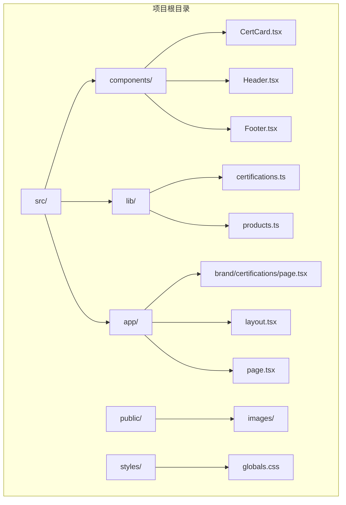
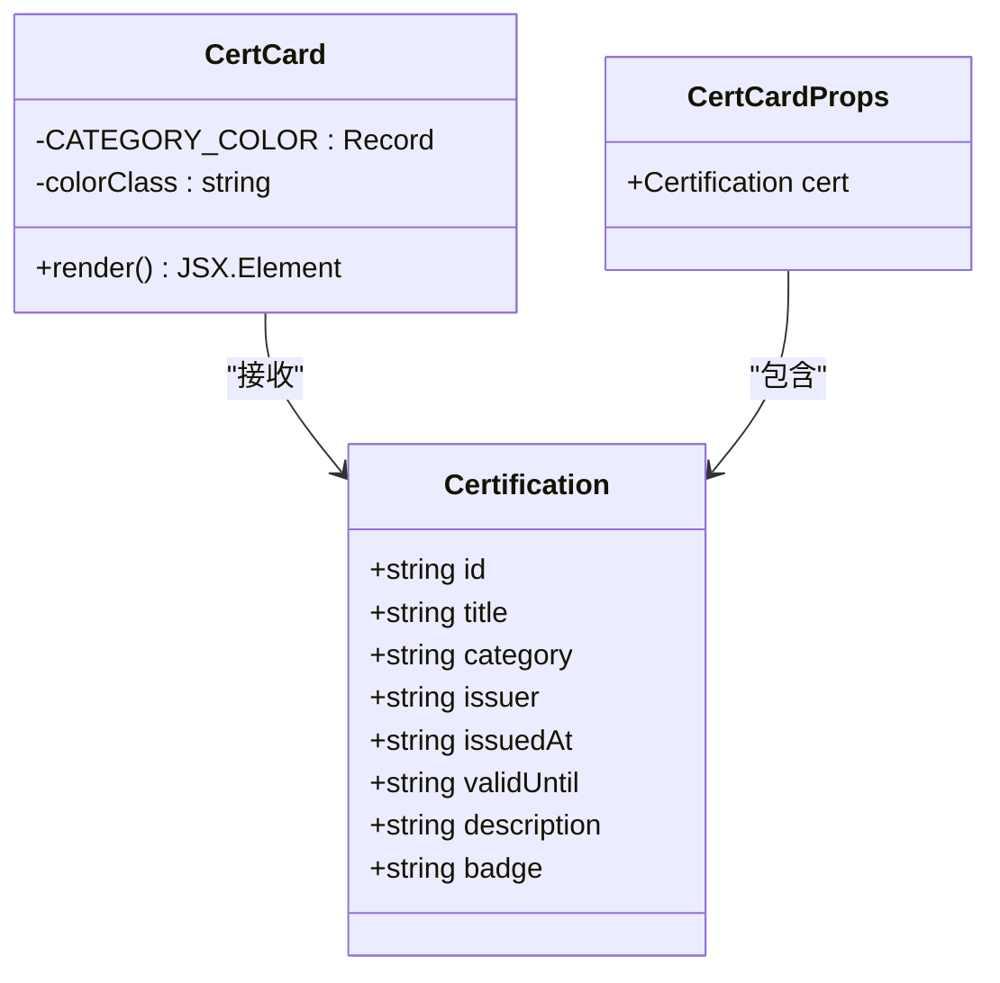
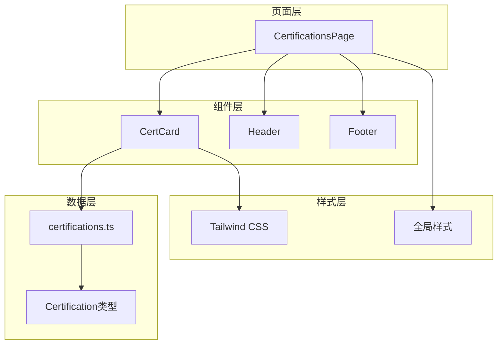
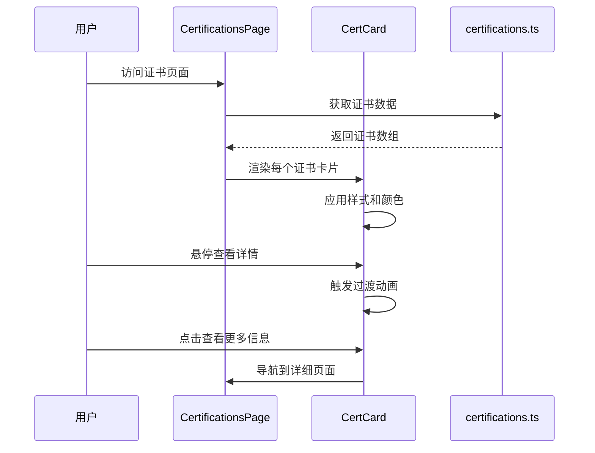
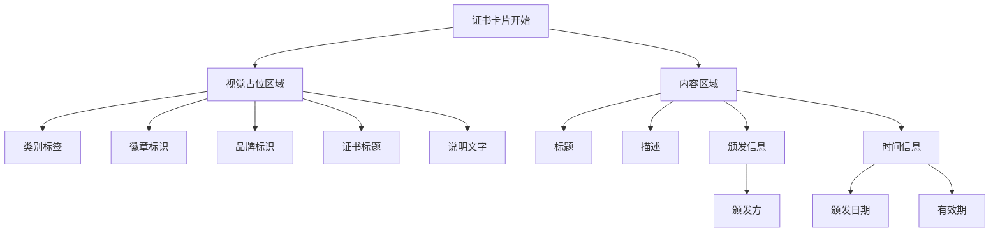
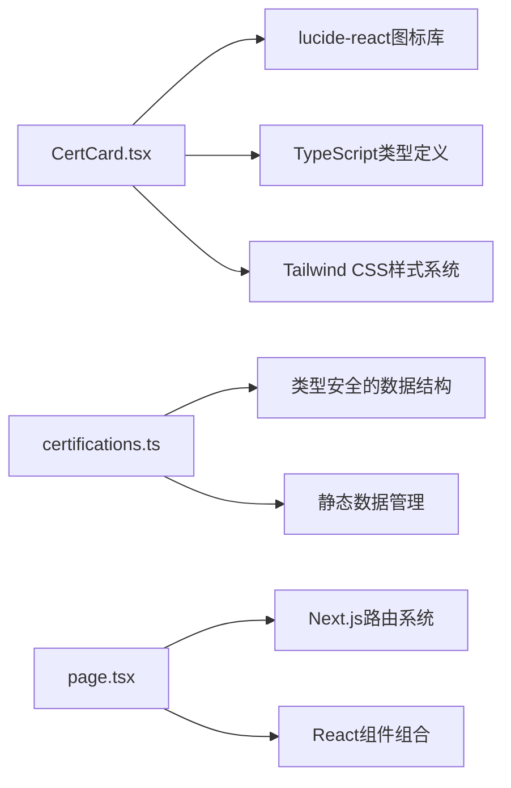
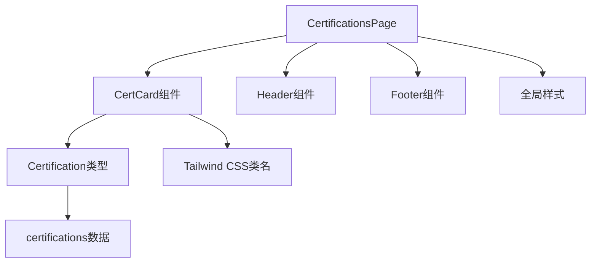

# 资质证书组件

<cite>
**本文档引用的文件**
- [CertCard.tsx](file://src/components/CertCard.tsx)
- [certifications.ts](file://src/lib/certifications.ts)
- [page.tsx](file://src/app/brand/certifications/page.tsx)
- [globals.css](file://src/app/globals.css)
- [postcss.config.mjs](file://postcss.config.mjs)
</cite>

## 目录
1. [简介](#简介)
2. [项目结构](#项目结构)
3. [核心组件](#核心组件)
4. [架构概览](#架构概览)
5. [详细组件分析](#详细组件分析)
6. [依赖关系分析](#依赖关系分析)
7. [性能考虑](#性能考虑)
8. [故障排除指南](#故障排除指南)
9. [结论](#结论)
10. [附录](#附录)

## 简介

资质证书组件是一个专门用于展示企业资质证书的React组件，采用Next.js框架构建。该组件设计用于在蓝辉轻改品牌的资质证书页面中展示各种类型的证书信息，包括营业执照、行业认证、门店资质和品牌合作等类别。

该组件的核心设计理念是通过视觉化的方式展示证书信息，同时保持良好的用户体验和可访问性。组件采用了渐变背景、阴影效果和悬停动画等现代Web设计元素，确保在不同设备上都能提供优秀的视觉体验。

## 项目结构

该项目采用基于功能的模块化组织方式，资质证书组件位于以下目录结构中：

**图表来源**
- [CertCard.tsx:1-77](file://src/components/CertCard.tsx#L1-L77)
- [certifications.ts:1-114](file://src/lib/certifications.ts#L1-L114)
- [page.tsx:1-107](file://src/app/brand/certifications/page.tsx#L1-L107)

**章节来源**
- [CertCard.tsx:1-77](file://src/components/CertCard.tsx#L1-L77)
- [certifications.ts:1-114](file://src/lib/certifications.ts#L1-L114)
- [page.tsx:1-107](file://src/app/brand/certifications/page.tsx#L1-L107)

## 核心组件

### 组件接口定义

资质证书组件采用TypeScript类型系统定义了完整的接口规范：

**图表来源**
- [CertCard.tsx:4-6](file://src/components/CertCard.tsx#L4-L6)
- [certifications.ts:8-17](file://src/lib/certifications.ts#L8-L17)

### 数据结构特点

组件使用强类型的数据结构来确保数据的一致性和完整性：

- **唯一标识符**: 每个证书都有唯一的字符串ID
- **分类系统**: 支持四种预定义的证书类别
- **时间信息**: 包含颁发日期和有效期信息
- **视觉标识**: 使用emoji或文本作为徽章标识

**章节来源**
- [CertCard.tsx:8-13](file://src/components/CertCard.tsx#L8-L13)
- [certifications.ts:8-17](file://src/lib/certifications.ts#L8-L17)

## 架构概览

### 整体架构设计

**图表来源**
- [page.tsx:15-78](file://src/app/brand/certifications/page.tsx#L15-L78)
- [CertCard.tsx:15-76](file://src/components/CertCard.tsx#L15-L76)
- [certifications.ts:19-86](file://src/lib/certifications.ts#L19-L86)

### 组件交互流程

**图表来源**
- [page.tsx:73-75](file://src/app/brand/certifications/page.tsx#L73-L75)
- [CertCard.tsx:15-76](file://src/components/CertCard.tsx#L15-L76)

## 详细组件分析

### 视觉设计系统

#### 颜色方案设计

组件采用了基于证书类别的颜色系统，每种证书类型都有独特的视觉标识：

| 证书类别 | 主色调 | 辅助色 | 背景色 |
|---------|--------|--------|--------|
| 营业执照 | 蓝色 | 蓝绿色 | 深蓝色背景 |
| 行业认证 | 橙色 | 橙红色 | 深橙色背景 |
| 门店资质 | 黄色 | 黄绿色 | 深黄色背景 |
| 品牌合作 | 灰色 | 灰蓝色 | 深灰色背景 |

#### 布局设计原则

组件采用卡片式布局设计，具有以下特点：

- **响应式网格**: 在小屏幕上显示1列，在中等屏幕上显示2列，在大屏幕上显示3列
- **统一间距**: 使用标准的间距系统确保视觉一致性
- **层次分明**: 通过阴影和边框创造深度感

**章节来源**
- [CertCard.tsx:8-13](file://src/components/CertCard.tsx#L8-L13)
- [page.tsx:72-76](file://src/app/brand/certifications/page.tsx#L72-L76)

### 内容展示逻辑

#### 证书信息展示

组件通过以下结构展示证书信息：

**图表来源**
- [CertCard.tsx:18-76](file://src/components/CertCard.tsx#L18-L76)

#### 图片适配策略

虽然当前版本使用占位符而非真实图片，但组件已经为图片适配做好了准备：

- **响应式容器**: 使用相对单位确保在不同屏幕尺寸下保持比例
- **渐变背景**: 提供视觉层次感，减少对真实图片的依赖
- **占位符设计**: 通过几何图案和品牌标识维持视觉一致性

**章节来源**
- [CertCard.tsx:20-49](file://src/components/CertCard.tsx#L20-L49)

### 交互设计实现

#### 悬停状态管理

组件实现了平滑的悬停过渡效果：

- **边框变化**: 从深色边框过渡到浅色边框
- **阴影效果**: 增加轻微的阴影增强立体感
- **圆角处理**: 保持一致的圆角半径

#### 可访问性特性

组件在可访问性方面采用了多项措施：

- **语义化标记**: 使用适当的HTML语义元素
- **屏幕阅读器支持**: 通过`aria-hidden`和`sr-only`类提供辅助信息
- **键盘导航**: 支持键盘操作和焦点管理

**章节来源**
- [CertCard.tsx:18](file://src/components/CertCard.tsx#L18)
- [CertCard.tsx:23](file://src/components/CertCard.tsx#L23)
- [CertCard.tsx:60](file://src/components/CertCard.tsx#L60)

## 依赖关系分析

### 外部依赖

组件的外部依赖关系相对简单，主要依赖于：

**图表来源**
- [CertCard.tsx:1](file://src/components/CertCard.tsx#L1)
- [certifications.ts:1](file://src/lib/certifications.ts#L1)
- [page.tsx:1](file://src/app/brand/certifications/page.tsx#L1)

### 内部依赖关系

**图表来源**
- [page.tsx:6](file://src/app/brand/certifications/page.tsx#L6)
- [CertCard.tsx:2](file://src/components/CertCard.tsx#L2)
- [certifications.ts:8](file://src/lib/certifications.ts#L8)

**章节来源**
- [CertCard.tsx:1-2](file://src/components/CertCard.tsx#L1-L2)
- [certifications.ts:1-6](file://src/lib/certifications.ts#L1-L6)
- [page.tsx:1-7](file://src/app/brand/certifications/page.tsx#L1-L7)

## 性能考虑

### 渲染优化

组件在性能方面采用了多项优化策略：

- **纯函数组件**: 使用函数式组件减少不必要的状态管理
- **最小化重渲染**: 通过合理的props传递避免不必要的重新渲染
- **CSS类名复用**: 使用Tailwind CSS提供的原子化类名提高渲染效率

### 样式性能

- **CSS变量**: 使用CSS自定义属性实现动态样式切换
- **硬件加速**: 合理使用transform和opacity属性触发GPU加速
- **样式缓存**: Tailwind CSS编译时生成静态CSS类名

## 故障排除指南

### 常见问题及解决方案

#### 样式不生效

**问题**: 组件样式显示异常或不正确
**原因**: Tailwind CSS配置问题或类名拼写错误
**解决方案**: 
1. 检查`postcss.config.mjs`配置文件
2. 验证类名拼写是否正确
3. 确认全局样式文件已正确导入

#### 数据类型错误

**问题**: TypeScript编译错误或运行时类型检查失败
**原因**: Certification类型定义不匹配
**解决方案**:
1. 检查证书数据格式是否符合类型定义
2. 验证枚举值是否在允许范围内
3. 确认所有必需字段都已提供

#### 响应式布局问题

**问题**: 在移动设备上布局错乱
**原因**: 断点设置不当或媒体查询冲突
**解决方案**:
1. 检查断点值是否符合设计要求
2. 验证容器宽度设置
3. 确认间距和字体大小的响应式调整

**章节来源**
- [postcss.config.mjs:1-7](file://postcss.config.mjs#L1-L7)
- [CertCard.tsx:4-6](file://src/components/CertCard.tsx#L4-L6)

## 结论

资质证书组件是一个设计精良、功能完整的React组件，它成功地实现了以下目标：

1. **视觉一致性**: 通过统一的设计语言和颜色系统确保了视觉上的和谐
2. **响应式设计**: 适配多种设备尺寸，提供优秀的跨平台体验
3. **可访问性**: 考虑了屏幕阅读器用户的需求，提供了良好的可访问性支持
4. **扩展性**: 采用模块化设计，便于未来添加新功能和修改样式

该组件为蓝辉轻改品牌提供了一个专业、可信的证书展示解决方案，不仅满足了当前的需求，也为未来的功能扩展奠定了坚实的基础。

## 附录

### 最佳实践建议

#### 开发最佳实践

1. **类型安全**: 始终使用TypeScript类型定义确保数据完整性
2. **样式组织**: 使用原子化CSS方法保持样式的可维护性
3. **性能优化**: 避免不必要的重渲染，合理使用React.memo
4. **测试覆盖**: 为关键功能编写单元测试和集成测试

#### 集成指南

当在其他页面中集成此组件时，建议遵循以下步骤：

1. **导入组件**: 从`src/components/CertCard.tsx`导入CertCard组件
2. **准备数据**: 确保传入的cert对象符合Certification类型定义
3. **样式配置**: 确认Tailwind CSS配置正确加载
4. **响应式测试**: 在不同设备上测试组件的响应式行为

### 未来改进方向

1. **真实图片支持**: 实现真实的证书图片展示功能
2. **模态框功能**: 添加点击查看详情的模态框展示
3. **图片懒加载**: 实现图片的懒加载以提升性能
4. **多语言支持**: 添加国际化支持以适应不同地区需求