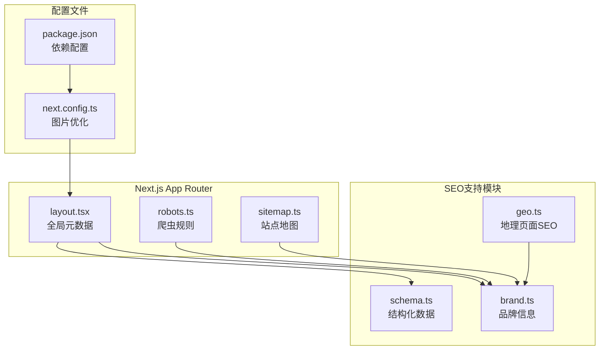
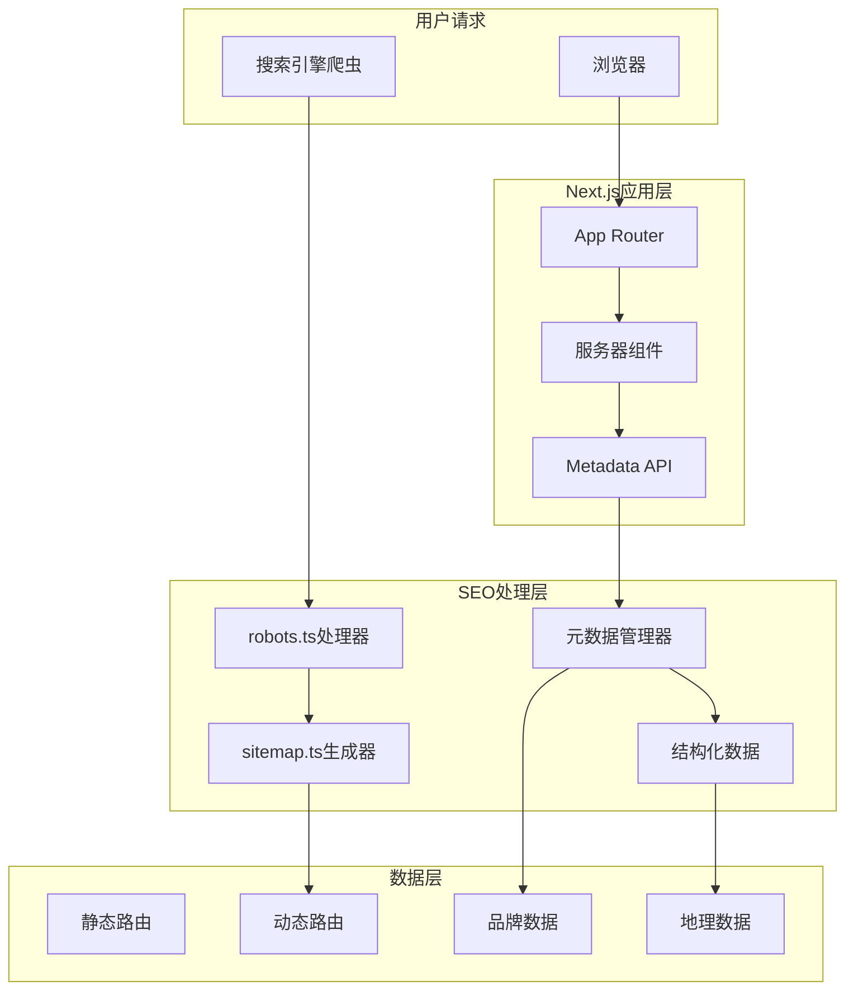
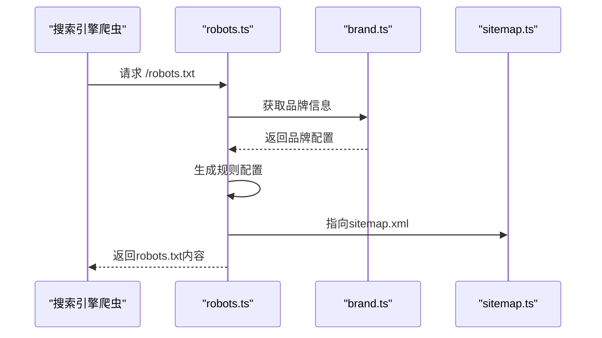
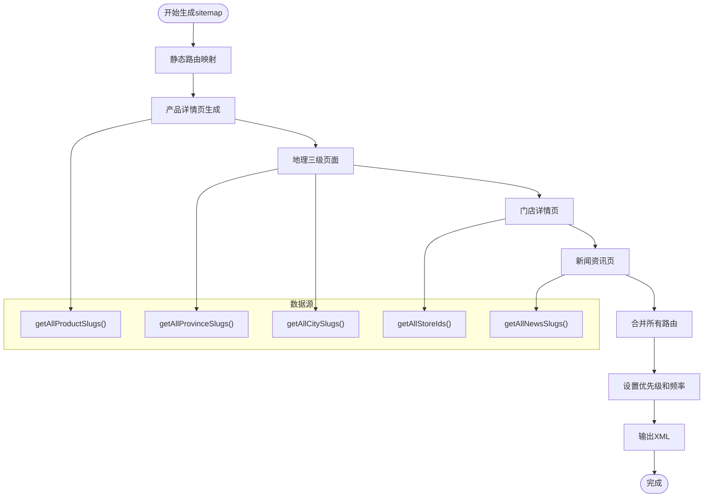
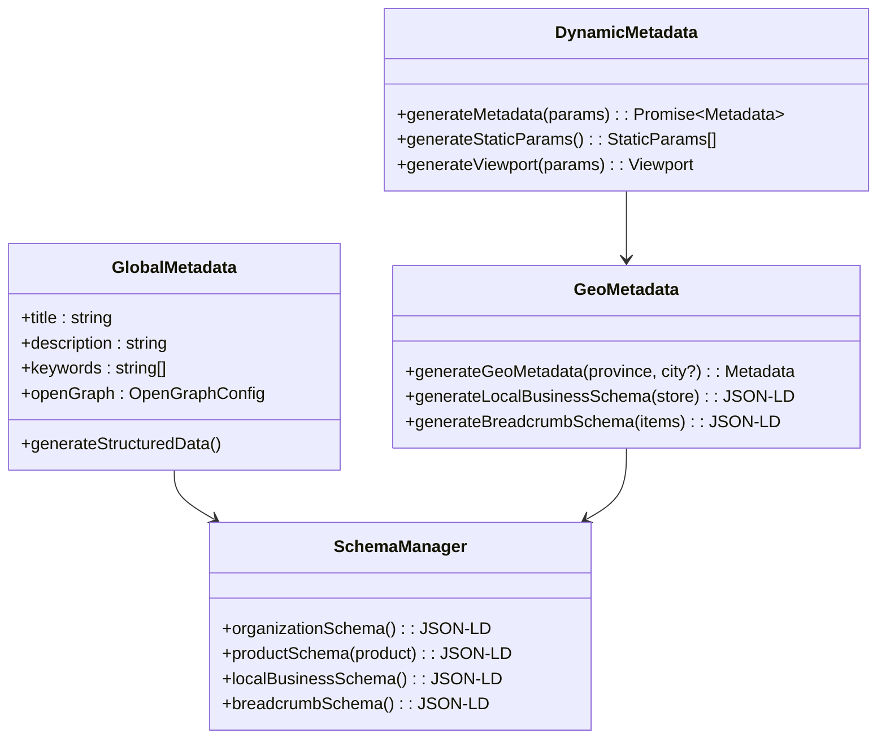
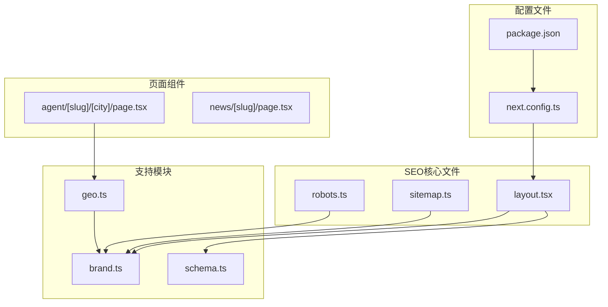

# SEO优化

<cite>
**本文档引用的文件**
- [robots.ts](file://src/app/robots.ts)
- [sitemap.ts](file://src/app/sitemap.ts)
- [layout.tsx](file://src/app/layout.tsx)
- [schema.ts](file://src/lib/schema.ts)
- [geo.ts](file://src/lib/geo.ts)
- [brand.ts](file://src/lib/brand.ts)
- [next.config.ts](file://next.config.ts)
- [package.json](file://package.json)
- [agent/[slug]/[city]/page.tsx](file://src/app/agent/[slug]/[city]/page.tsx)
- [news/[slug]/page.tsx](file://src/app/news/[slug]/page.tsx)
- [metadata.md](file://.claude/skills/next-best-practices/metadata.md)
- [MOXIAOER_TECH_ANALYSIS.md](file://docs/research/MOXIAOER_TECH_ANALYSIS.md)
</cite>

## 目录
1. [简介](#简介)
2. [项目结构](#项目结构)
3. [核心组件](#核心组件)
4. [架构概览](#架构概览)
5. [详细组件分析](#详细组件分析)
6. [依赖关系分析](#依赖关系分析)
7. [性能考虑](#性能考虑)
8. [故障排除指南](#故障排除指南)
9. [结论](#结论)
10. [附录](#附录)

## 简介
本文件针对蓝辉轻改网站的Next.js应用进行全面的SEO优化文档编制。内容涵盖robots.txt配置、sitemap.xml动态生成、元数据管理、结构化数据Schema.org、Open Graph与Twitter Cards配置、搜索引擎索引优化、爬虫友好最佳实践，以及移动端SEO和AMP页面配置方法。通过分析现有代码库中的实现，提供可操作的配置策略和最佳实践。

## 项目结构
蓝辉轻改网站采用Next.js App Router架构，SEO相关的核心文件主要位于以下位置：
- 应用级元数据：src/app/layout.tsx
- 爬虫规则：src/app/robots.ts
- 站点地图：src/app/sitemap.ts
- 结构化数据：src/lib/schema.ts
- 地理页面SEO：src/lib/geo.ts
- 品牌信息：src/lib/brand.ts
- 图片优化配置：next.config.ts



**图表来源**
- [layout.tsx:1-39](file://src/app/layout.tsx#L1-L39)
- [robots.ts:1-17](file://src/app/robots.ts#L1-L17)
- [sitemap.ts:1-128](file://src/app/sitemap.ts#L1-L128)
- [schema.ts:1-70](file://src/lib/schema.ts#L1-L70)
- [geo.ts:1-100](file://src/lib/geo.ts#L1-L100)
- [brand.ts:1-28](file://src/lib/brand.ts#L1-L28)
- [next.config.ts:1-14](file://next.config.ts#L1-L14)
- [package.json:1-60](file://package.json#L1-L60)

**章节来源**
- [layout.tsx:1-39](file://src/app/layout.tsx#L1-L39)
- [robots.ts:1-17](file://src/app/robots.ts#L1-L17)
- [sitemap.ts:1-128](file://src/app/sitemap.ts#L1-L128)
- [schema.ts:1-70](file://src/lib/schema.ts#L1-L70)
- [geo.ts:1-100](file://src/lib/geo.ts#L1-L100)
- [brand.ts:1-28](file://src/lib/brand.ts#L1-L28)
- [next.config.ts:1-14](file://next.config.ts#L1-L14)
- [package.json:1-60](file://package.json#L1-L60)

## 核心组件
本节深入分析SEO优化的关键组件及其配置策略：

### 全局元数据管理
项目在根布局中集中管理全局SEO元数据，包括：
- 页面标题和描述的静态配置
- 关键词设置
- Open Graph协议配置
- 结构化数据的JSON-LD嵌入

### 爬虫规则配置
robots.ts实现了标准的爬虫访问控制：
- 全局允许所有路径
- 明确禁止API端点访问
- 自动指向sitemap.xml
- 指定主域名

### 站点地图生成
sitemap.ts采用动态生成策略：
- 静态路由映射
- 产品详情页动态生成
- 地理三级页面结构
- 门店详情页生成
- 新闻资讯页生成
- 统一的lastModified和优先级设置

**章节来源**
- [layout.tsx:5-18](file://src/app/layout.tsx#L5-L18)
- [robots.ts:4-16](file://src/app/robots.ts#L4-L16)
- [sitemap.ts:17-123](file://src/app/sitemap.ts#L17-L123)

## 架构概览
蓝辉轻改网站的SEO架构采用分层设计，确保搜索引擎优化的全面性和可维护性：



**图表来源**
- [layout.tsx:20-38](file://src/app/layout.tsx#L20-L38)
- [robots.ts:4-16](file://src/app/robots.ts#L4-L16)
- [sitemap.ts:17-123](file://src/app/sitemap.ts#L17-L123)
- [schema.ts:12-38](file://src/lib/schema.ts#L12-L38)

## 详细组件分析

### robots.txt配置策略
项目采用动态robots.ts文件而非静态robots.txt，提供更灵活的配置能力：



**图表来源**
- [robots.ts:4-16](file://src/app/robots.ts#L4-L16)
- [brand.ts:8-25](file://src/lib/brand.ts#L8-L25)

配置特点：
- 使用通配符userAgent: "*"允许所有爬虫访问
- 明确禁止"/api/"路径访问
- 动态生成sitemap链接
- 主域名指定

**章节来源**
- [robots.ts:1-17](file://src/app/robots.ts#L1-L17)
- [brand.ts:1-28](file://src/lib/brand.ts#L1-L28)

### sitemap.xml动态生成机制
sitemap.ts实现了完整的动态站点地图生成，涵盖所有页面类型：



**图表来源**
- [sitemap.ts:17-123](file://src/app/sitemap.ts#L17-L123)

动态生成策略：
- 静态路由：首页、产品页、品牌页、新闻页、联系页
- 动态路由：产品详情、省份页、城市页、门店详情、新闻详情
- 优先级设置：1.0(首页)到0.5(资讯详情)
- 更新频率：weekly到yearly不等

**章节来源**
- [sitemap.ts:1-128](file://src/app/sitemap.ts#L1-L128)

### 元数据管理系统
项目采用多层次的元数据管理策略：

#### 全局元数据（根布局）
在layout.tsx中定义全局SEO元数据：
- 标题模板：包含品牌名称
- 描述：涵盖核心业务范围
- 关键词：包含品牌名和主要服务
- Open Graph：设置locale和类型

#### 动态元数据（页面级别）
特定页面使用generateMetadata函数实现动态SEO：
- 地理页面：根据省市区动态生成标题和描述
- 新闻详情：基于文章内容生成元数据
- 产品详情：结合产品特性和品牌信息



**图表来源**
- [layout.tsx:5-18](file://src/app/layout.tsx#L5-L18)
- [geo.ts:18-41](file://src/lib/geo.ts#L18-L41)
- [schema.ts:12-63](file://src/lib/schema.ts#L12-L63)

**章节来源**
- [layout.tsx:1-39](file://src/app/layout.tsx#L1-L39)
- [geo.ts:1-100](file://src/lib/geo.ts#L1-L100)
- [schema.ts:1-70](file://src/lib/schema.ts#L1-L70)

### 结构化数据（Schema.org）实现
项目实现了完整的Schema.org结构化数据体系：

#### 组织架构数据
在根布局中嵌入Organization Schema：
- 基础组织信息：名称、备用名称、URL
- 联系方式：电话、客服类型
- 地址信息：街道地址、国家
- 动态Logo路径

#### 产品页面数据
Product Schema包含：
- 产品基本信息：名称、描述、类别
- URL链接：指向具体产品页
- 品牌和制造商信息

#### 本地商业数据
LocalBusiness Schema用于门店页面：
- 商业实体信息：名称、描述、地址
- 联系信息：电话、营业时间
- 位置信息：经纬度坐标
- 父组织关联

```mermaid
erDiagram
ORGANIZATION {
string "@context"
string "@type"
string name
string alternateName
string url
string logo
string description
}
PRODUCT {
string "@context"
string "@type"
string name
string description
string category
string url
}
LOCAL_BUSINESS {
string "@context"
string "@type"
string name
string description
string telephone
string openingHours
string url
}
BREADCRUMB_LIST {
string "@context"
string "@type"
int position
string name
string item
}
ORGANIZATION ||--o{ PRODUCT : "包含"
ORGANIZATION ||--o{ LOCAL_BUSINESS : "拥有"
ORGANIZATION ||--o{ BREADCRUMB_LIST : "生成"
```

**图表来源**
- [schema.ts:12-38](file://src/lib/schema.ts#L12-L38)
- [schema.ts:41-63](file://src/lib/schema.ts#L41-L63)
- [geo.ts:44-78](file://src/lib/geo.ts#L44-L78)

**章节来源**
- [schema.ts:1-70](file://src/lib/schema.ts#L1-L70)
- [geo.ts:1-100](file://src/lib/geo.ts#L1-L100)

### Open Graph和Twitter Cards配置
项目采用统一的社交媒体元数据配置：

#### Open Graph配置
- 标题：继承全局标题设置
- 描述：提供页面摘要
- 语言：zh_CN（简体中文）
- 类型：website

#### Twitter Cards配置
- Twitter自动继承Open Graph设置
- 单一OG图像同时支持Facebook和Twitter
- 静态图像文件作为默认社交分享图

**章节来源**
- [layout.tsx:11-17](file://src/app/layout.tsx#L11-L17)

### 动态元数据生成最佳实践
项目展示了不同页面类型的动态元数据生成策略：

#### 地理页面元数据
根据省市区层级动态生成：
- 城市页面：包含城市名称和门店数量
- 省份页面：覆盖范围和服务概述
- 关键词：包含品牌名和地域标识

#### 新闻详情页元数据
基于文章内容动态生成：
- 标题：包含文章标题和品牌标识
- 描述：使用文章摘要
- 动态内容：避免重复索引问题

**章节来源**
- [agent/[slug]/[city]/page.tsx:24-36](file://src/app/agent/[slug]/[city]/page.tsx#L24-L36)
- [news/[slug]/page.tsx:13-25](file://src/app/news/[slug]/page.tsx#L13-L25)

## 依赖关系分析



**图表来源**
- [robots.ts:2](file://src/app/robots.ts#L2)
- [sitemap.ts:2-10](file://src/app/sitemap.ts#L2-L10)
- [layout.tsx:2](file://src/app/layout.tsx#L2)
- [schema.ts:7](file://src/lib/schema.ts#L7)
- [geo.ts:13](file://src/lib/geo.ts#L13)
- [brand.ts:8](file://src/lib/brand.ts#L8)

**章节来源**
- [robots.ts:1-17](file://src/app/robots.ts#L1-L17)
- [sitemap.ts:1-128](file://src/app/sitemap.ts#L1-L128)
- [layout.tsx:1-39](file://src/app/layout.tsx#L1-L39)
- [schema.ts:1-70](file://src/lib/schema.ts#L1-L70)
- [geo.ts:1-100](file://src/lib/geo.ts#L1-L100)
- [brand.ts:1-28](file://src/lib/brand.ts#L1-L28)
- [next.config.ts:1-14](file://next.config.ts#L1-L14)
- [package.json:1-60](file://package.json#L1-L60)

## 性能考虑
项目在SEO优化的同时注重性能表现：

### 图片优化配置
next.config.ts配置了全面的图片优化策略：
- 支持现代格式：AVIF和WebP
- 多设备断点：从640到3840像素
- 缓存策略：30天最小缓存时间
- 质量控制：75%压缩质量

### 站点地图性能优化
sitemap.ts采用高效的数据生成策略：
- 批量映射操作减少循环开销
- 统一的时间戳避免频繁计算
- 分块生成避免内存溢出

**章节来源**
- [next.config.ts:5-10](file://next.config.ts#L5-L10)
- [sitemap.ts:14-15](file://src/app/sitemap.ts#L14-L15)

## 故障排除指南

### 常见SEO问题诊断
1. **robots.txt访问问题**
   - 检查robots.ts导出函数是否正确
   - 验证品牌配置是否有效
   - 确认sitemap链接指向正确

2. **站点地图生成错误**
   - 验证所有slug生成函数正常工作
   - 检查数据源可用性
   - 确认URL格式一致性

3. **元数据冲突**
   - 检查全局元数据与页面元数据优先级
   - 验证动态元数据生成逻辑
   - 确认结构化数据格式正确

### 性能监控指标
- **首屏加载时间**：< 600ms（参考蓝辉目标）
- **CSS体积**：< 10KB
- **JS体积**：< 150KB
- **并发请求数**：< 25
- **图片总体积**：< 80KB

**章节来源**
- [MOXIAOER_TECH_ANALYSIS.md:287-297](file://docs/research/MOXIAOER_TECH_ANALYSIS.md#L287-L297)

## 结论
蓝辉轻改网站的SEO优化方案体现了现代Next.js应用的最佳实践。通过动态robots配置、完整的sitemap生成、多层次元数据管理和丰富的结构化数据，实现了全面的搜索引擎优化。项目在保证功能完整性的同时，注重性能优化和可维护性，为类似的企业网站提供了可复制的SEO解决方案。

## 附录

### SEO配置检查清单
- [ ] robots.ts配置验证
- [ ] sitemap.ts生成测试
- [ ] 元数据动态生成验证
- [ ] 结构化数据完整性检查
- [ ] Open Graph图像配置
- [ ] 图片优化配置确认

### 参考文档
- Next.js Metadata API官方文档
- Schema.org结构化数据规范
- Google Search Console使用指南
- 百度站长平台配置说明