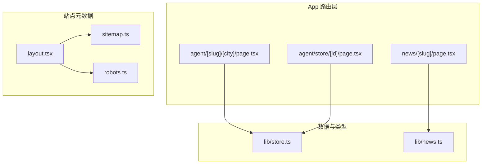
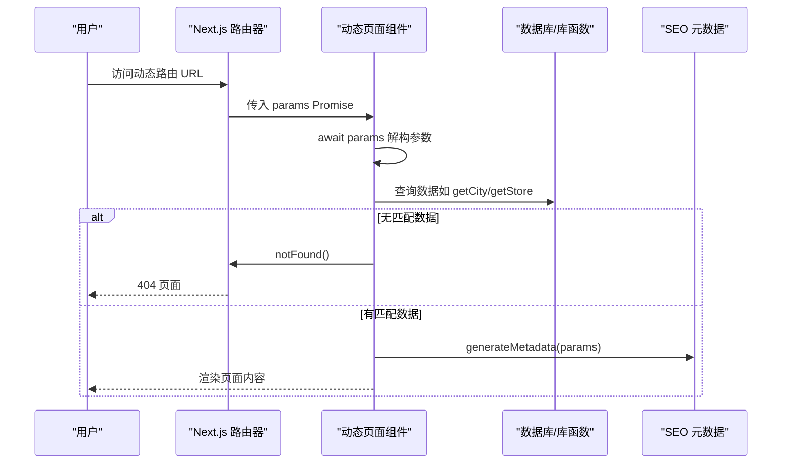
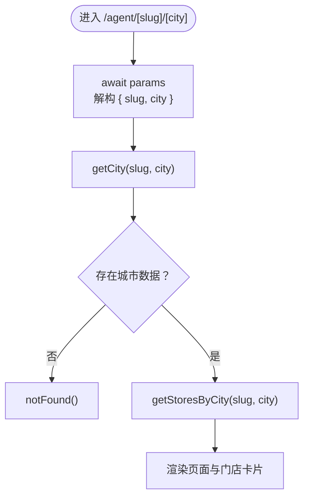
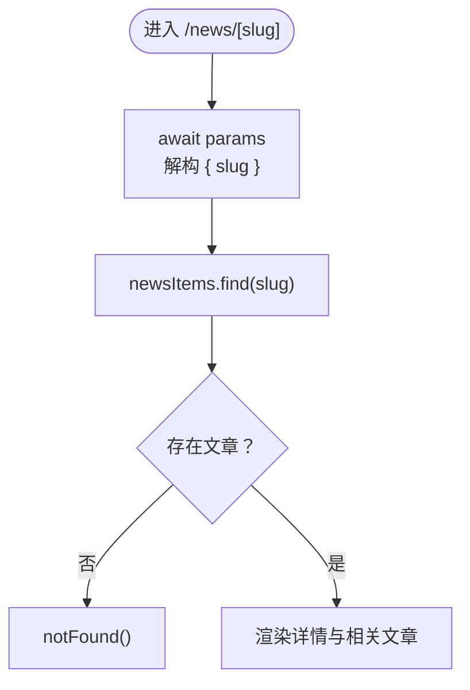
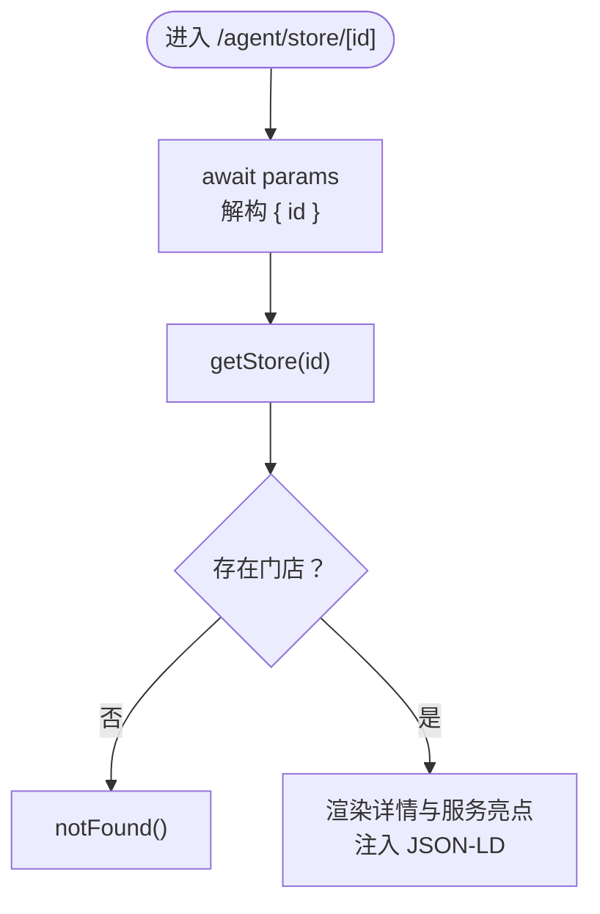
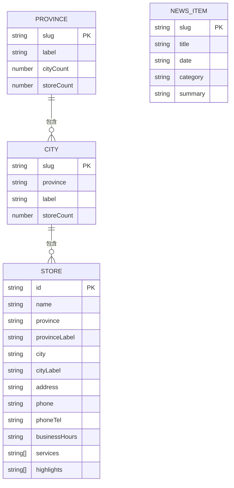
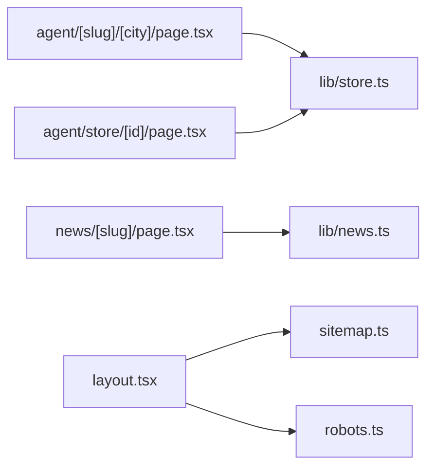

# 动态路由

<cite>
**本文引用的文件**
- [src/app/agent/[slug]/[city]/page.tsx](file://src/app/agent/[slug]/[city]/page.tsx)
- [src/app/news/[slug]/page.tsx](file://src/app/news/[slug]/page.tsx)
- [src/app/agent/store/[id]/page.tsx](file://src/app/agent/store/[id]/page.tsx)
- [src/lib/store.ts](file://src/lib/store.ts)
- [src/lib/news.ts](file://src/lib/news.ts)
- [src/app/layout.tsx](file://src/app/layout.tsx)
- [src/app/page.tsx](file://src/app/page.tsx)
- [next.config.ts](file://next.config.ts)
- [src/app/sitemap.ts](file://src/app/sitemap.ts)
- [src/app/robots.ts](file://src/app/robots.ts)
</cite>

## 目录
1. [简介](#简介)
2. [项目结构](#项目结构)
3. [核心组件](#核心组件)
4. [架构总览](#架构总览)
5. [详细组件分析](#详细组件分析)
6. [依赖关系分析](#依赖关系分析)
7. [性能考量](#性能考量)
8. [故障排查指南](#故障排查指南)
9. [结论](#结论)
10. [附录](#附录)

## 简介
本文件系统性梳理蓝辉轻改网站基于 Next.js App Router 的动态路由实现，重点覆盖：
- 使用方括号[]定义动态段的规则与最佳实践
- 参数提取机制（params Promise 解构、类型安全）
- 多级动态路由配置（如代理商页面的 slug 与 city 组合）
- 动态路由与静态路由的区别及适用场景
- 参数校验、默认值、错误处理（notFound）与 SEO 元数据生成
- 在产品详情、新闻文章、代理商信息等页面的实际应用
- 性能优化策略与缓存机制

## 项目结构
本项目采用 Next.js App Router 的约定式路由，动态路由通过文件夹名中的方括号[]声明动态段。关键目录与文件如下：
- 代理商页面：src/app/agent/[slug]/[city]/page.tsx
- 新闻详情页：src/app/news/[slug]/page.tsx
- 门店详情页：src/app/agent/store/[id]/page.tsx
- 数据与类型：src/lib/store.ts、src/lib/news.ts
- 站点元数据与根布局：src/app/layout.tsx、src/app/sitemap.ts、src/app/robots.ts
- 根页面：src/app/page.tsx
- Next 配置：next.config.ts

图表来源
- [src/app/agent/[slug]/[city]/page.tsx](file://src/app/agent/[slug]/[city]/page.tsx#L1-L136)
- [src/app/news/[slug]/page.tsx](file://src/app/news/[slug]/page.tsx#L1-L181)
- [src/app/agent/store/[id]/page.tsx](file://src/app/agent/store/[id]/page.tsx#L1-L247)
- [src/lib/store.ts:1-122](file://src/lib/store.ts#L1-L122)
- [src/lib/news.ts:1-46](file://src/lib/news.ts#L1-L46)
- [src/app/layout.tsx:1-39](file://src/app/layout.tsx#L1-L39)
- [src/app/sitemap.ts:69-127](file://src/app/sitemap.ts#L69-L127)
- [src/app/robots.ts:1-17](file://src/app/robots.ts#L1-L17)

章节来源
- [src/app/agent/[slug]/[city]/page.tsx](file://src/app/agent/[slug]/[city]/page.tsx#L1-L136)
- [src/app/news/[slug]/page.tsx](file://src/app/news/[slug]/page.tsx#L1-L181)
- [src/app/agent/store/[id]/page.tsx](file://src/app/agent/store/[id]/page.tsx#L1-L247)
- [src/lib/store.ts:1-122](file://src/lib/store.ts#L1-L122)
- [src/lib/news.ts:1-46](file://src/lib/news.ts#L1-L46)
- [src/app/layout.tsx:1-39](file://src/app/layout.tsx#L1-L39)
- [src/app/sitemap.ts:69-127](file://src/app/sitemap.ts#L69-L127)
- [src/app/robots.ts:1-17](file://src/app/robots.ts#L1-L17)

## 核心组件
- 动态路由页面均采用 Server Component，并通过 generateStaticParams 预渲染静态参数集合，提升首屏性能与 SEO 友好度。
- 参数提取统一通过解构 params Promise（Next 15+），并在函数体内部 await 获取实际值，确保类型安全与运行时正确性。
- 错误处理统一使用 notFound()，当无法匹配到有效数据时返回 404。
- SEO 元数据通过 generateMetadata 动态生成，结合页面标题、描述与面包屑结构化数据，提升搜索引擎可见性。

章节来源
- [src/app/agent/[slug]/[city]/page.tsx](file://src/app/agent/[slug]/[city]/page.tsx#L14-L36)
- [src/app/news/[slug]/page.tsx](file://src/app/news/[slug]/page.tsx#L9-L25)
- [src/app/agent/store/[id]/page.tsx](file://src/app/agent/store/[id]/page.tsx#L17-L33)

## 架构总览
动态路由在本项目中的工作流：
- 用户访问动态路由（如 /agent/guangdong/foshan-shunde 或 /news/brand-website-prep 或 /agent/store/shunde-daliang）
- Next.js 将 URL 中的动态段映射为 params 对象（Promise<{ ... }>)
- 页面组件 await params，解构出所需参数（如 slug、city、id）
- 页面调用对应库函数（如 getCity、getAllCitySlugs、getStore）进行数据查询
- 若无匹配数据，调用 notFound() 返回 404；否则渲染页面内容
- 同步生成 SEO 元数据（generateMetadata）与结构化数据（JSON-LD）

图表来源
- [src/app/agent/[slug]/[city]/page.tsx](file://src/app/agent/[slug]/[city]/page.tsx#L38-L46)
- [src/app/news/[slug]/page.tsx](file://src/app/news/[slug]/page.tsx#L27-L34)
- [src/app/agent/store/[id]/page.tsx](file://src/app/agent/store/[id]/page.tsx#L35-L42)

## 详细组件分析

### 代理商城市页：agent/[slug]/[city]
- 动态段：slug（省份拼音缩写）、city（城市拼音缩写）
- 静态预渲染：generateStaticParams 遍历所有省份与城市的 slug 组合，生成静态页面
- 参数提取：await params 解构出 { slug, city }
- 数据查询：getCity、getStoresByCity
- 错误处理：若 cityData 不存在，notFound()
- SEO：generateMetadata 动态生成标题与描述
- 导航：面包屑从“门店服务 -> 省份 -> 城市”逐级跳转

图表来源
- [src/app/agent/[slug]/[city]/page.tsx](file://src/app/agent/[slug]/[city]/page.tsx#L38-L46)
- [src/lib/store.ts:99-105](file://src/lib/store.ts#L99-L105)

章节来源
- [src/app/agent/[slug]/[city]/page.tsx](file://src/app/agent/[slug]/[city]/page.tsx#L14-L46)
- [src/lib/store.ts:99-105](file://src/lib/store.ts#L99-L105)

### 新闻详情页：news/[slug]
- 动态段：slug（文章唯一标识）
- 静态预渲染：generateStaticParams 基于 getAllNewsSlugs 生成静态页面
- 参数提取：await params 解构出 { slug }
- 数据查询：newsItems.find(n => n.slug === slug)
- 错误处理：若未找到文章，notFound()
- SEO：generateMetadata 动态生成标题与摘要
- 相关文章：同分类下排除自身取前若干条

图表来源
- [src/app/news/[slug]/page.tsx](file://src/app/news/[slug]/page.tsx#L27-L34)
- [src/lib/news.ts:16-41](file://src/lib/news.ts#L16-L41)

章节来源
- [src/app/news/[slug]/page.tsx](file://src/app/news/[slug]/page.tsx#L9-L34)
- [src/lib/news.ts:1-46](file://src/lib/news.ts#L1-L46)

### 门店详情页：agent/store/[id]
- 动态段：id（门店唯一标识）
- 静态预渲染：generateStaticParams 基于 getAllStoreIds 生成静态页面
- 参数提取：await params 解构出 { id }
- 数据查询：getStore
- 错误处理：若未找到门店，notFound()
- SEO：generateMetadata 动态生成标题与描述
- 结构化数据：生成 LocalBusiness Schema 与面包屑 Schema，提升搜索体验

图表来源
- [src/app/agent/store/[id]/page.tsx](file://src/app/agent/store/[id]/page.tsx#L35-L42)
- [src/lib/store.ts:91-93](file://src/lib/store.ts#L91-L93)

章节来源
- [src/app/agent/store/[id]/page.tsx](file://src/app/agent/store/[id]/page.tsx#L17-L42)
- [src/lib/store.ts:1-122](file://src/lib/store.ts#L1-L122)

### 数据模型与库函数
- 门店数据模型 Store：包含 id、省市区 slug 与标签、地址、电话、服务、亮点等字段
- 城市与省份数据：提供 getCity、getStoresByCity、getAllCitySlugs 等查询函数
- 新闻数据模型 NewsItem：包含 slug、标题、日期、分类、摘要
- 工具函数：getAllStoreIds、getAllProvinceSlugs、getAllNewsSlugs

图表来源
- [src/lib/store.ts:8-26](file://src/lib/store.ts#L8-L26)
- [src/lib/store.ts:59-89](file://src/lib/store.ts#L59-L89)
- [src/lib/store.ts:91-121](file://src/lib/store.ts#L91-L121)
- [src/lib/news.ts:8-14](file://src/lib/news.ts#L8-L14)

章节来源
- [src/lib/store.ts:1-122](file://src/lib/store.ts#L1-L122)
- [src/lib/news.ts:1-46](file://src/lib/news.ts#L1-L46)

## 依赖关系分析
- 页面组件依赖对应的库函数进行数据查询，库函数负责对内存数组进行过滤与查找
- generateStaticParams 与库函数配合，确保静态预渲染的参数集合完整且准确
- generateMetadata 依赖页面参数与库函数返回的数据，动态生成 SEO 元信息
- 根布局与 sitemap/robots 文件共同维护站点整体 SEO 与爬虫行为

图表来源
- [src/app/agent/[slug]/[city]/page.tsx](file://src/app/agent/[slug]/[city]/page.tsx#L6-L12)
- [src/app/news/[slug]/page.tsx](file://src/app/news/[slug]/page.tsx#L7)
- [src/app/agent/store/[id]/page.tsx](file://src/app/agent/store/[id]/page.tsx#L14-L15)
- [src/app/layout.tsx:1-39](file://src/app/layout.tsx#L1-L39)
- [src/app/sitemap.ts:69-127](file://src/app/sitemap.ts#L69-L127)
- [src/app/robots.ts:1-17](file://src/app/robots.ts#L1-L17)

章节来源
- [src/app/agent/[slug]/[city]/page.tsx](file://src/app/agent/[slug]/[city]/page.tsx#L1-L136)
- [src/app/news/[slug]/page.tsx](file://src/app/news/[slug]/page.tsx#L1-L181)
- [src/app/agent/store/[id]/page.tsx](file://src/app/agent/store/[id]/page.tsx#L1-L247)
- [src/lib/store.ts:1-122](file://src/lib/store.ts#L1-L122)
- [src/lib/news.ts:1-46](file://src/lib/news.ts#L1-L46)
- [src/app/layout.tsx:1-39](file://src/app/layout.tsx#L1-L39)
- [src/app/sitemap.ts:69-127](file://src/app/sitemap.ts#L69-L127)
- [src/app/robots.ts:1-17](file://src/app/robots.ts#L1-L17)

## 性能考量
- 静态预渲染（SSG）：通过 generateStaticParams 生成静态页面，减少运行时查询与首屏等待
- 缓存策略：图片缓存最小 TTL 设置为 30 天，降低带宽与服务器压力
- 结构化数据：注入 JSON-LD，提升搜索点击率与索引质量
- 站点地图：按动态路由生成 sitemap，帮助搜索引擎抓取与索引

章节来源
- [src/app/agent/[slug]/[city]/page.tsx](file://src/app/agent/[slug]/[city]/page.tsx#L14-L22)
- [src/app/news/[slug]/page.tsx](file://src/app/news/[slug]/page.tsx#L9-L11)
- [src/app/agent/store/[id]/page.tsx](file://src/app/agent/store/[id]/page.tsx#L17-L19)
- [next.config.ts](file://next.config.ts#L9)
- [src/app/sitemap.ts:69-127](file://src/app/sitemap.ts#L69-L127)

## 故障排查指南
- 参数类型错误：Next 15+ 中 params 为 Promise，需 await 后再解构；否则会出现类型不匹配或运行时错误
- 404 场景：当数据查询结果为空时，务必调用 notFound()，避免返回空页面
- SEO 元数据：generateMetadata 必须在 Server Component 中使用，且仅在 Server Component 生效
- 站点地图与 robots：确保 sitemap 与 robots 正确指向，避免被搜索引擎屏蔽

章节来源
- [src/app/agent/[slug]/[city]/page.tsx](file://src/app/agent/[slug]/[city]/page.tsx#L24-L36)
- [src/app/news/[slug]/page.tsx](file://src/app/news/[slug]/page.tsx#L13-L25)
- [src/app/agent/store/[id]/page.tsx](file://src/app/agent/store/[id]/page.tsx#L21-L33)
- [src/app/robots.ts:1-17](file://src/app/robots.ts#L1-L17)

## 结论
本项目通过规范化的动态路由设计，结合 generateStaticParams、generateMetadata、notFound 与结构化数据，实现了高性能、可维护、SEO 友好的页面体系。多级动态路由（如代理商城市页）与单级动态路由（如新闻详情、门店详情）分别适用于不同场景：前者适合层级化导航与地域化聚合，后者适合内容型详情页。建议在新增动态路由时遵循本文的参数提取、错误处理与 SEO 最佳实践，确保一致性与可扩展性。

## 附录
- 动态路由与静态路由区别（概念性说明）
  - 动态路由：基于 URL 片段的参数化页面，适合内容型详情页与聚合页
  - 静态路由：固定路径页面，适合首页、静态页面与无需参数的页面
  - 选择建议：内容型详情页优先使用动态路由；聚合页可考虑静态路由 + 动态子路由组合