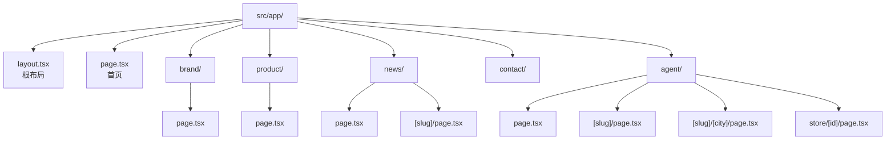
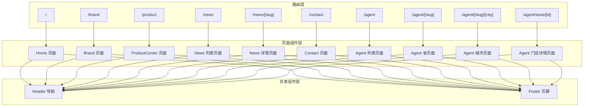
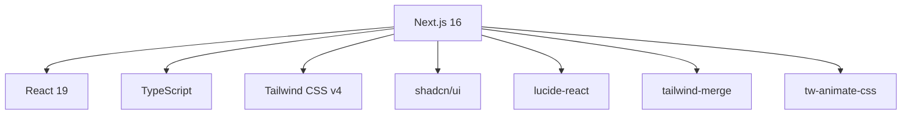

# 文件系统路由

<cite>
**本文档引用的文件**
- [src/app/layout.tsx](file://src/app/layout.tsx)
- [src/app/page.tsx](file://src/app/page.tsx)
- [src/app/brand/page.tsx](file://src/app/brand/page.tsx)
- [src/app/product/page.tsx](file://src/app/product/page.tsx)
- [src/app/news/page.tsx](file://src/app/news/page.tsx)
- [src/app/news/[slug]/page.tsx](file://src/app/news/[slug]/page.tsx)
- [src/app/contact/page.tsx](file://src/app/contact/page.tsx)
- [src/app/agent/page.tsx](file://src/app/agent/page.tsx)
- [src/app/agent/[slug]/page.tsx](file://src/app/agent/[slug]/page.tsx)
- [src/app/agent/[slug]/[city]/page.tsx](file://src/app/agent/[slug]/[city]/page.tsx)
- [src/app/agent/store/[id]/page.tsx](file://src/app/agent/store/[id]/page.tsx)
- [src/app/robots.ts](file://src/app/robots.ts)
- [src/app/sitemap.ts](file://src/app/sitemap.ts)
- [src/components/Header.tsx](file://src/components/Header.tsx)
- [src/components/Footer.tsx](file://src/components/Footer.tsx)
- [src/lib/brand.ts](file://src/lib/brand.ts)
- [src/lib/products.ts](file://src/lib/products.ts)
- [src/app/globals.css](file://src/app/globals.css)
- [package.json](file://package.json)
- [next.config.ts](file://next.config.ts)
</cite>

## 目录
1. [引言](#引言)
2. [项目结构](#项目结构)
3. [核心组件](#核心组件)
4. [架构总览](#架构总览)
5. [详细组件分析](#详细组件分析)
6. [依赖分析](#依赖分析)
7. [性能考量](#性能考量)
8. [故障排除指南](#故障排除指南)
9. [结论](#结论)
10. [附录](#附录)

## 引言
本文件系统路由文档聚焦于蓝辉轻改网站基于 Next.js 16 App Router 的文件系统路由机制，系统性阐述如何通过目录结构自动生成路由、根布局（RootLayout）的作用与配置方法、页面组件组织结构（首页、品牌介绍、产品展示、新闻资讯、联系信息、门店服务等）、路由层级与嵌套规则（含动态路由参数与多级目录组合）、命名规范与最佳实践，并提供实际代码示例路径以便快速定位实现。

## 项目结构
Next.js 16 App Router 将 src/app 下的目录结构直接映射为应用路由。每个页面由该目录下的 page.tsx 或 route.ts 文件定义，子目录形成嵌套路由。公共元数据与全局样式通过根布局与全局 CSS 统一管理。

图表来源
- [src/app/layout.tsx](file://src/app/layout.tsx)
- [src/app/page.tsx](file://src/app/page.tsx)
- [src/app/brand/page.tsx](file://src/app/brand/page.tsx)
- [src/app/product/page.tsx](file://src/app/product/page.tsx)
- [src/app/news/page.tsx](file://src/app/news/page.tsx)
- [src/app/news/[slug]/page.tsx](file://src/app/news/[slug]/page.tsx)
- [src/app/agent/page.tsx](file://src/app/agent/page.tsx)
- [src/app/agent/[slug]/page.tsx](file://src/app/agent/[slug]/page.tsx)
- [src/app/agent/[slug]/[city]/page.tsx](file://src/app/agent/[slug]/[city]/page.tsx)
- [src/app/agent/store/[id]/page.tsx](file://src/app/agent/store/[id]/page.tsx)

章节来源
- [src/app/layout.tsx](file://src/app/layout.tsx)
- [src/app/page.tsx](file://src/app/page.tsx)
- [src/app/brand/page.tsx](file://src/app/brand/page.tsx)
- [src/app/product/page.tsx](file://src/app/product/page.tsx)
- [src/app/news/page.tsx](file://src/app/news/page.tsx)
- [src/app/news/[slug]/page.tsx](file://src/app/news/[slug]/page.tsx)
- [src/app/agent/page.tsx](file://src/app/agent/page.tsx)
- [src/app/agent/[slug]/page.tsx](file://src/app/agent/[slug]/page.tsx)
- [src/app/agent/[slug]/[city]/page.tsx](file://src/app/agent/[slug]/[city]/page.tsx)
- [src/app/agent/store/[id]/page.tsx](file://src/app/agent/store/[id]/page.tsx)

## 核心组件
- 根布局（RootLayout）
  - 作用：统一设置站点元数据、全局样式、语言与主题类名；作为所有页面的父容器包裹 children。
  - 配置要点：在根布局中导入全局 CSS，设置 html 语言与主题类，包裹 body 结构。
  - 示例路径：[src/app/layout.tsx](file://src/app/layout.tsx)

- 全局样式
  - 作用：统一字体、颜色变量、暗色模式适配与基础层样式。
  - 配置要点：通过 globals.css 导入 Tailwind、动画与 shadcn 组件样式，定义 CSS 变量与暗色主题切换。
  - 示例路径：[src/app/globals.css](file://src/app/globals.css)

- 页面组件组织
  - 首页：聚合 Header、Hero、WhyChooseUs、CoreServices、ProductsQuickEntry、Footer。
  - 品牌介绍：品牌理念、发展历程与到店引导。
  - 产品中心：按“轻改装备”“汽车膜系”分组展示产品卡片。
  - 新闻资讯：列表页与详情页（动态路由）。
  - 联系信息：预约咨询表单与门店信息。
  - 门店服务：省市区筛选、门店列表与详情页（多级动态路由）。

章节来源
- [src/app/layout.tsx](file://src/app/layout.tsx)
- [src/app/globals.css](file://src/app/globals.css)
- [src/app/page.tsx](file://src/app/page.tsx)
- [src/components/Header.tsx](file://src/components/Header.tsx)
- [src/components/Footer.tsx](file://src/components/Footer.tsx)

## 架构总览
Next.js 16 App Router 通过文件系统自动生成路由，遵循“目录即路由”的约定。根布局负责全局结构与样式，各页面组件负责业务内容与交互。导航组件 Header 与 Footer 在多个页面复用，确保一致的用户体验。

图表来源
- [src/app/page.tsx](file://src/app/page.tsx)
- [src/app/brand/page.tsx](file://src/app/brand/page.tsx)
- [src/app/product/page.tsx](file://src/app/product/page.tsx)
- [src/app/news/page.tsx](file://src/app/news/page.tsx)
- [src/app/news/[slug]/page.tsx](file://src/app/news/[slug]/page.tsx)
- [src/app/contact/page.tsx](file://src/app/contact/page.tsx)
- [src/app/agent/page.tsx](file://src/app/agent/page.tsx)
- [src/app/agent/[slug]/page.tsx](file://src/app/agent/[slug]/page.tsx)
- [src/app/agent/[slug]/[city]/page.tsx](file://src/app/agent/[slug]/[city]/page.tsx)
- [src/app/agent/store/[id]/page.tsx](file://src/app/agent/store/[id]/page.tsx)
- [src/components/Header.tsx](file://src/components/Header.tsx)
- [src/components/Footer.tsx](file://src/components/Footer.tsx)

## 详细组件分析

### 根布局（RootLayout）
- 功能职责
  - 设置站点元数据（标题、描述、Open Graph 等）。
  - 导入全局样式文件，初始化暗色主题类名。
  - 包裹所有页面内容，提供统一的 html/body 结构。
- 关键实现
  - 元数据对象导出，供 Next.js 自动注入。
  - 返回包含 children 的 HTML 结构，设置语言与主题类。
- 示例路径
  - [src/app/layout.tsx](file://src/app/layout.tsx)
  - [src/app/globals.css](file://src/app/globals.css)

章节来源
- [src/app/layout.tsx](file://src/app/layout.tsx)
- [src/app/globals.css](file://src/app/globals.css)

### 首页（/）
- 组织结构
  - Header、Hero、WhyChooseUs、CoreServices、ProductsQuickEntry、Footer 顺序渲染。
- 路由生成
  - 通过 src/app/page.tsx 自动生成 / 路由。
- 示例路径
  - [src/app/page.tsx](file://src/app/page.tsx)
  - [src/components/Header.tsx](file://src/components/Header.tsx)
  - [src/components/Footer.tsx](file://src/components/Footer.tsx)

章节来源
- [src/app/page.tsx](file://src/app/page.tsx)
- [src/components/Header.tsx](file://src/components/Header.tsx)
- [src/components/Footer.tsx](file://src/components/Footer.tsx)

### 品牌介绍（/brand）
- 页面构成
  - Hero 区域、品牌介绍、品牌理念（三块价值观卡片）、发展历程、到店引导。
- 路由生成
  - 通过 src/app/brand/page.tsx 自动生成 /brand 路由。
- 示例路径
  - [src/app/brand/page.tsx](file://src/app/brand/page.tsx)

章节来源
- [src/app/brand/page.tsx](file://src/app/brand/page.tsx)

### 产品中心（/product）
- 页面构成
  - 按“轻改装备”“汽车膜系”分组展示产品卡片，点击进入对应产品详情页。
- 路由生成
  - 通过 src/app/product/page.tsx 自动生成 /product 路由。
- 产品数据
  - 产品清单与分组来自数据模块，用于动态渲染与导航。
- 示例路径
  - [src/app/product/page.tsx](file://src/app/product/page.tsx)
  - [src/lib/products.ts](file://src/lib/products.ts)

章节来源
- [src/app/product/page.tsx](file://src/app/product/page.tsx)
- [src/lib/products.ts](file://src/lib/products.ts)

### 新闻资讯（/news 与 /news/[slug]）
- 新闻列表（/news）
  - 展示新闻列表，包含日期、分类标签与摘要。
  - 路由生成：src/app/news/page.tsx。
- 新闻详情（/news/[slug]）
  - 动态路由参数 [slug]，支持静态生成参数与动态元数据。
  - 路由生成：src/app/news/[slug]/page.tsx。
- 示例路径
  - [src/app/news/page.tsx](file://src/app/news/page.tsx)
  - [src/app/news/[slug]/page.tsx](file://src/app/news/[slug]/page.tsx)

章节来源
- [src/app/news/page.tsx](file://src/app/news/page.tsx)
- [src/app/news/[slug]/page.tsx](file://src/app/news/[slug]/page.tsx)

### 联系信息（/contact）
- 页面构成
  - 预约咨询表单（使用 mailto 后端）、门店信息与沟通建议。
- 路由生成
  - 通过 src/app/contact/page.tsx 自动生成 /contact 路由。
- 示例路径
  - [src/app/contact/page.tsx](file://src/app/contact/page.tsx)

章节来源
- [src/app/contact/page.tsx](file://src/app/contact/page.tsx)

### 门店服务（/agent 及其多级动态路由）
- 代理/门店入口（/agent）
  - 展示省列表与当前开放门店，支持跳转到省/城市/门店详情。
  - 路由生成：src/app/agent/page.tsx。
- 省页面（/agent/[slug]）
  - 路由生成：src/app/agent/[slug]/page.tsx。
- 城市页面（/agent/[slug]/[city]）
  - 路由生成：src/app/agent/[slug]/[city]/page.tsx。
- 门店详情（/agent/store/[id]）
  - 路由生成：src/app/agent/store/[id]/page.tsx。
- 示例路径
  - [src/app/agent/page.tsx](file://src/app/agent/page.tsx)
  - [src/app/agent/[slug]/page.tsx](file://src/app/agent/[slug]/page.tsx)
  - [src/app/agent/[slug]/[city]/page.tsx](file://src/app/agent/[slug]/[city]/page.tsx)
  - [src/app/agent/store/[id]/page.tsx](file://src/app/agent/store/[id]/page.tsx)

章节来源
- [src/app/agent/page.tsx](file://src/app/agent/page.tsx)
- [src/app/agent/[slug]/page.tsx](file://src/app/agent/[slug]/page.tsx)
- [src/app/agent/[slug]/[city]/page.tsx](file://src/app/agent/[slug]/[city]/page.tsx)
- [src/app/agent/store/[id]/page.tsx](file://src/app/agent/store/[id]/page.tsx)

### 导航与页脚（Header 与 Footer）
- Header
  - 统一导航结构，支持桌面端下拉菜单与移动端抽屉菜单。
  - 使用路由前缀匹配与 usePathname 实现活动状态高亮。
  - 示例路径：[src/components/Header.tsx](file://src/components/Header.tsx)
- Footer
  - 快捷导航、产品中心链接、联系方式与版权信息。
  - 示例路径：[src/components/Footer.tsx](file://src/components/Footer.tsx)

章节来源
- [src/components/Header.tsx](file://src/components/Header.tsx)
- [src/components/Footer.tsx](file://src/components/Footer.tsx)

### SEO 与站点地图（robots 与 sitemap）
- robots
  - 控制爬虫访问规则与 sitemap 地址。
  - 示例路径：[src/app/robots.ts](file://src/app/robots.ts)
- sitemap
  - 静态路由 + 动态路由（产品、省、城市、门店、新闻）生成站点地图。
  - 示例路径：[src/app/sitemap.ts](file://src/app/sitemap.ts)

章节来源
- [src/app/robots.ts](file://src/app/robots.ts)
- [src/app/sitemap.ts](file://src/app/sitemap.ts)

## 依赖分析
- 项目技术栈
  - Next.js 16.2.1（App Router）、React 19、TypeScript、Tailwind CSS v4、shadcn/ui。
- 关键依赖
  - next、react、react-dom、lucide-react、tailwind-merge、tw-animate-css 等。
- 构建配置
  - 输出模式为 standalone，便于容器化部署。
- 示例路径
  - [package.json](file://package.json)
  - [next.config.ts](file://next.config.ts)

图表来源
- [package.json](file://package.json)
- [next.config.ts](file://next.config.ts)

章节来源
- [package.json](file://package.json)
- [next.config.ts](file://next.config.ts)

## 性能考量
- 静态生成与预渲染
  - 对于静态内容丰富的页面（如品牌介绍、产品中心），可结合静态生成减少运行时开销。
- 动态路由参数
  - 使用 generateStaticParams 为动态路由生成静态页面，提升 SEO 与首屏性能。
- 样式与主题
  - 全局样式一次性加载，暗色主题通过类名切换，避免重复计算。
- 资源优化
  - 图片资源位于 public/images，建议配合懒加载与合适的尺寸策略。

## 故障排除指南
- 动态路由 404 处理
  - 在新闻详情页中，若未找到对应 slug，调用 notFound 触发 404 页面。
  - 示例路径：[src/app/news/[slug]/page.tsx](file://src/app/news/[slug]/page.tsx)
- 路由前缀匹配
  - Header 中使用 matchPrefix 判断导航活动状态，确保多级路由下仍正确高亮。
  - 示例路径：[src/components/Header.tsx](file://src/components/Header.tsx)
- 元数据缺失兜底
  - 动态路由详情页在找不到内容时返回默认元数据，避免空标题或描述。
  - 示例路径：[src/app/news/[slug]/page.tsx](file://src/app/news/[slug]/page.tsx)

章节来源
- [src/app/news/[slug]/page.tsx](file://src/app/news/[slug]/page.tsx)
- [src/components/Header.tsx](file://src/components/Header.tsx)

## 结论
蓝辉轻改网站通过 Next.js 16 App Router 的文件系统路由机制，实现了清晰的目录即路由、根布局统一管理与页面组件的模块化组织。动态路由参数与多级嵌套满足了品牌、产品、新闻与门店服务的复杂业务需求。配合 Header/Footer 的跨页面复用、SEO 元数据与站点地图配置，整体具备良好的可维护性与扩展性。

## 附录

### 路由层级与嵌套规则
- 单层路由：/、/brand、/product、/news、/contact、/agent。
- 动态路由：/news/[slug]、/agent/[slug]、/agent/[slug]/[city]、/agent/store/[id]。
- 嵌套规则：子目录中的 page.tsx 对应子路由，参数以方括号命名，支持多级参数组合。

章节来源
- [src/app/news/[slug]/page.tsx](file://src/app/news/[slug]/page.tsx)
- [src/app/agent/[slug]/page.tsx](file://src/app/agent/[slug]/page.tsx)
- [src/app/agent/[slug]/[city]/page.tsx](file://src/app/agent/[slug]/[city]/page.tsx)
- [src/app/agent/store/[id]/page.tsx](file://src/app/agent/store/[id]/page.tsx)

### 路由文件命名规范与目录结构最佳实践
- 命名规范
  - 页面文件统一使用 page.tsx 或 route.ts，避免同级重复。
  - 动态路由参数使用方括号 [param]，多级参数按需组合。
- 目录结构
  - 将语义相关的页面归类至同一目录，如 news、agent、product。
  - 公共组件放置于 src/components，数据与类型放置于 src/lib。
- 最佳实践
  - 在根布局集中管理全局样式与元数据。
  - 使用 generateStaticParams 与静态生成提升性能。
  - 在 Header 中使用 matchPrefix 管理导航活动状态，确保多级路由一致性。

章节来源
- [src/app/layout.tsx](file://src/app/layout.tsx)
- [src/app/news/[slug]/page.tsx](file://src/app/news/[slug]/page.tsx)
- [src/app/agent/[slug]/page.tsx](file://src/app/agent/[slug]/page.tsx)
- [src/app/agent/[slug]/[city]/page.tsx](file://src/app/agent/[slug]/[city]/page.tsx)
- [src/app/agent/store/[id]/page.tsx](file://src/app/agent/store/[id]/page.tsx)
- [src/components/Header.tsx](file://src/components/Header.tsx)