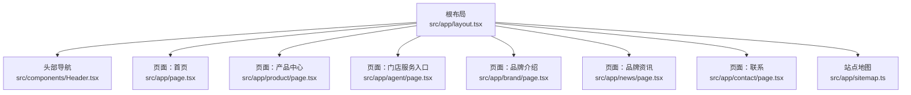
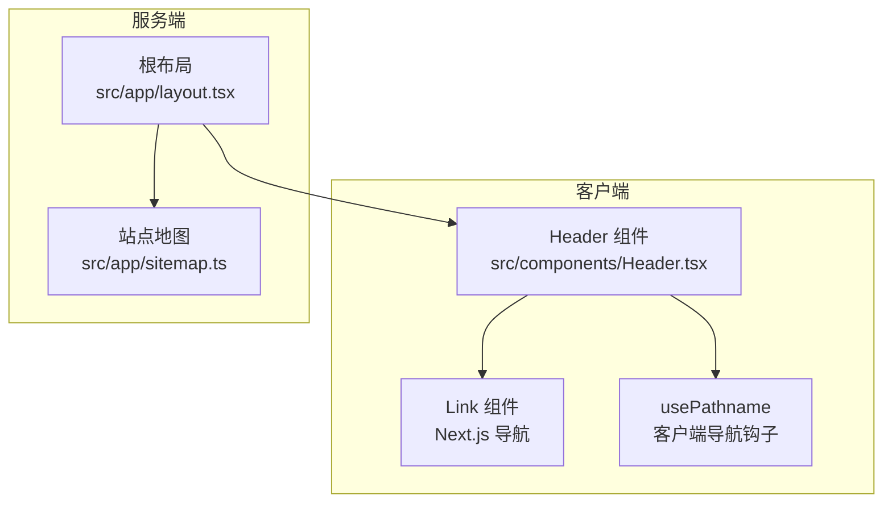
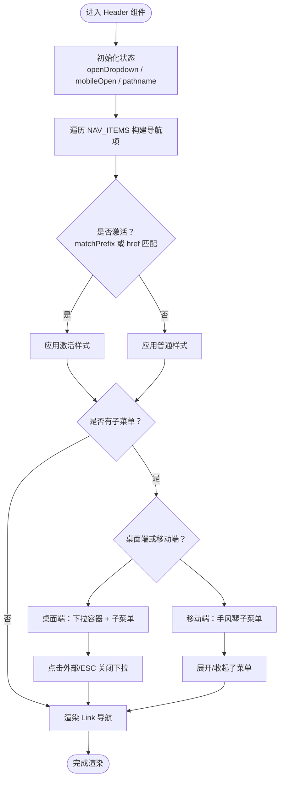
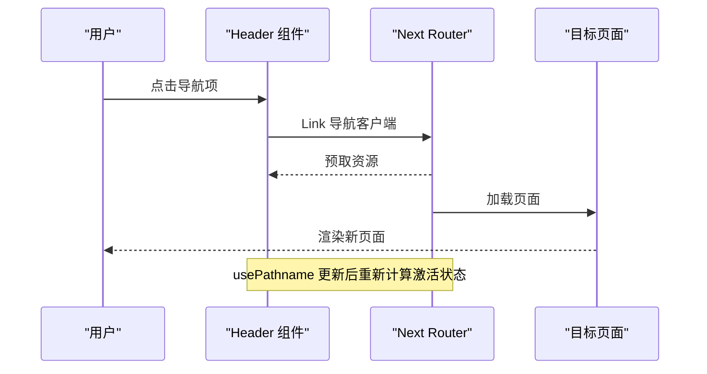
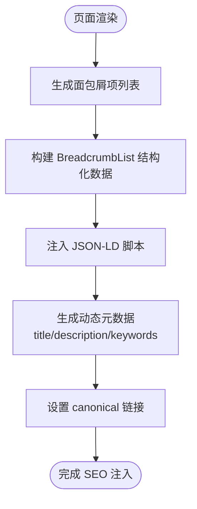
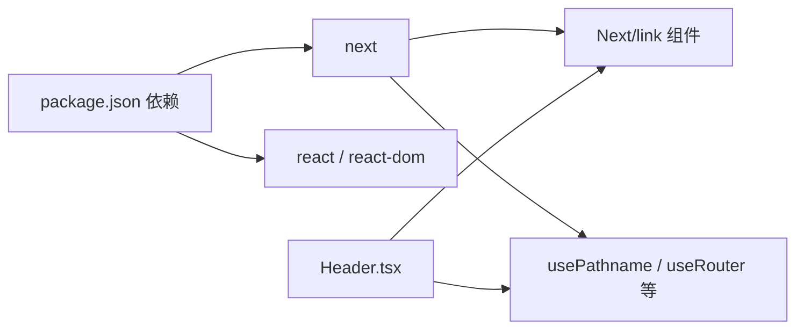

# 路由导航

<cite>
**本文引用的文件**
- [src/components/Header.tsx](file://src/components/Header.tsx)
- [src/app/layout.tsx](file://src/app/layout.tsx)
- [src/lib/geo.ts](file://src/lib/geo.ts)
- [next.config.ts](file://next.config.ts)
- [package.json](file://package.json)
- [.claude/skills/next-best-practices/functions.md](file://.claude/skills/next-best-practices/functions.md)
- [.claude/skills/next-best-practices/parallel-routes.md](file://.claude/skills/next-best-practices/parallel-routes.md)
- [docs/PROGRESS.md](file://docs/PROGRESS.md)
</cite>

## 目录
1. [简介](#简介)
2. [项目结构](#项目结构)
3. [核心组件](#核心组件)
4. [架构总览](#架构总览)
5. [详细组件分析](#详细组件分析)
6. [依赖关系分析](#依赖关系分析)
7. [性能考量](#性能考量)
8. [故障排查指南](#故障排查指南)
9. [结论](#结论)
10. [附录](#附录)

## 简介
本文件围绕蓝辉轻改网站的路由导航体系进行系统化梳理，重点覆盖以下主题：
- Next.js 导航机制与 Link 组件的使用与性能优化
- 客户端导航与服务器端导航的区别与适用场景
- 面包屑导航的实现与 SEO 优化策略
- 路由状态管理与页面间数据传递方案
- 导航菜单的动态生成与激活状态管理
- Header 组件中的导航实现示例路径
- 路由过渡动画与页面切换效果的实现技巧
- 移动端导航的适配与响应式设计
- 导航性能监控与优化最佳实践

## 项目结构
该项目采用 Next.js App Router 的目录结构组织页面与布局。根布局负责全局元数据与基础样式注入；Header 组件提供导航栏与移动端菜单；各业务模块（产品、门店、品牌、资讯）通过约定式路由组织。

图表来源
- [src/app/layout.tsx:20-38](file://src/app/layout.tsx#L20-L38)
- [src/components/Header.tsx:80-248](file://src/components/Header.tsx#L80-L248)

章节来源
- [src/app/layout.tsx:1-39](file://src/app/layout.tsx#L1-L39)
- [docs/PROGRESS.md:70-93](file://docs/PROGRESS.md#L70-L93)

## 核心组件
- Header 导航组件：负责桌面端与移动端导航、下拉菜单、激活状态判断、点击外部关闭等交互逻辑。
- 根布局：定义全局元数据、结构标签与脚本注入，确保 SEO 与 Schema 结构化数据可用。
- 路由清单：明确各页面的渲染方式（SS/SSG）与文件位置，便于导航与 SEO 策略落地。

章节来源
- [src/components/Header.tsx:44-249](file://src/components/Header.tsx#L44-L249)
- [src/app/layout.tsx:5-18](file://src/app/layout.tsx#L5-L18)
- [docs/PROGRESS.md:70-93](file://docs/PROGRESS.md#L70-L93)

## 架构总览
Next.js App Router 将页面以“路由段”组织，支持静态生成（SSG）、服务端渲染（SSR）与流式渲染。导航层通过 Link 组件实现客户端预取与平滑跳转；Header 组件在客户端侧根据当前路径计算激活状态，结合移动端菜单与下拉子菜单，形成完整的导航体验。

图表来源
- [src/components/Header.tsx:44-249](file://src/components/Header.tsx#L44-L249)
- [src/app/layout.tsx:20-38](file://src/app/layout.tsx#L20-L38)
- [.claude/skills/next-best-practices/functions.md:7-17](file://.claude/skills/next-best-practices/functions.md#L7-L17)

## 详细组件分析

### Header 导航组件
- 导航项定义：通过常量数组集中声明导航项，支持带子菜单与前缀匹配的激活规则。
- 激活状态：基于 usePathname 与 matchPrefix 判断当前路径是否命中某导航项。
- 下拉菜单：桌面端与移动端分别实现下拉容器与子菜单项，支持点击外部关闭与 Esc 键盘关闭。
- 移动端菜单：折叠/展开状态切换，子菜单以手风琴形式呈现。
- 预约按钮：右侧 CTA，桌面端与移动端均提供。

图表来源
- [src/components/Header.tsx:44-249](file://src/components/Header.tsx#L44-L249)

章节来源
- [src/components/Header.tsx:19-42](file://src/components/Header.tsx#L19-L42)
- [src/components/Header.tsx:50-55](file://src/components/Header.tsx#L50-L55)
- [src/components/Header.tsx:61-78](file://src/components/Header.tsx#L61-L78)
- [src/components/Header.tsx:94-189](file://src/components/Header.tsx#L94-L189)
- [src/components/Header.tsx:213-246](file://src/components/Header.tsx#L213-L246)

### Link 组件与导航钩子
- 使用 Link 进行内部导航，避免使用原生 a 标签，以启用客户端预取与平滑跳转。
- usePathname 获取当前路径，用于激活状态判断与面包屑构建。
- useLinkStatus 可检查链接预取状态，辅助性能优化。
- useRouter 提供程序化导航能力（push/replace/back/refresh），适用于复杂交互场景。

图表来源
- [.claude/skills/next-best-practices/functions.md:50-82](file://.claude/skills/next-best-practices/functions.md#L50-L82)
- [.claude/skills/next-best-practices/functions.md:7-17](file://.claude/skills/next-best-practices/functions.md#L7-L17)

章节来源
- [.claude/skills/next-best-practices/functions.md:50-82](file://.claude/skills/next-best-practices/functions.md#L50-L82)
- [.claude/skills/next-best-practices/functions.md:7-17](file://.claude/skills/next-best-practices/functions.md#L7-L17)

### 客户端导航 vs 服务器端导航
- 客户端导航（Link/programmatic）：适合页面内切换、减少全页刷新，提升交互流畅度。
- 服务器端导航（直接访问/重定向）：适合硬导航、SEO 页面与需要 SSR 的场景。
- 并行路由与拦截：可实现模态等复杂交互，但需正确使用 router.back() 关闭，避免历史栈污染。

章节来源
- [.claude/skills/next-best-practices/parallel-routes.md:103-166](file://.claude/skills/next-best-practices/parallel-routes.md#L103-L166)
- [.claude/skills/next-best-practices/parallel-routes.md:58-288](file://.claude/skills/next-best-practices/parallel-routes.md#L58-L288)

### 面包屑导航与 SEO
- 面包屑结构化数据：通过 generateBreadcrumbSchema 生成 BreadcrumbList，包含 position、name、item 字段。
- 页面级 canonical 链接：通过 getCanonicalUrl 生成规范 URL，避免重复索引。
- 动态元数据：各页面 generateMetadata 返回独立 title/description/keywords，提升搜索可见性。

图表来源
- [src/lib/geo.ts:80-99](file://src/lib/geo.ts#L80-L99)

章节来源
- [src/lib/geo.ts:80-99](file://src/lib/geo.ts#L80-L99)
- [docs/research/MOXIAOER_TECH_ANALYSIS.md:353-371](file://docs/research/MOXIAOER_TECH_ANALYSIS.md#L353-L371)

### 路由状态管理与页面间数据传递
- 激活状态：usePathname + matchPrefix 精确匹配，支持多层级导航的高亮。
- 参数与查询：useParams/useSearchParams 读取动态路由参数与查询字符串，用于筛选与过滤。
- 数据传递：通过 URL 参数、查询字符串或缓存共享（如本地存储）实现跨页面数据传递；避免在导航中携带大型对象。

章节来源
- [.claude/skills/next-best-practices/functions.md:11-17](file://.claude/skills/next-best-practices/functions.md#L11-L17)
- [src/components/Header.tsx:50-55](file://src/components/Header.tsx#L50-L55)

### 导航菜单的动态生成与激活状态
- 动态生成：产品类目从产品库动态映射为导航子菜单，保证内容与导航一致。
- 激活状态：支持精确匹配与前缀匹配，确保父级导航在子页面时保持高亮。
- 事件处理：点击外部关闭、键盘 ESC 关闭，提升可访问性与易用性。

章节来源
- [src/components/Header.tsx:19-42](file://src/components/Header.tsx#L19-L42)
- [src/components/Header.tsx:50-55](file://src/components/Header.tsx#L50-L55)
- [src/components/Header.tsx:61-78](file://src/components/Header.tsx#L61-L78)

### 路由过渡动画与页面切换效果
- 过渡建议：利用页面布局的透明度与位移过渡，配合 Link 预取减少白屏；在需要时引入轻量动画库实现淡入淡出或滑动切换。
- 注意事项：避免在导航中执行重型同步操作，优先使用异步加载与骨架屏提升感知性能。

（本节为通用指导，不直接分析具体文件）

### 移动端导航适配与响应式设计
- 断点策略：桌面端使用水平导航，移动端折叠为汉堡菜单；子菜单以手风琴形式展开。
- 交互细节：移动端子菜单项具备最小触控高度，确保可点击区域充足；外层容器支持点击外部关闭。
- 可访问性：为菜单按钮与下拉按钮提供 aria-* 属性，确保键盘与屏幕阅读器可用。

章节来源
- [src/components/Header.tsx:213-246](file://src/components/Header.tsx#L213-L246)
- [src/components/Header.tsx:251-291](file://src/components/Header.tsx#L251-L291)

## 依赖关系分析
- 组件依赖：Header 依赖 Next.js 的 Link 与导航钩子，依赖产品与品牌数据源以动态生成菜单。
- 配置依赖：Next.js 配置影响图片优化与输出模式，间接影响导航资源加载性能。
- 版本依赖：Next.js 16.x 与 React 19.x 提供稳定的 App Router 与客户端能力。

图表来源
- [package.json:37-47](file://package.json#L37-L47)
- [next.config.ts:3-11](file://next.config.ts#L3-L11)

章节来源
- [package.json:37-47](file://package.json#L37-L47)
- [next.config.ts:3-11](file://next.config.ts#L3-L11)

## 性能考量
- 预取与缓存：Link 组件自动预取邻近页面资源；合理配置图片格式与缓存 TTL，降低首屏与切换延迟。
- 路由清单：明确静态生成与服务端渲染页面，减少不必要的全量 SSR。
- 事件监听：下拉关闭逻辑仅在打开状态下绑定，避免常驻监听造成内存压力。
- 图标与样式：使用矢量图标与原子化样式，减小体积并提升渲染效率。

章节来源
- [next.config.ts:5-10](file://next.config.ts#L5-L10)
- [src/components/Header.tsx:61-78](file://src/components/Header.tsx#L61-L78)

## 故障排查指南
- 激活状态不生效：检查 usePathname 是否正确获取，matchPrefix 是否覆盖目标路径前缀。
- 下拉菜单无法关闭：确认点击外部与 ESC 事件绑定是否在打开状态下生效，避免重复绑定。
- 模态关闭异常：使用 router.back() 关闭拦截路由，避免 push 或 Link 导致历史栈污染。
- SEO 异常：核对 JSON-LD 注入与 canonical 设置，确保面包屑结构化数据字段完整。

章节来源
- [src/components/Header.tsx:50-55](file://src/components/Header.tsx#L50-L55)
- [src/components/Header.tsx:61-78](file://src/components/Header.tsx#L61-L78)
- [.claude/skills/next-best-practices/parallel-routes.md:103-166](file://.claude/skills/next-best-practices/parallel-routes.md#L103-L166)
- [src/lib/geo.ts:80-99](file://src/lib/geo.ts#L80-L99)

## 结论
本项目通过 Header 组件与 Link 导航实现了清晰、可扩展且高性能的导航体系。结合 usePathname 的激活状态管理、移动端响应式设计与结构化数据注入，既满足用户体验也兼顾 SEO 与性能。后续可在页面切换动画、路由监控与更细粒度的预取策略方面持续优化。

## 附录
- 路由清单（部分）：首页、产品中心、门店服务、品牌介绍、品牌资讯、联系、sitemap 等页面的渲染方式与文件位置参见进度文档。

章节来源
- [docs/PROGRESS.md:70-93](file://docs/PROGRESS.md#L70-L93)