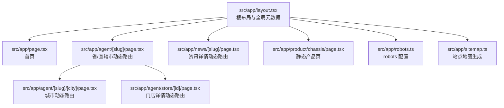
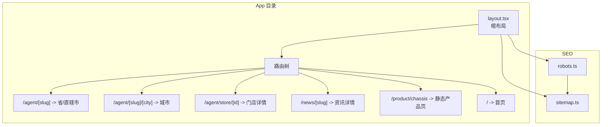
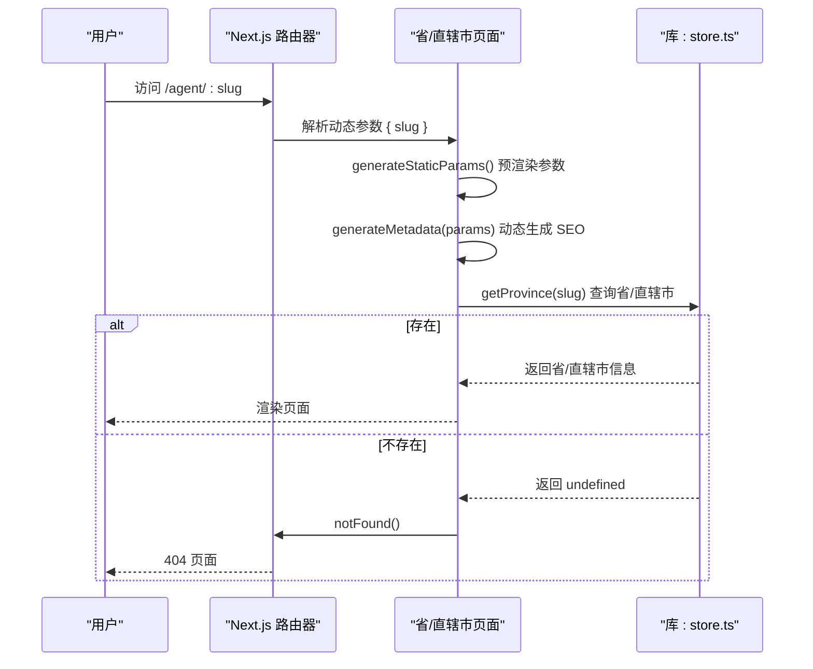
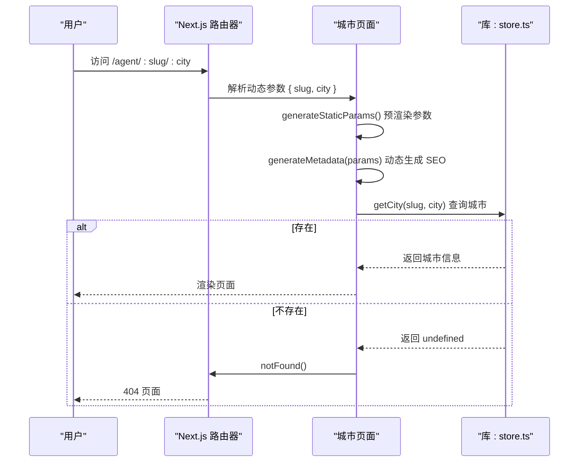
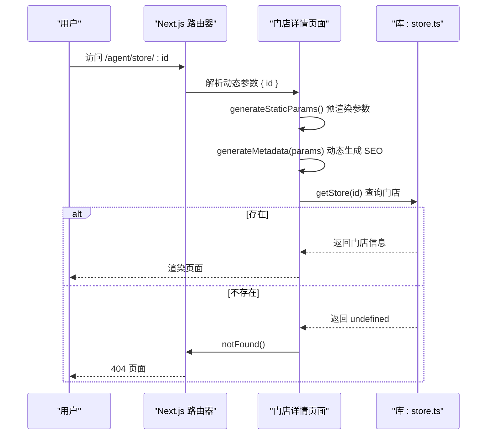
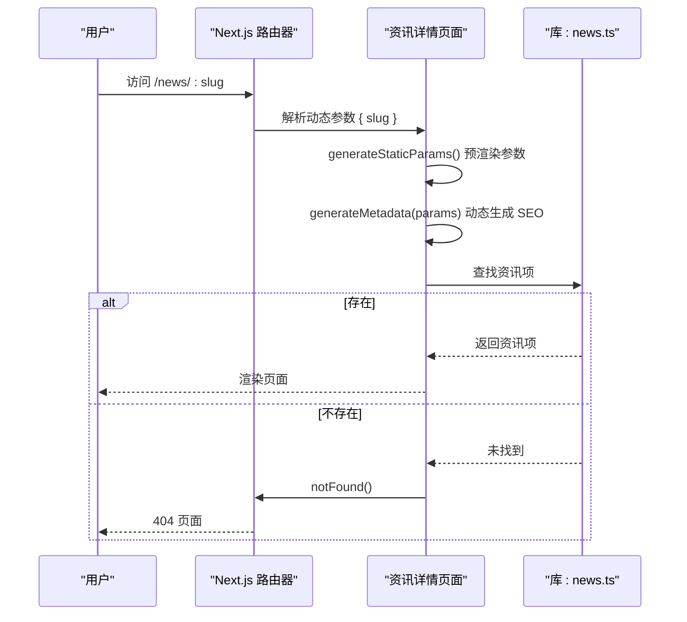
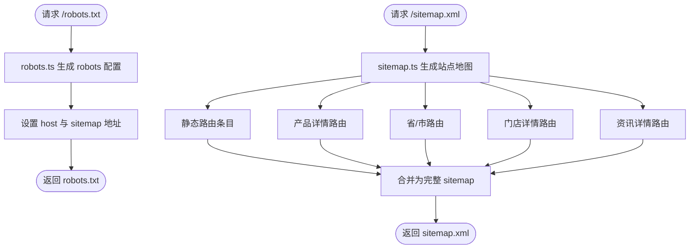
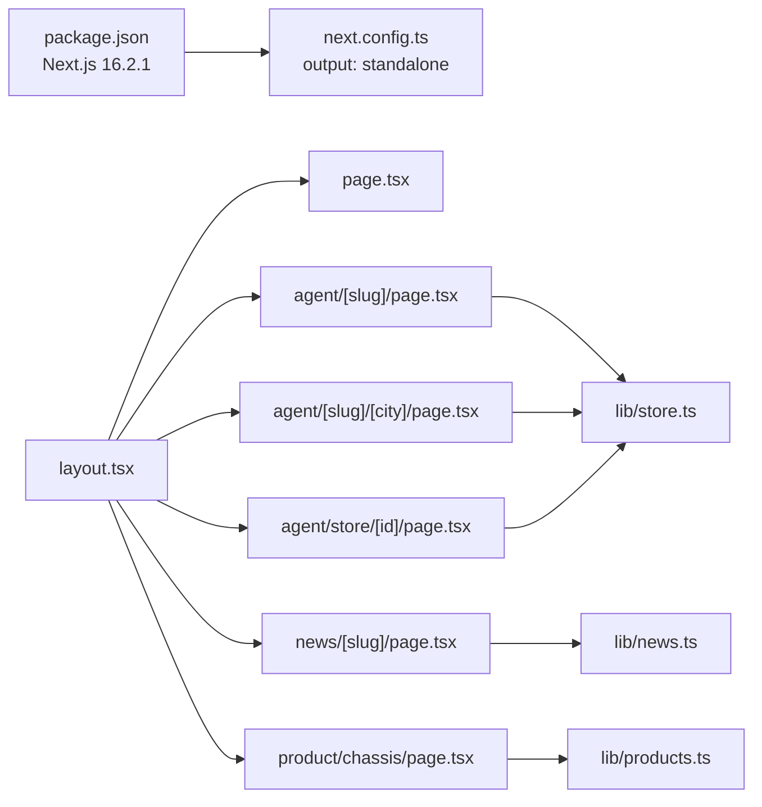

# 路由系统

<cite>
**本文引用的文件**
- [src/app/layout.tsx](file://src/app/layout.tsx)
- [src/app/page.tsx](file://src/app/page.tsx)
- [src/app/robots.ts](file://src/app/robots.ts)
- [src/app/sitemap.ts](file://src/app/sitemap.ts)
- [src/app/agent/[slug]/page.tsx](file://src/app/agent/[slug]/page.tsx)
- [src/app/agent/[slug]/[city]/page.tsx](file://src/app/agent/[slug]/[city]/page.tsx)
- [src/app/agent/store/[id]/page.tsx](file://src/app/agent/store/[id]/page.tsx)
- [src/app/news/[slug]/page.tsx](file://src/app/news/[slug]/page.tsx)
- [src/app/product/chassis/page.tsx](file://src/app/product/chassis/page.tsx)
- [src/lib/store.ts](file://src/lib/store.ts)
- [src/lib/news.ts](file://src/lib/news.ts)
- [src/lib/products.ts](file://src/lib/products.ts)
- [next.config.ts](file://next.config.ts)
- [package.json](file://package.json)
</cite>

## 目录
1. [简介](#简介)
2. [项目结构](#项目结构)
3. [核心组件](#核心组件)
4. [架构总览](#架构总览)
5. [详细组件分析](#详细组件分析)
6. [依赖分析](#依赖分析)
7. [性能考量](#性能考量)
8. [故障排查指南](#故障排查指南)
9. [结论](#结论)
10. [附录](#附录)

## 简介
本文件系统性梳理蓝辉轻改网站的 Next.js 16 App Router 路由体系，涵盖文件系统路由与动态路由的实现原理、根布局设计、静态与动态路由配置、参数提取与类型安全、路由元数据生成、SEO（robots.txt 与 sitemap.xml）、以及页面预加载与导航体验优化策略。文档同时提供路由扩展最佳实践，帮助开发者在不破坏现有结构的前提下快速新增页面。

## 项目结构
蓝辉轻改网站采用 Next.js 16 App Router 的 App 目录结构，所有路由页面位于 src/app 下，遵循“文件系统即路由”的约定式路由规则。根布局负责全局元数据与 HTML 结构，首页作为根路径页面，各功能模块（如门店、新闻、产品）分别组织在子目录下，动态路由通过方括号命名的目录实现。

图表来源
- [src/app/layout.tsx:1-32](file://src/app/layout.tsx#L1-L32)
- [src/app/page.tsx:1-22](file://src/app/page.tsx#L1-L22)
- [src/app/agent/[slug]/page.tsx:1-128](file://src/app/agent/[slug]/page.tsx#L1-L128)
- [src/app/agent/[slug]/[city]/page.tsx:1-131](file://src/app/agent/[slug]/[city]/page.tsx#L1-L131)
- [src/app/agent/store/[id]/page.tsx:1-226](file://src/app/agent/store/[id]/page.tsx#L1-L226)
- [src/app/news/[slug]/page.tsx:1-181](file://src/app/news/[slug]/page.tsx#L1-L181)
- [src/app/product/chassis/page.tsx:1-17](file://src/app/product/chassis/page.tsx#L1-L17)
- [src/app/robots.ts:1-17](file://src/app/robots.ts#L1-L17)
- [src/app/sitemap.ts:1-128](file://src/app/sitemap.ts#L1-L128)

章节来源
- [src/app/layout.tsx:1-32](file://src/app/layout.tsx#L1-L32)
- [src/app/page.tsx:1-22](file://src/app/page.tsx#L1-L22)
- [src/app/agent/[slug]/page.tsx:1-128](file://src/app/agent/[slug]/page.tsx#L1-L128)
- [src/app/agent/[slug]/[city]/page.tsx:1-131](file://src/app/agent/[slug]/[city]/page.tsx#L1-L131)
- [src/app/agent/store/[id]/page.tsx:1-226](file://src/app/agent/store/[id]/page.tsx#L1-L226)
- [src/app/news/[slug]/page.tsx:1-181](file://src/app/news/[slug]/page.tsx#L1-L181)
- [src/app/product/chassis/page.tsx:1-17](file://src/app/product/chassis/page.tsx#L1-L17)
- [src/app/robots.ts:1-17](file://src/app/robots.ts#L1-L17)
- [src/app/sitemap.ts:1-128](file://src/app/sitemap.ts#L1-L128)

## 核心组件
- 根布局（RootLayout）
  - 负责设置全局语言、主题类名、基础样式容器与页面元数据（title、description、openGraph 等）。
  - 作为所有页面的父级容器，统一注入头部与底部组件。
- 首页（Home）
  - 组合多个业务区块组件，形成首屏内容。
- 动态路由页面
  - 通过 generateStaticParams 预渲染静态参数集合，提升 SEO 与首屏性能。
  - 使用 generateMetadata 动态生成页面标题与描述，确保每条动态路由具备独立 SEO 元数据。
  - 使用 notFound 进行无效参数的优雅降级。
- SEO 配置
  - robots.ts 输出 robots 协议与 sitemap 地址。
  - sitemap.ts 生成全站静态与动态路由的站点地图。

章节来源
- [src/app/layout.tsx:1-32](file://src/app/layout.tsx#L1-L32)
- [src/app/page.tsx:1-22](file://src/app/page.tsx#L1-L22)
- [src/app/agent/[slug]/page.tsx:12-28](file://src/app/agent/[slug]/page.tsx#L12-L28)
- [src/app/agent/[slug]/[city]/page.tsx:12-32](file://src/app/agent/[slug]/[city]/page.tsx#L12-L32)
- [src/app/agent/store/[id]/page.tsx:16-32](file://src/app/agent/store/[id]/page.tsx#L16-L32)
- [src/app/news/[slug]/page.tsx:9-25](file://src/app/news/[slug]/page.tsx#L9-L25)
- [src/app/robots.ts:4-16](file://src/app/robots.ts#L4-L16)
- [src/app/sitemap.ts:17-123](file://src/app/sitemap.ts#L17-L123)

## 架构总览
Next.js 16 App Router 将文件系统映射为路由树，动态路由通过方括号目录捕获路径段，配合 generateStaticParams 与 generateMetadata 实现静态预渲染与 SEO 元数据动态生成。根布局贯穿所有页面，提供一致的元数据与 UI 结构。

图表来源
- [src/app/layout.tsx:1-32](file://src/app/layout.tsx#L1-L32)
- [src/app/agent/[slug]/page.tsx:12-14](file://src/app/agent/[slug]/page.tsx#L12-L14)
- [src/app/agent/[slug]/[city]/page.tsx:12-18](file://src/app/agent/[slug]/[city]/page.tsx#L12-L18)
- [src/app/agent/store/[id]/page.tsx:16-18](file://src/app/agent/store/[id]/page.tsx#L16-L18)
- [src/app/news/[slug]/page.tsx:9-11](file://src/app/news/[slug]/page.tsx#L9-L11)
- [src/app/robots.ts:4-16](file://src/app/robots.ts#L4-L16)
- [src/app/sitemap.ts:17-123](file://src/app/sitemap.ts#L17-L123)

## 详细组件分析

### 根布局（RootLayout）
- 设计理念
  - 作为应用的根容器，统一注入全局样式、主题类名与元数据，保证跨页面一致性。
  - 通过 children 接受任意页面内容，确保页面无需重复声明 html/body 结构。
- 作用机制
  - 设置 html lang 与主题类名，提供基础样式容器 body。
  - 在 metadata 中集中配置 title、description、openGraph 等 SEO 基础信息。
- 与页面的关系
  - 所有页面（包括动态路由）均被包裹在根布局之下，共享同一套元数据与 UI 结构。

章节来源
- [src/app/layout.tsx:4-17](file://src/app/layout.tsx#L4-L17)
- [src/app/layout.tsx:19-31](file://src/app/layout.tsx#L19-L31)

### 首页（Home）
- 组成
  - Header、Hero、WhyChooseUs、CoreServices、ProductsQuickEntry、Footer 等业务区块组件。
- 作用
  - 作为根路径页面，承载首屏核心内容与导航入口。

章节来源
- [src/app/page.tsx:1-22](file://src/app/page.tsx#L1-L22)

### 动态路由：省/直辖市（/agent/[slug]）
- 路由路径
  - /agent/[slug]，其中 [slug] 为省/直辖市的拼音缩写。
- 参数提取与类型安全
  - 通过 params: Promise<{ slug: string }> 获取异步参数，确保类型安全。
- 静态预渲染
  - generateStaticParams 返回所有省/直辖市的 slug，提前生成静态页面。
- 元数据生成
  - generateMetadata 基于 slug 查询省/直辖市信息，动态生成标题与描述。
- 错误处理
  - 若省/直辖市不存在，notFound 优雅降级。
- 数据来源
  - 通过 src/lib/store.ts 提供的省/直辖市与门店查询函数获取数据。

图表来源
- [src/app/agent/[slug]/page.tsx:12-28](file://src/app/agent/[slug]/page.tsx#L12-L28)
- [src/app/agent/[slug]/page.tsx:30-38](file://src/app/agent/[slug]/page.tsx#L30-L38)
- [src/lib/store.ts:88-98](file://src/lib/store.ts#L88-L98)

章节来源
- [src/app/agent/[slug]/page.tsx:12-28](file://src/app/agent/[slug]/page.tsx#L12-L28)
- [src/app/agent/[slug]/page.tsx:30-38](file://src/app/agent/[slug]/page.tsx#L30-L38)
- [src/lib/store.ts:88-98](file://src/lib/store.ts#L88-L98)

### 动态路由：城市（/agent/[slug]/[city]）
- 路由路径
  - /agent/[slug]/[city]，其中 [slug] 为省/直辖市 slug，[city] 为城市 slug。
- 参数提取与类型安全
  - params: Promise<{ slug: string; city: string }>
- 静态预渲染
  - generateStaticParams 返回特定省/直辖市下的所有城市 slug。
- 元数据生成
  - generateMetadata 基于省/直辖市与城市信息生成 SEO。
- 错误处理
  - 若城市不存在，notFound 降级。
- 数据来源
  - 通过 src/lib/store.ts 提供的城市与门店查询函数获取数据。

图表来源
- [src/app/agent/[slug]/[city]/page.tsx:12-32](file://src/app/agent/[slug]/[city]/page.tsx#L12-L32)
- [src/app/agent/[slug]/[city]/page.tsx:34-42](file://src/app/agent/[slug]/[city]/page.tsx#L34-L42)
- [src/lib/store.ts:96-102](file://src/lib/store.ts#L96-L102)

章节来源
- [src/app/agent/[slug]/[city]/page.tsx:12-32](file://src/app/agent/[slug]/[city]/page.tsx#L12-L32)
- [src/app/agent/[slug]/[city]/page.tsx:34-42](file://src/app/agent/[slug]/[city]/page.tsx#L34-L42)
- [src/lib/store.ts:96-102](file://src/lib/store.ts#L96-L102)

### 动态路由：门店详情（/agent/store/[id]）
- 路由路径
  - /agent/store/[id]，其中 [id] 为门店唯一标识。
- 参数提取与类型安全
  - params: Promise<{ id: string }>
- 静态预渲染
  - generateStaticParams 返回所有门店 id，提前生成静态页面。
- 元数据生成
  - generateMetadata 基于门店信息生成 SEO。
- 错误处理
  - 若门店不存在，notFound 降级。
- 数据来源
  - 通过 src/lib/store.ts 提供的门店查询函数获取数据。

图表来源
- [src/app/agent/store/[id]/page.tsx:16-32](file://src/app/agent/store/[id]/page.tsx#L16-L32)
- [src/app/agent/store/[id]/page.tsx:34-41](file://src/app/agent/store/[id]/page.tsx#L34-L41)
- [src/lib/store.ts:88-90](file://src/lib/store.ts#L88-L90)

章节来源
- [src/app/agent/store/[id]/page.tsx:16-32](file://src/app/agent/store/[id]/page.tsx#L16-L32)
- [src/app/agent/store/[id]/page.tsx:34-41](file://src/app/agent/store/[id]/page.tsx#L34-L41)
- [src/lib/store.ts:88-90](file://src/lib/store.ts#L88-L90)

### 动态路由：资讯详情（/news/[slug]）
- 路由路径
  - /news/[slug]，其中 [slug] 为资讯文章的 slug。
- 参数提取与类型安全
  - params: Promise<{ slug: string }>
- 静态预渲染
  - generateStaticParams 返回所有资讯 slug。
- 元数据生成
  - generateMetadata 基于资讯信息生成 SEO。
- 错误处理
  - 若资讯不存在，notFound 降级。
- 数据来源
  - 通过 src/lib/news.ts 提供的资讯数组与查询函数获取数据。

图表来源
- [src/app/news/[slug]/page.tsx:9-25](file://src/app/news/[slug]/page.tsx#L9-L25)
- [src/app/news/[slug]/page.tsx:27-34](file://src/app/news/[slug]/page.tsx#L27-L34)
- [src/lib/news.ts:16-41](file://src/lib/news.ts#L16-L41)

章节来源
- [src/app/news/[slug]/page.tsx:9-25](file://src/app/news/[slug]/page.tsx#L9-L25)
- [src/app/news/[slug]/page.tsx:27-34](file://src/app/news/[slug]/page.tsx#L27-L34)
- [src/lib/news.ts:16-41](file://src/lib/news.ts#L16-L41)

### 静态路由：产品页（示例：/product/chassis）
- 路由路径
  - /product/chassis 为静态路由，直接对应 src/app/product/chassis/page.tsx。
- 元数据
  - 通过 metadata 直接配置页面标题与描述。
- 错误处理
  - 若产品不存在，notFound 降级。
- 数据来源
  - 通过 src/lib/products.ts 提供的产品查询函数获取数据。

章节来源
- [src/app/product/chassis/page.tsx:6-16](file://src/app/product/chassis/page.tsx#L6-L16)
- [src/lib/products.ts:266-268](file://src/lib/products.ts#L266-L268)

### SEO：robots.txt 与 sitemap.xml
- robots.ts
  - 定义爬虫规则（允许访问根路径，禁止访问 /api/），并指定 sitemap 与 host。
- sitemap.ts
  - 生成静态路由、产品详情、省/市、门店、资讯详情等全站链接。
  - 使用 lastModified、changeFrequency、priority 控制搜索引擎抓取与排序权重。

图表来源
- [src/app/robots.ts:4-16](file://src/app/robots.ts#L4-L16)
- [src/app/sitemap.ts:17-123](file://src/app/sitemap.ts#L17-L123)

章节来源
- [src/app/robots.ts:4-16](file://src/app/robots.ts#L4-L16)
- [src/app/sitemap.ts:17-123](file://src/app/sitemap.ts#L17-L123)

## 依赖分析
- Next.js 版本与配置
  - 依赖 next@16.2.1，构建输出模式为 standalone，便于容器化部署。
- 路由与页面
  - 动态路由页面依赖 generateStaticParams 与 generateMetadata，确保 SEO 与性能。
  - notFound 用于无效参数的错误边界处理。
- 数据层
  - 门店、资讯、产品等数据通过 src/lib 下的模块提供查询函数，页面仅负责消费数据。

图表来源
- [package.json:42-42](file://package.json#L42-L42)
- [next.config.ts:5-5](file://next.config.ts#L5-L5)
- [src/app/layout.tsx:1-32](file://src/app/layout.tsx#L1-L32)
- [src/app/agent/[slug]/page.tsx:1-128](file://src/app/agent/[slug]/page.tsx#L1-L128)
- [src/app/agent/[slug]/[city]/page.tsx:1-131](file://src/app/agent/[slug]/[city]/page.tsx#L1-L131)
- [src/app/agent/store/[id]/page.tsx:1-226](file://src/app/agent/store/[id]/page.tsx#L1-L226)
- [src/app/news/[slug]/page.tsx:1-181](file://src/app/news/[slug]/page.tsx#L1-L181)
- [src/app/product/chassis/page.tsx:1-17](file://src/app/product/chassis/page.tsx#L1-L17)
- [src/lib/store.ts:1-119](file://src/lib/store.ts#L1-L119)
- [src/lib/news.ts:1-46](file://src/lib/news.ts#L1-L46)
- [src/lib/products.ts:1-282](file://src/lib/products.ts#L1-L282)

章节来源
- [package.json:42-42](file://package.json#L42-L42)
- [next.config.ts:5-5](file://next.config.ts#L5-L5)
- [src/app/layout.tsx:1-32](file://src/app/layout.tsx#L1-L32)
- [src/lib/store.ts:1-119](file://src/lib/store.ts#L1-L119)
- [src/lib/news.ts:1-46](file://src/lib/news.ts#L1-L46)
- [src/lib/products.ts:1-282](file://src/lib/products.ts#L1-L282)

## 性能考量
- 静态预渲染（SSG）
  - 通过 generateStaticParams 为动态路由生成静态页面，减少首屏渲染时间与服务器压力。
- 元数据生成（SSG + SSR）
  - generateMetadata 可在构建时生成静态元数据，或在请求时动态生成，视业务需要选择。
- 路由守卫与权限控制
  - 可在页面内部基于参数与用户上下文进行权限判断；若需全局守卫，可在中间件中实现（需额外开发）。
- 页面预加载与导航体验
  - 利用 Next.js 的 Link 组件与自动预取能力，结合骨架屏与渐进式渲染，提升交互流畅度。
- SEO 优化
  - robots.txt 与 sitemap.xml 提升搜索引擎收录质量与索引效率。

## 故障排查指南
- 动态路由 404
  - 检查 generateStaticParams 是否包含当前参数；若参数不存在，notFound 将触发 404。
- 元数据缺失或错误
  - 确认 generateMetadata 正确解析 params 并返回预期的 title/description。
- 数据查询失败
  - 检查 src/lib 下对应模块的查询函数是否正确实现，确保数据存在且可访问。
- SEO 问题
  - 确认 robots.ts 中的 host 与 sitemap 地址正确；检查 sitemap.ts 是否包含目标路由。

章节来源
- [src/app/agent/[slug]/page.tsx:37-37](file://src/app/agent/[slug]/page.tsx#L37-L37)
- [src/app/agent/[slug]/[city]/page.tsx:41-41](file://src/app/agent/[slug]/[city]/page.tsx#L41-L41)
- [src/app/agent/store/[id]/page.tsx:41-41](file://src/app/agent/store/[id]/page.tsx#L41-L41)
- [src/app/news/[slug]/page.tsx:34-34](file://src/app/news/[slug]/page.tsx#L34-L34)
- [src/app/robots.ts:13-14](file://src/app/robots.ts#L13-L14)
- [src/app/sitemap.ts:12-15](file://src/app/sitemap.ts#L12-L15)

## 结论
蓝辉轻改网站的路由系统充分利用 Next.js 16 App Router 的文件系统路由与动态路由能力，结合 generateStaticParams 与 generateMetadata 实现高性能与高 SEO 的页面生成。根布局统一管理全局元数据与 UI 结构，动态路由页面通过参数提取与类型安全确保运行时稳定性。配合 robots.txt 与 sitemap.xml，整体路由体系在可维护性、性能与 SEO 方面达到良好平衡。

## 附录
- 路由扩展最佳实践
  - 新增页面时，优先在 src/app 下创建对应目录结构，遵循文件系统即路由原则。
  - 对于动态路由，实现 generateStaticParams 与 generateMetadata，确保 SEO 与性能。
  - 使用 notFound 处理无效参数，保持错误边界一致。
  - 将数据查询逻辑集中在 src/lib 下，页面仅负责消费数据与渲染。
  - 如需全局守卫或权限控制，可在中间件中实现（需额外开发）。
- 依赖版本
  - Next.js 16.2.1，构建输出模式为 standalone，便于容器化部署。

章节来源
- [package.json:42-42](file://package.json#L42-L42)
- [next.config.ts:5-5](file://next.config.ts#L5-L5)