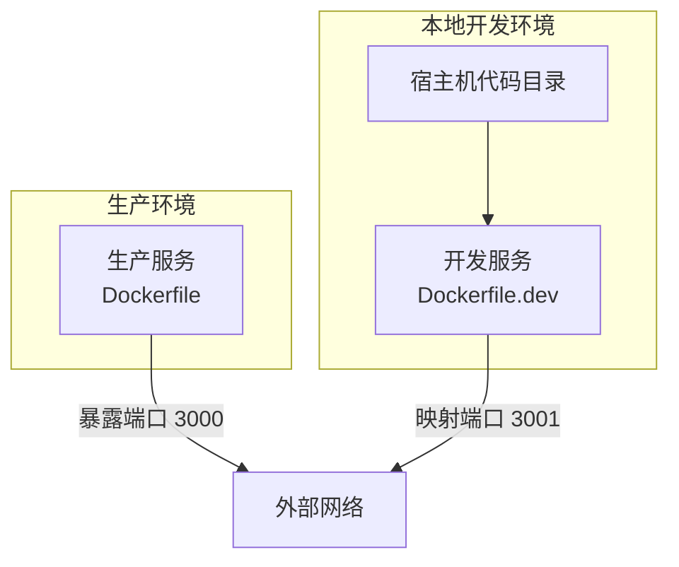
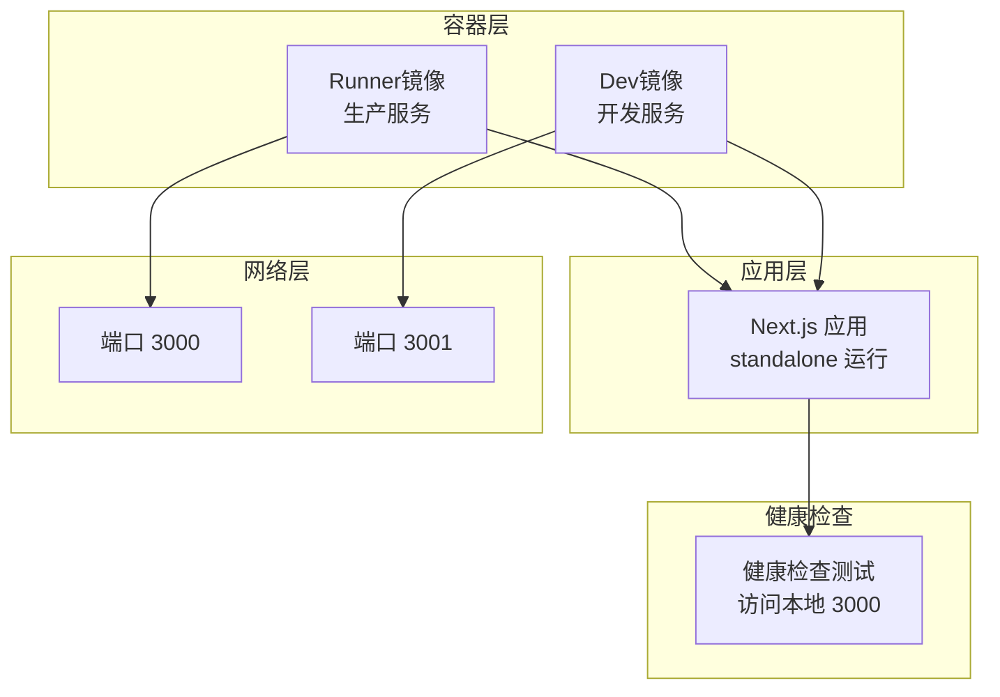
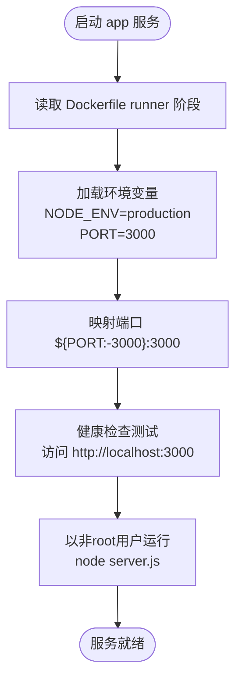
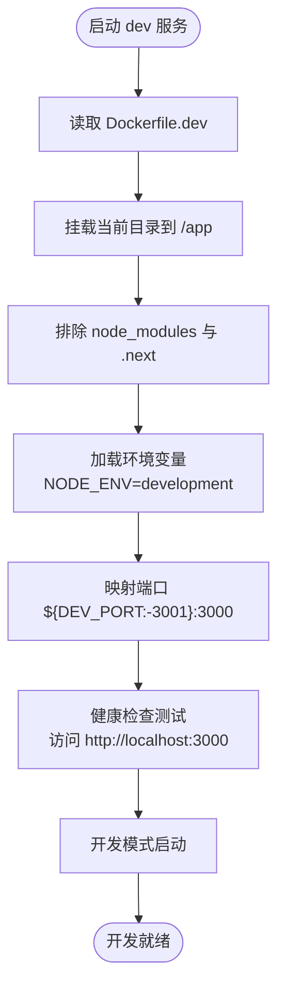
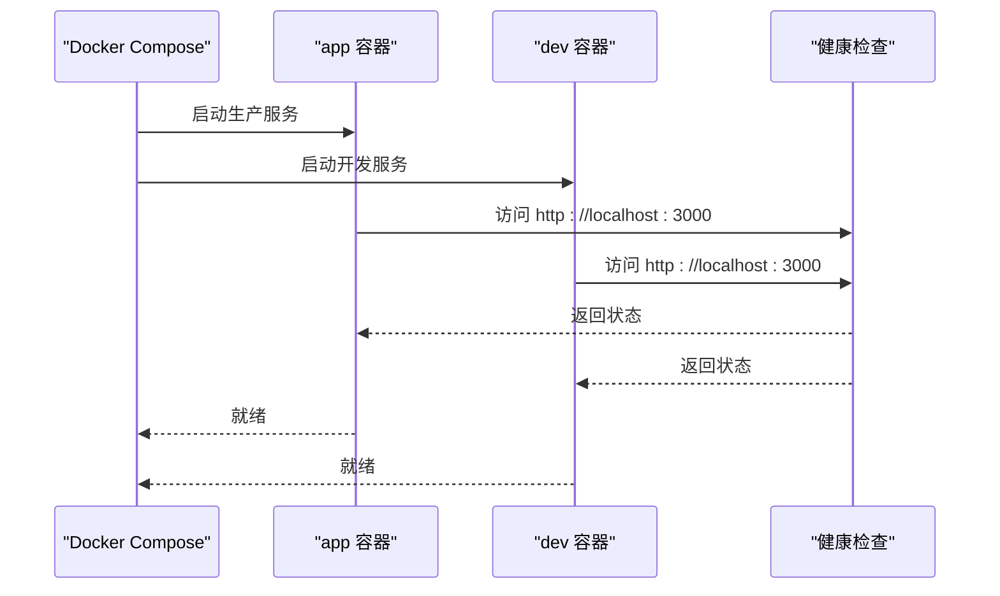
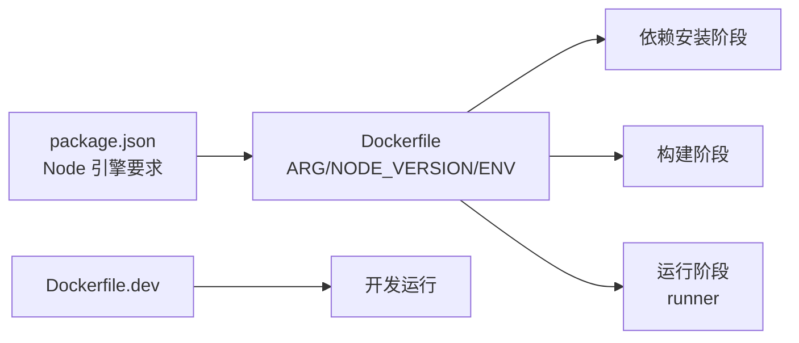

# Docker Compose编排

<cite>
**本文引用的文件**
- [docker-compose.yml](file://docker-compose.yml)
- [Dockerfile](file://Dockerfile)
- [Dockerfile.dev](file://Dockerfile.dev)
- [package.json](file://package.json)
- [README.md](file://README.md)
- [.claude/skills/next-best-practices/self-hosting.md](file://.claude/skills/next-best-practices/self-hosting.md)
</cite>

## 目录
1. [简介](#简介)
2. [项目结构](#项目结构)
3. [核心组件](#核心组件)
4. [架构总览](#架构总览)
5. [详细组件分析](#详细组件分析)
6. [依赖关系分析](#依赖关系分析)
7. [性能考量](#性能考量)
8. [故障排查指南](#故障排查指南)
9. [结论](#结论)
10. [附录](#附录)

## 简介
本文件面向蓝辉轻改网站的Docker Compose编排配置，系统性说明docker-compose.yml的配置结构与运行机制，涵盖服务定义、网络与端口映射、卷挂载、环境变量管理与加载顺序、健康检查与重启策略等。同时结合仓库中的Dockerfile与Dockerfile.dev，解释开发与生产两种镜像构建路径及差异，并给出在本地开发环境中模拟生产服务依赖关系的方法。最后提供扩展到多服务（如数据库、缓存）的集成思路、服务间通信、扩缩容与负载均衡的实现建议。

## 项目结构
该仓库采用单应用容器化部署模式，通过一个Compose文件定义两个主要服务：生产服务与开发服务，分别使用不同的Dockerfile进行构建。应用基于Next.js 16，采用standalone输出以适配容器运行。

图表来源
- [docker-compose.yml:1-54](file://docker-compose.yml#L1-L54)
- [Dockerfile.dev:1-16](file://Dockerfile.dev#L1-L16)
- [Dockerfile:1-114](file://Dockerfile#L1-L114)

章节来源
- [docker-compose.yml:1-54](file://docker-compose.yml#L1-L54)
- [Dockerfile:1-114](file://Dockerfile#L1-L114)
- [Dockerfile.dev:1-16](file://Dockerfile.dev#L1-L16)
- [README.md:146-151](file://README.md#L146-L151)

## 核心组件
- 生产服务(app)
  - 基于Dockerfile构建，目标阶段为runner，使用standalone输出，非root用户运行，暴露3000端口
  - 默认重启策略为unless-stopped，健康检查通过访问本地3000端口
  - 环境变量默认NODE_ENV=production，NEXT_TELEMETRY_DISABLED=1
  - 端口映射支持通过环境变量PORT覆盖，默认3000
  - 支持从.env与.env.local加载环境变量（可选）

- 开发服务(dev)
  - 基于Dockerfile.dev构建，使用开发模式启动，暴露3000端口
  - 默认重启策略为unless-stopped，健康检查同上
  - 环境变量默认NODE_ENV=development，NEXT_TELEMETRY_DISABLED=1
  - 端口映射支持通过环境变量DEV_PORT覆盖，默认3001
  - 挂载当前目录到/app，忽略node_modules与.next目录，实现热重载

- 构建与运行差异
  - 生产镜像分阶段构建：依赖安装、构建、运行三阶段；最终运行时仅包含standalone与静态资源
  - 开发镜像直接安装依赖并以开发服务器启动，便于本地调试

章节来源
- [docker-compose.yml:1-54](file://docker-compose.yml#L1-L54)
- [Dockerfile:1-114](file://Dockerfile#L1-L114)
- [Dockerfile.dev:1-16](file://Dockerfile.dev#L1-L16)
- [package.json:29-36](file://package.json#L29-L36)

## 架构总览
下图展示生产与开发两种运行模式的容器化架构，以及健康检查与端口映射的关键点。

图表来源
- [docker-compose.yml:10-25](file://docker-compose.yml#L10-L25)
- [docker-compose.yml:34-53](file://docker-compose.yml#L34-L53)
- [Dockerfile:76-114](file://Dockerfile#L76-L114)
- [Dockerfile.dev:10-15](file://Dockerfile.dev#L10-L15)

## 详细组件分析

### 生产服务(app)分析
- 镜像与构建
  - 使用Dockerfile，目标阶段runner，复制standalone与静态资源，非root用户运行
- 端口与网络
  - 映射宿主端口至容器3000，支持通过环境变量PORT覆盖
- 环境变量
  - 默认NODE_ENV=production，NEXT_TELEMETRY_DISABLED=1，支持.env与.env.local
- 健康检查
  - CMD-SHELL方式访问本地3000端口，间隔30秒，超时10秒，重试3次，启动期10秒
- 重启策略
  - unless-stopped

图表来源
- [docker-compose.yml:2-25](file://docker-compose.yml#L2-L25)
- [Dockerfile:76-114](file://Dockerfile#L76-L114)

章节来源
- [docker-compose.yml:2-25](file://docker-compose.yml#L2-L25)
- [Dockerfile:76-114](file://Dockerfile#L76-L114)

### 开发服务(dev)分析
- 镜像与构建
  - 使用Dockerfile.dev，安装依赖后以开发模式启动
- 端口与网络
  - 映射宿主端口至容器3000，支持通过环境变量DEV_PORT覆盖
- 卷挂载
  - 将当前目录挂载到/app，排除node_modules与.next，实现热重载
- 环境变量
  - 默认NODE_ENV=development，NEXT_TELEMETRY_DISABLED=1，支持.env与.env.local
- 健康检查
  - CMD-SHELL方式访问本地3000端口，间隔30秒，超时10秒，重试3次，启动期15秒
- 重启策略
  - unless-stopped

图表来源
- [docker-compose.yml:27-53](file://docker-compose.yml#L27-L53)
- [Dockerfile.dev:1-16](file://Dockerfile.dev#L1-L16)

章节来源
- [docker-compose.yml:27-53](file://docker-compose.yml#L27-L53)
- [Dockerfile.dev:1-16](file://Dockerfile.dev#L1-L16)

### 服务间通信与健康检查流程
- 服务内通信
  - 容器内部通过localhost:3000访问应用
- 健康检查
  - 通过访问本地3000端口判断服务可用性
- 重启策略
  - unless-stopped确保容器异常退出后自动重启

图表来源
- [docker-compose.yml:20-25](file://docker-compose.yml#L20-L25)
- [docker-compose.yml:48-53](file://docker-compose.yml#L48-L53)

章节来源
- [docker-compose.yml:20-25](file://docker-compose.yml#L20-L25)
- [docker-compose.yml:48-53](file://docker-compose.yml#L48-L53)

### 多服务协调与生产环境模拟
- 当前仓库未包含数据库、缓存等外部服务的Compose定义
- 可参考仓库中“自托管Next.js”最佳实践文档，了解standalone输出、健康检查端点与多实例缓存处理等要点
- 在本地模拟生产依赖时，可在现有app服务基础上新增数据库/缓存服务，并通过服务名进行内部DNS解析

章节来源
- [.claude/skills/next-best-practices/self-hosting.md:1-89](file://.claude/skills/next-best-practices/self-hosting.md#L1-L89)
- [.claude/skills/next-best-practices/self-hosting.md:325-372](file://.claude/skills/next-best-practices/self-hosting.md#L325-L372)

## 依赖关系分析
- 构建链路
  - 生产镜像：依赖安装 → 构建 → 运行（runner）
  - 开发镜像：安装依赖 → 开发启动
- 运行时依赖
  - Node.js版本由Dockerfile ARG与ENV控制，需与package.json引擎要求一致
  - 应用通过standalone输出运行，不依赖宿主系统额外依赖

图表来源
- [package.json:26-28](file://package.json#L26-L28)
- [Dockerfile:10-114](file://Dockerfile#L10-L114)
- [Dockerfile.dev:1-16](file://Dockerfile.dev#L1-L16)

章节来源
- [package.json:26-28](file://package.json#L26-L28)
- [Dockerfile:10-114](file://Dockerfile#L10-L114)
- [Dockerfile.dev:1-16](file://Dockerfile.dev#L1-L16)

## 性能考量
- 构建优化
  - 使用多阶段构建减少镜像体积
  - 缓存依赖安装与构建产物，提升重复构建速度
- 运行优化
  - 使用standalone输出，避免运行时安装依赖
  - 非root用户运行，提升安全性
- 健康检查
  - 合理的间隔与超时参数，避免频繁探测造成压力

章节来源
- [Dockerfile:21-32](file://Dockerfile#L21-L32)
- [Dockerfile:56-70](file://Dockerfile#L56-L70)
- [Dockerfile:98-105](file://Dockerfile#L98-L105)

## 故障排查指南
- 健康检查失败
  - 检查容器内应用是否监听0.0.0.0而非127.0.0.1
  - 确认端口映射正确且未被占用
- 端口冲突
  - 修改环境变量PORT或DEV_PORT，避免与宿主或其他容器冲突
- 权限问题
  - 生产镜像以非root用户运行，确认必要目录权限
- 开发模式无法热更新
  - 确认卷挂载路径与排除规则正确，避免node_modules与.next被覆盖

章节来源
- [docker-compose.yml:10-11](file://docker-compose.yml#L10-L11)
- [docker-compose.yml:34-35](file://docker-compose.yml#L34-L35)
- [Dockerfile:107-108](file://Dockerfile#L107-L108)
- [Dockerfile.dev:44-47](file://Dockerfile.dev#L44-L47)

## 结论
本仓库的Docker Compose配置简洁明确，通过两套镜像分别满足生产与开发场景。生产镜像采用多阶段构建与standalone输出，具备良好的安全性和运行效率；开发镜像提供热重载能力，便于本地迭代。结合健康检查与合理的重启策略，可在本地快速模拟近似生产的服务依赖关系。若需引入数据库、缓存等外部依赖，可参考自托管最佳实践文档，在现有app服务基础上扩展多服务编排。

## 附录

### 开发与生产环境差异对比
- 镜像来源
  - 生产：Dockerfile（runner阶段）
  - 开发：Dockerfile.dev
- 端口映射
  - 生产：默认映射${PORT:-3000}:3000
  - 开发：默认映射${DEV_PORT:-3001}:3000
- 运行模式
  - 生产：以非root用户运行，standalone输出
  - 开发：挂载源码卷，支持热重载
- 健康检查
  - 两者均通过访问本地3000端口进行健康检查
- 重启策略
  - 两者均设置为unless-stopped

章节来源
- [docker-compose.yml:2-25](file://docker-compose.yml#L2-L25)
- [docker-compose.yml:27-53](file://docker-compose.yml#L27-L53)
- [Dockerfile:76-114](file://Dockerfile#L76-L114)
- [Dockerfile.dev:1-16](file://Dockerfile.dev#L1-L16)

### 多服务集成与扩展建议
- 数据库/缓存服务
  - 新增服务定义，使用稳定的基础镜像（如官方MySQL/Redis镜像）
  - 通过服务名进行内部DNS解析，避免硬编码IP
- 健康检查与依赖
  - 为数据库/缓存添加健康检查，应用侧可按需连接验证
- 负载均衡与扩缩容
  - 使用反向代理（如Nginx或Traefik）统一入口
  - 多实例运行时，确保共享缓存或数据库可用
- 服务发现
  - 利用容器网络与服务名实现服务发现，避免硬编码端点

章节来源
- [.claude/skills/next-best-practices/self-hosting.md:71-89](file://.claude/skills/next-best-practices/self-hosting.md#L71-L89)