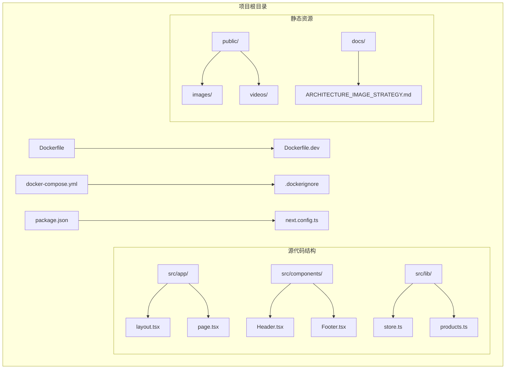
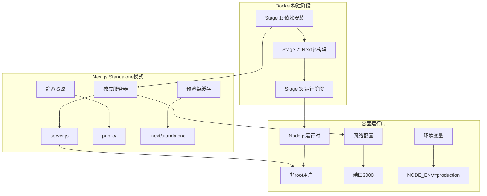
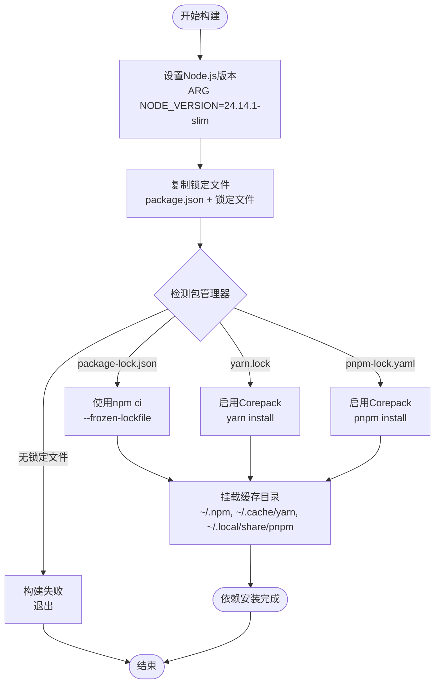
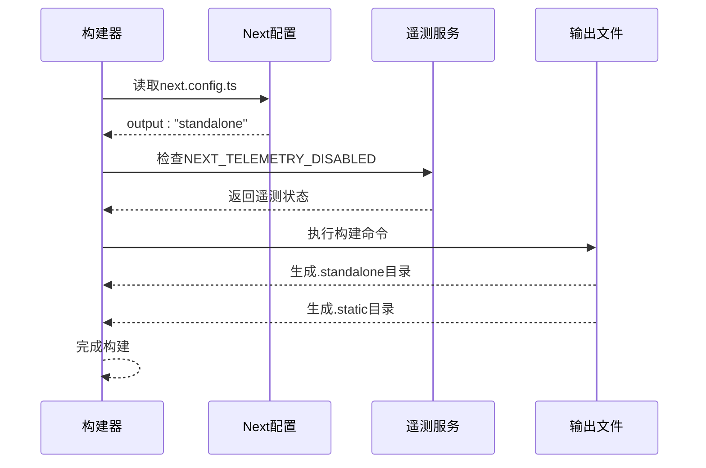
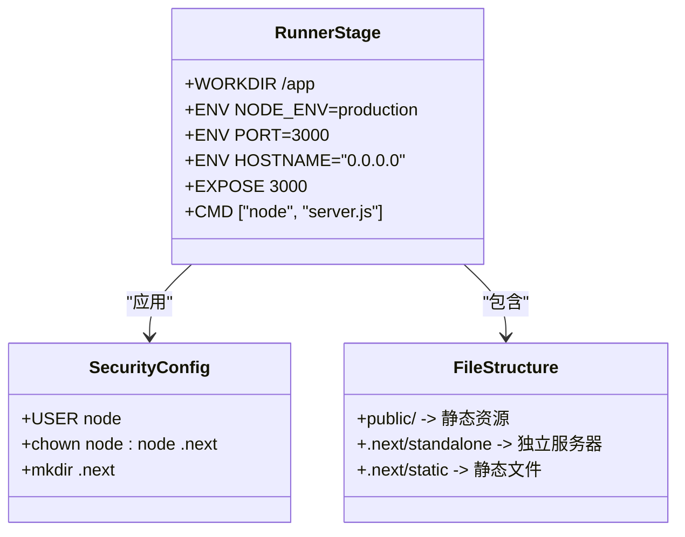
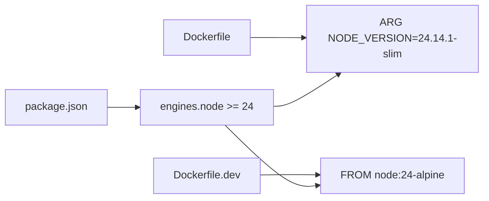
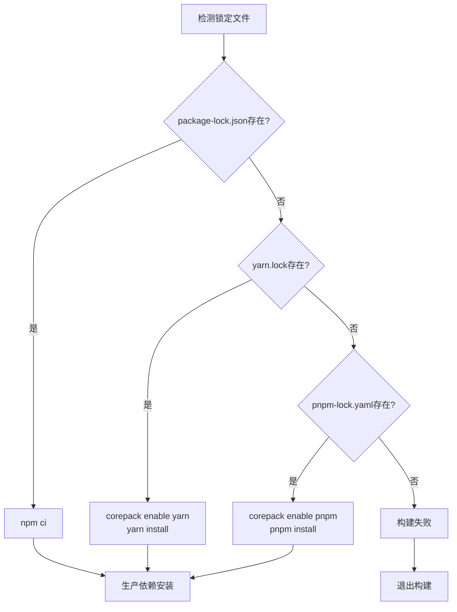

# Docker容器化部署

<cite>
**本文档引用的文件**
- [Dockerfile](file://Dockerfile)
- [Dockerfile.dev](file://Dockerfile.dev)
- [docker-compose.yml](file://docker-compose.yml)
- [.dockerignore](file://.dockerignore)
- [package.json](file://package.json)
- [next.config.ts](file://next.config.ts)
- [src/app/layout.tsx](file://src/app/layout.tsx)
- [src/app/page.tsx](file://src/app/page.tsx)
</cite>

## 目录
1. [简介](#简介)
2. [项目结构](#项目结构)
3. [核心组件](#核心组件)
4. [架构概览](#架构概览)
5. [详细组件分析](#详细组件分析)
6. [依赖关系分析](#依赖关系分析)
7. [性能考虑](#性能考虑)
8. [故障排除指南](#故障排除指南)
9. [结论](#结论)

## 简介

本指南详细介绍了蓝辉轻改网站的Docker容器化部署方案。该项目采用三阶段Docker构建流程，充分利用Next.js的standalone模式进行优化部署。文档涵盖了从依赖安装到应用构建再到运行的完整流程，包括生产环境和开发环境的差异化配置、安全最佳实践以及性能优化策略。

## 项目结构

蓝辉轻改网站是一个基于Next.js 16.2.1的现代化React应用，专注于汽车轻改装服务展示。项目采用TypeScript编写，使用TailwindCSS进行样式设计，整体架构清晰，适合容器化部署。

**图表来源**
- [Dockerfile:1-114](file://Dockerfile#L1-L114)
- [docker-compose.yml:1-54](file://docker-compose.yml#L1-L54)

**章节来源**
- [Dockerfile:1-114](file://Dockerfile#L1-L114)
- [Dockerfile.dev:1-16](file://Dockerfile.dev#L1-L16)
- [docker-compose.yml:1-54](file://docker-compose.yml#L1-L54)

## 核心组件

### Dockerfile三阶段构建系统

项目实现了完整的三阶段Docker构建流程，每个阶段都有明确的职责分工：

#### 阶段1：依赖安装阶段
- **基础镜像选择**：使用指定Node.js版本的slim镜像，确保与项目Node基线一致
- **缓存优化**：优先复制包管理器锁定文件，利用Docker层缓存机制
- **多包管理器支持**：同时支持npm、yarn和pnpm，自动检测并使用相应的锁定文件

#### 阶段2：Next.js应用构建阶段  
- **构建环境配置**：设置生产环境变量和Next.js遥测禁用
- **构建优化**：支持构建缓存挂载，加速重复构建过程
- **standalone模式**：生成独立的构建产物，便于后续部署

#### 阶段3：运行阶段
- **最小化镜像**：仅包含运行所需的必要文件
- **安全配置**：切换到非root用户运行，提升安全性
- **输出追踪**：利用Next.js的输出文件追踪机制减少镜像大小

**章节来源**
- [Dockerfile:1-114](file://Dockerfile#L1-L114)

### 开发环境Dockerfile

开发环境使用轻量级Alpine Linux镜像，支持热重载功能：
- **基础镜像**：node:24-alpine提供更小的镜像体积
- **开发工具**：安装完整的开发依赖用于本地开发
- **热重载支持**：通过卷挂载实现代码变更的实时反映
- **端口映射**：默认映射到3001端口，避免与生产环境冲突

**章节来源**
- [Dockerfile.dev:1-16](file://Dockerfile.dev#L1-L16)

### Docker Compose编排

使用docker-compose.yml统一管理两个服务：
- **生产服务(app)**：使用标准Dockerfile构建，暴露3000端口
- **开发服务(dev)**：使用Dockerfile.dev构建，映射3001端口
- **环境配置**：支持.env和.env.local文件的动态加载
- **健康检查**：内置HTTP健康检查确保容器正常运行

**章节来源**
- [docker-compose.yml:1-54](file://docker-compose.yml#L1-L54)

## 架构概览

**图表来源**
- [Dockerfile:35-114](file://Dockerfile#L35-L114)
- [next.config.ts:1-9](file://next.config.ts#L1-L9)

## 详细组件分析

### 依赖安装阶段详解

**图表来源**
- [Dockerfile:21-32](file://Dockerfile#L21-L32)

#### 缓存优化机制

- **npm缓存**：`/root/.npm`目录缓存
- **yarn缓存**：`/usr/local/share/.cache/yarn`目录缓存  
- **pnpm缓存**：`/root/.local/share/pnpm/store`目录缓存

这些缓存挂载确保了依赖安装的快速性和一致性。

**章节来源**
- [Dockerfile:21-32](file://Dockerfile#L21-L32)

### Next.js构建阶段分析

**图表来源**
- [Dockerfile:56-70](file://Dockerfile#L56-L70)
- [next.config.ts:5](file://next.config.ts#L5)

#### Standalone模式优势

- **独立部署**：生成的server.js可直接运行，无需额外依赖
- **镜像优化**：通过输出文件追踪机制，只包含实际使用的文件
- **启动速度**：减少不必要的文件传输和解压时间
- **维护简化**：单一可执行文件便于管理和更新

**章节来源**
- [Dockerfile:98-105](file://Dockerfile#L98-L105)
- [next.config.ts:5](file://next.config.ts#L5)

### 运行阶段配置

**图表来源**
- [Dockerfile:76-114](file://Dockerfile#L76-L114)

#### 安全最佳实践

- **非root用户运行**：使用node用户而非root用户提升安全性
- **权限控制**：正确设置.prerender缓存目录的所有权
- **最小权限原则**：只暴露必要的端口和服务
- **环境隔离**：生产环境和开发环境的严格分离

**章节来源**
- [Dockerfile:107-114](file://Dockerfile#L107-L114)

### 开发环境对比分析

| 特性 | 生产环境Dockerfile | 开发环境Dockerfile.dev |
|------|-------------------|----------------------|
| 基础镜像 | node:24.14.1-slim | node:24-alpine |
| 端口映射 | 3000 | 3001 |
| 环境变量 | NODE_ENV=production | NODE_ENV=development |
| 卷挂载 | 无 | 源码卷挂载 |
| 缓存策略 | 依赖缓存 | 无缓存 |
| 遥测 | 可禁用 | 默认禁用 |
| 启动方式 | 独立服务器 | 开发服务器 |

**章节来源**
- [Dockerfile:1-114](file://Dockerfile#L1-L114)
- [Dockerfile.dev:1-16](file://Dockerfile.dev#L1-L16)

## 依赖关系分析

### Node.js版本管理

项目严格遵循Node.js 24+的引擎要求，通过多种机制确保版本一致性：

**图表来源**
- [package.json:26-28](file://package.json#L26-L28)
- [Dockerfile:8-10](file://Dockerfile#L8-L10)
- [Dockerfile.dev:1](file://Dockerfile.dev#L1)

### 包管理器兼容性

Dockerfile支持三种主流包管理器，通过智能检测机制实现无缝切换：

**图表来源**
- [Dockerfile:24-32](file://Dockerfile#L24-L32)

**章节来源**
- [package.json:26-28](file://package.json#L26-L28)
- [Dockerfile:24-32](file://Dockerfile#L24-L32)

## 性能考虑

### 构建性能优化

1. **多层缓存策略**
   - 依赖安装缓存：`/root/.npm`、`/usr/local/share/.cache/yarn`、`/root/.local/share/pnpm/store`
   - 构建缓存：`.next/cache`目录（可选启用）

2. **并行构建优化**
   - 使用多阶段构建避免重复安装依赖
   - 利用Docker层缓存机制提升构建效率

3. **镜像大小优化**
   - 仅复制必要的构建产物
   - 使用输出文件追踪机制精简镜像内容

### 运行时性能配置

1. **内存管理**
   - 设置适当的Node.js内存限制
   - 合理配置垃圾回收参数

2. **并发处理**
   - 利用Next.js的并发渲染能力
   - 优化静态资源的CDN分发

3. **缓存策略**
   - 启用浏览器缓存机制
   - 实现服务端缓存优化

## 故障排除指南

### 常见构建问题

#### 1. Node.js版本不匹配
**症状**：构建过程中出现Node.js版本错误
**解决方案**：
- 检查package.json中的engines配置
- 更新Dockerfile中的NODE_VERSION参数
- 确保本地Node.js版本与容器内版本一致

#### 2. 依赖安装失败
**症状**：npm/yarn/pnpm安装过程中报错
**解决方案**：
- 清理Docker构建缓存：`docker builder prune`
- 检查网络连接和代理设置
- 验证锁定文件的完整性

#### 3. Standalone构建问题
**症状**：运行时缺少依赖文件
**解决方案**：
- 确认next.config.ts中output设置为"standalone"
- 检查输出文件追踪是否正确
- 验证所有导入的模块都已包含在最终镜像中

### 运行时问题诊断

#### 1. 端口访问问题
**症状**：无法通过浏览器访问应用
**排查步骤**：
- 检查容器端口映射配置
- 验证防火墙设置
- 使用`docker logs <container>`查看错误信息

#### 2. 权限相关错误
**症状**：应用启动时报权限错误
**解决方案**：
- 确认非root用户权限设置正确
- 检查.prerender缓存目录所有权
- 验证卷挂载权限配置

#### 3. 环境变量问题
**症状**：应用行为异常或配置不生效
**排查方法**：
- 检查.env和.env.local文件格式
- 验证docker-compose中的环境变量配置
- 使用`docker exec`进入容器检查环境变量

### 性能问题排查

#### 1. 启动缓慢
**可能原因**：
- 首次构建缓存缺失
- 镜像过大导致传输缓慢
- 磁盘IO性能不足

**优化建议**：
- 启用构建缓存挂载
- 使用更小的基础镜像
- 优化.dockerignore配置

#### 2. 内存使用过高
**可能原因**：
- Node.js内存限制未设置
- 静态资源过大
- 缓存策略不当

**解决方案**：
- 添加内存限制配置
- 优化图片和媒体资源
- 调整缓存清理策略

**章节来源**
- [Dockerfile:21-32](file://Dockerfile#L21-L32)
- [Dockerfile:98-105](file://Dockerfile#L98-L105)
- [docker-compose.yml:20-25](file://docker-compose.yml#L20-L25)

## 结论

蓝辉轻改网站的Docker容器化部署方案展现了现代Web应用的最佳实践。通过三阶段构建流程、Next.js standalone模式和严格的缓存优化策略，实现了高效、安全且易于维护的部署架构。

### 主要优势

1. **构建效率**：多层缓存和并行构建显著提升构建速度
2. **运行安全**：非root用户运行和最小权限原则确保容器安全
3. **部署简化**：standalone模式使部署过程更加直观
4. **环境隔离**：生产与开发环境的明确分离便于维护

### 最佳实践建议

1. **持续监控**：定期检查容器性能指标和日志
2. **安全更新**：及时更新基础镜像和依赖包
3. **备份策略**：建立完整的配置和数据备份机制
4. **文档维护**：保持部署文档与实际配置同步

该部署方案为类似的企业级Web应用提供了可靠的容器化模板，既保证了开发效率又确保了生产环境的稳定性。