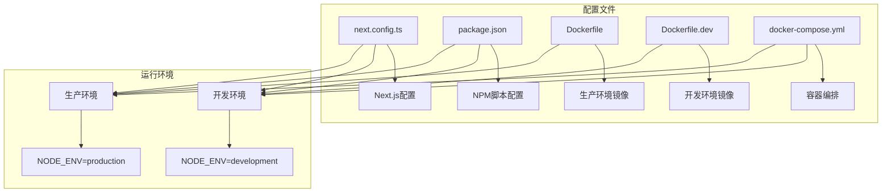
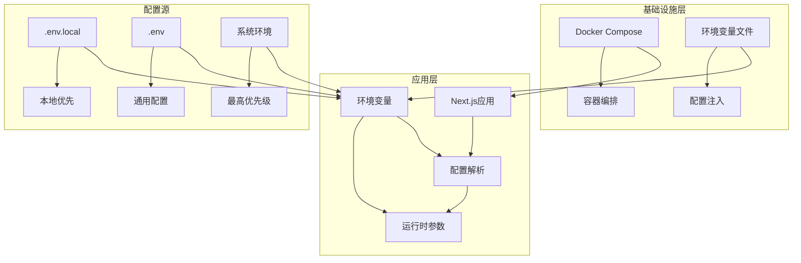
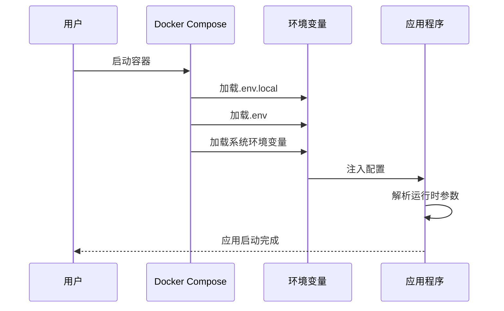
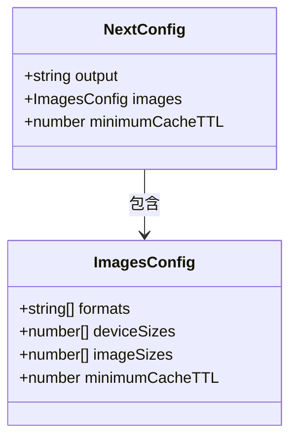
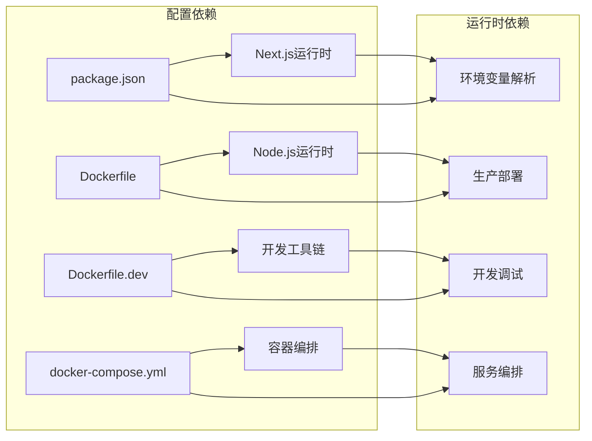

# 环境配置管理

<cite>
**本文档引用的文件**
- [next.config.ts](file://next.config.ts)
- [package.json](file://package.json)
- [Dockerfile](file://Dockerfile)
- [Dockerfile.dev](file://Dockerfile.dev)
- [docker-compose.yml](file://docker-compose.yml)
</cite>

## 目录
1. [简介](#简介)
2. [项目结构](#项目结构)
3. [核心组件](#核心组件)
4. [架构概览](#架构概览)
5. [详细组件分析](#详细组件分析)
6. [依赖分析](#依赖分析)
7. [性能考虑](#性能考虑)
8. [故障排除指南](#故障排除指南)
9. [结论](#结论)

## 简介

本指南专注于蓝辉轻改网站的环境配置管理，提供从开发到生产的完整配置策略。该网站基于Next.js技术栈，采用容器化部署，需要建立完善的环境变量管理体系来支持多环境运行。

## 项目结构

该项目采用现代化的前端技术栈，主要配置文件分布如下：

**图表来源**
- [next.config.ts:1-14](file://next.config.ts#L1-L14)
- [package.json:29-35](file://package.json#L29-L35)
- [Dockerfile:49-84](file://Dockerfile#L49-L84)
- [Dockerfile.dev:12-13](file://Dockerfile.dev#L12-L13)
- [docker-compose.yml:12-19](file://docker-compose.yml#L12-L19)

**章节来源**
- [next.config.ts:1-14](file://next.config.ts#L1-L14)
- [package.json:1-60](file://package.json#L1-L60)
- [Dockerfile:1-114](file://Dockerfile#L1-L114)
- [Dockerfile.dev:1-16](file://Dockerfile.dev#L1-L16)
- [docker-compose.yml:1-54](file://docker-compose.yml#L1-L54)

## 核心组件

### Next.js配置管理

Next.js应用通过专门的配置文件管理运行时参数：

- **输出模式**: 使用独立输出模式以优化容器部署
- **图像优化**: 配置多种图像格式支持和缓存策略
- **性能参数**: 设置合理的缓存时间和设备尺寸

### 容器化配置

项目采用多阶段Docker构建，分别针对开发和生产环境：

- **生产镜像**: 基于Node.js官方镜像，使用独立输出模式
- **开发镜像**: 使用Alpine Linux，支持热重载
- **环境变量**: 统一的环境变量管理和优先级控制

**章节来源**
- [next.config.ts:3-11](file://next.config.ts#L3-L11)
- [Dockerfile:38-101](file://Dockerfile#L38-L101)
- [Dockerfile.dev:1-16](file://Dockerfile.dev#L1-L16)

## 架构概览

系统采用分层架构，从底层基础设施到应用层都有明确的配置边界：

**图表来源**
- [docker-compose.yml:15-19](file://docker-compose.yml#L15-L19)
- [Dockerfile:82-84](file://Dockerfile#L82-L84)
- [Dockerfile.dev:12-13](file://Dockerfile.dev#L12-L13)

## 详细组件分析

### 环境变量加载机制

系统实现了多层级的环境变量加载策略：

**图表来源**
- [docker-compose.yml:15-19](file://docker-compose.yml#L15-L19)
- [Dockerfile:49-84](file://Dockerfile#L49-L84)

### 开发环境配置

开发环境专注于快速迭代和调试：

- **端口映射**: 默认开发端口为3001，避免与生产端口冲突
- **热重载**: 挂载源码目录实现代码变更即时生效
- **调试支持**: 禁用遥测数据收集，减少开发干扰

### 生产环境配置

生产环境强调稳定性和性能：

- **安全隔离**: 使用非root用户运行应用
- **资源优化**: 独立输出模式减少镜像体积
- **健康检查**: 内置健康检查确保服务可用性

**章节来源**
- [docker-compose.yml:27-54](file://docker-compose.yml#L27-L54)
- [Dockerfile:76-114](file://Dockerfile#L76-L114)

### Next.js特定配置

应用的Next.js配置重点关注性能和用户体验：

**图表来源**
- [next.config.ts:3-11](file://next.config.ts#L3-L11)

**章节来源**
- [next.config.ts:1-14](file://next.config.ts#L1-L14)

## 依赖分析

系统配置依赖关系清晰，各组件职责明确：

**图表来源**
- [package.json:37-48](file://package.json#L37-L48)
- [Dockerfile:12-18](file://Dockerfile#L12-L18)
- [Dockerfile.dev:1-6](file://Dockerfile.dev#L1-L6)

**章节来源**
- [package.json:1-60](file://package.json#L1-L60)
- [Dockerfile:1-114](file://Dockerfile#L1-L114)

## 性能考虑

### 缓存策略

系统采用了多层次的缓存机制：

- **图像缓存**: 30天缓存期优化静态资源加载
- **构建缓存**: Docker构建缓存加速重复构建过程
- **依赖缓存**: 包管理器缓存提升安装效率

### 资源优化

- **独立输出**: 减少容器镜像大小，提升部署速度
- **按需加载**: 图像格式多样化支持现代浏览器特性
- **内存管理**: 合理的进程配置避免资源浪费

## 故障排除指南

### 常见配置问题

1. **环境变量未生效**
   - 检查.env文件权限和语法
   - 验证Docker环境变量注入
   - 确认变量名称符合Next.js要求

2. **端口冲突**
   - 修改docker-compose中的端口映射
   - 检查宿主机端口占用情况
   - 验证防火墙设置

3. **构建失败**
   - 清理node_modules和缓存
   - 检查Node.js版本兼容性
   - 验证包管理器锁定文件完整性

### 调试技巧

- 使用`npm run check`执行完整的配置验证
- 查看Docker日志获取详细错误信息
- 在开发模式下启用详细的错误报告

**章节来源**
- [package.json:35-35](file://package.json#L35-L35)
- [docker-compose.yml:20-25](file://docker-compose.yml#L20-L25)

## 结论

该环境配置管理方案提供了完整的多环境支持，通过容器化部署确保了开发和生产环境的一致性。建议在实际使用中：

1. 建立标准化的环境变量命名规范
2. 实施配置文件的版本控制
3. 定期审查和更新配置依赖
4. 建立配置变更的审批流程

这套配置体系为蓝辉轻改网站提供了可靠的基础设施支撑，能够满足从开发到生产的各种需求场景。