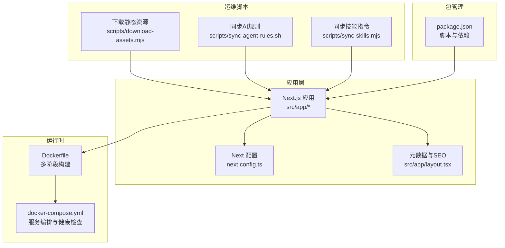
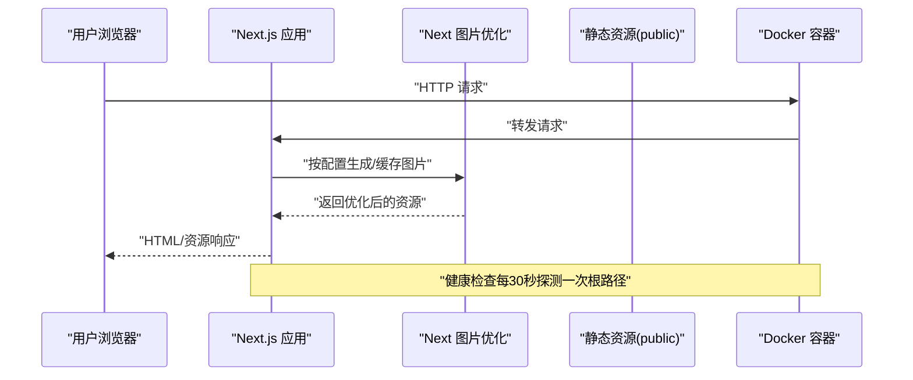
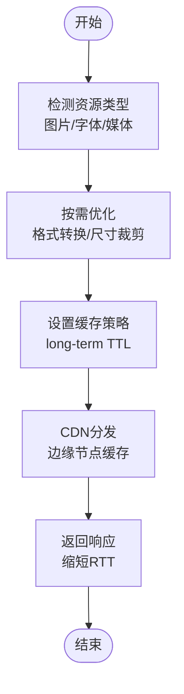
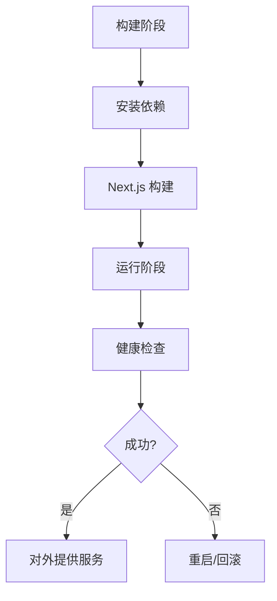
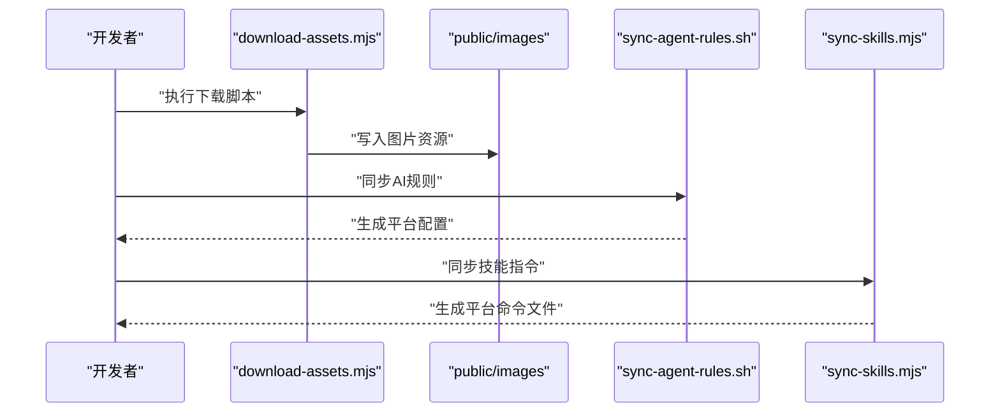
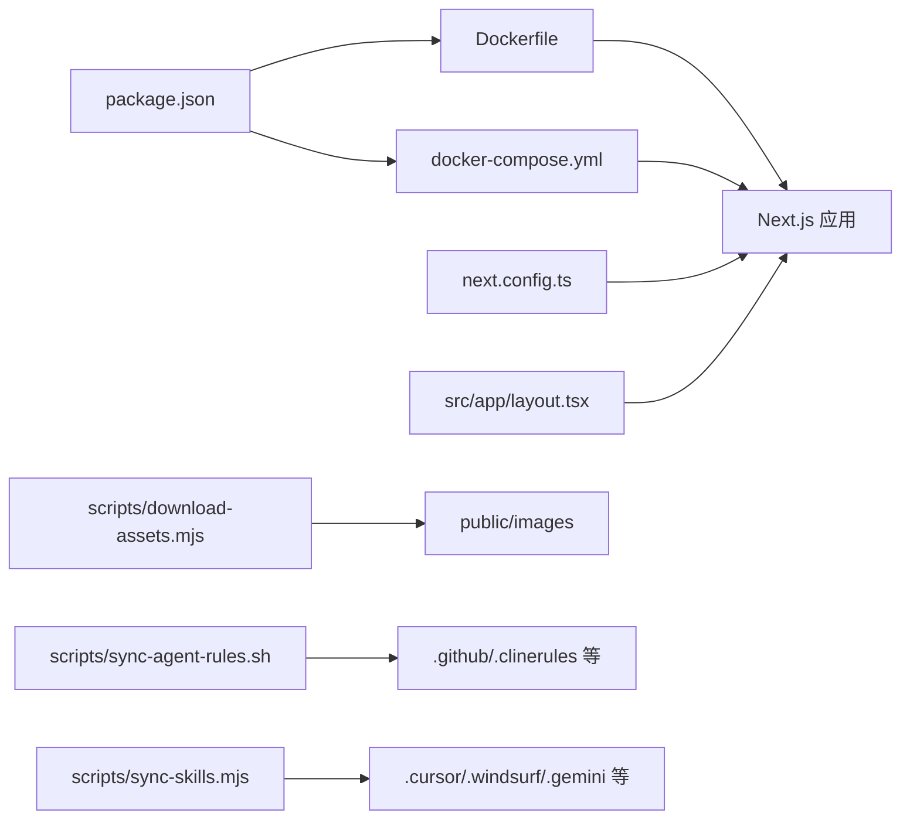

# 监控与维护

<cite>
**本文引用的文件**
- [package.json](file://package.json)
- [next.config.ts](file://next.config.ts)
- [Dockerfile](file://Dockerfile)
- [docker-compose.yml](file://docker-compose.yml)
- [scripts/download-assets.mjs](file://scripts/download-assets.mjs)
- [scripts/sync-agent-rules.sh](file://scripts/sync-agent-rules.sh)
- [scripts/sync-skills.mjs](file://scripts/sync-skills.mjs)
- [src/app/layout.tsx](file://src/app/layout.tsx)
</cite>

## 目录
1. [简介](#简介)
2. [项目结构](#项目结构)
3. [核心组件](#核心组件)
4. [架构总览](#架构总览)
5. [详细组件分析](#详细组件分析)
6. [依赖关系分析](#依赖关系分析)
7. [性能考量](#性能考量)
8. [故障排查指南](#故障排查指南)
9. [结论](#结论)
10. [附录](#附录)

## 简介
本指南面向蓝辉轻改网站的运维与开发团队，围绕应用性能监控（APM）、日志管理、静态资源优化与CDN集成、定期维护自动化脚本、故障排查流程以及安全与合规实践，提供可操作的配置建议与最佳实践。由于当前仓库未包含内置的APM、日志采集或CDN配置文件，本指南在“现有能力”基础上给出可落地的扩展方案与流程，帮助团队建立完善的监控与维护体系。

## 项目结构
该仓库采用Next.js 16应用，结合Docker容器化部署与健康检查；前端通过Next.js Image优化与缓存策略；脚本目录提供资产下载与AI协作平台规则同步工具；元数据与SEO配置集中在根布局中。

**图表来源**
- [next.config.ts:1-14](file://next.config.ts#L1-L14)
- [Dockerfile:1-114](file://Dockerfile#L1-L114)
- [docker-compose.yml:1-54](file://docker-compose.yml#L1-L54)
- [scripts/download-assets.mjs:1-64](file://scripts/download-assets.mjs#L1-L64)
- [scripts/sync-agent-rules.sh:1-89](file://scripts/sync-agent-rules.sh#L1-L89)
- [scripts/sync-skills.mjs:1-113](file://scripts/sync-skills.mjs#L1-L113)
- [package.json:1-60](file://package.json#L1-L60)

**章节来源**
- [package.json:1-60](file://package.json#L1-L60)
- [next.config.ts:1-14](file://next.config.ts#L1-L14)
- [Dockerfile:1-114](file://Dockerfile#L1-L114)
- [docker-compose.yml:1-54](file://docker-compose.yml#L1-L54)
- [scripts/download-assets.mjs:1-64](file://scripts/download-assets.mjs#L1-L64)
- [scripts/sync-agent-rules.sh:1-89](file://scripts/sync-agent-rules.sh#L1-L89)
- [scripts/sync-skills.mjs:1-113](file://scripts/sync-skills.mjs#L1-L113)
- [src/app/layout.tsx:1-39](file://src/app/layout.tsx#L1-L39)

## 核心组件
- 构建与运行配置：Next.js配置控制图像格式、设备尺寸、缓存时间；Dockerfile采用多阶段构建与standalone输出，提升镜像体积与启动速度；docker-compose定义生产与开发环境、端口映射与健康检查。
- 静态资源与SEO：next.config.ts中的images配置与layout.tsx中的metadata共同保障图片优化与搜索引擎可见性。
- 运维脚本：download-assets用于批量拉取品牌图片至public/images；sync-agent-rules与sync-skills用于统一AI协作平台的规则与技能指令，减少重复维护成本。

**章节来源**
- [next.config.ts:3-11](file://next.config.ts#L3-L11)
- [Dockerfile:38-114](file://Dockerfile#L38-L114)
- [docker-compose.yml:1-54](file://docker-compose.yml#L1-L54)
- [scripts/download-assets.mjs:14-44](file://scripts/download-assets.mjs#L14-L44)
- [scripts/sync-agent-rules.sh:67-89](file://scripts/sync-agent-rules.sh#L67-L89)
- [scripts/sync-skills.mjs:51-113](file://scripts/sync-skills.mjs#L51-L113)
- [src/app/layout.tsx:5-18](file://src/app/layout.tsx#L5-L18)

## 架构总览
下图展示从请求到响应的关键路径，以及容器化与健康检查的运行时保障。

**图表来源**
- [Dockerfile:82-114](file://Dockerfile#L82-L114)
- [docker-compose.yml:20-25](file://docker-compose.yml#L20-L25)
- [next.config.ts:5-10](file://next.config.ts#L5-L10)

## 详细组件分析

### 组件A：静态资源优化与CDN集成
- 现有能力
  - 图片格式与尺寸：next.config.ts启用AVIF/WebP格式，并配置deviceSizes与imageSizes，结合minimumCacheTTL实现长期缓存。
  - 站点元数据：layout.tsx提供title、description、keywords与openGraph信息，利于SEO与社交分享。
- 建议扩展
  - CDN接入：在生产环境通过CDN缓存public目录与_next静态资源，结合Cache-Control与边缘缓存策略，降低源站压力。
  - 渐进增强：对第三方图片引入CDN域名，配合Image组件的loader与自定义domain白名单，确保跨域安全与性能。
  - 资源版本化：为CSS/JS增加内容哈希后缀，结合长缓存与失效策略，避免缓存污染。
  - 压缩与传输：开启Brotli/Gzip压缩，优先使用HTTP/2或HTTP/3，减少首字节时间与往返次数。

**图表来源**
- [next.config.ts:5-10](file://next.config.ts#L5-L10)
- [src/app/layout.tsx:5-18](file://src/app/layout.tsx#L5-L18)

**章节来源**
- [next.config.ts:3-11](file://next.config.ts#L3-L11)
- [src/app/layout.tsx:5-18](file://src/app/layout.tsx#L5-L18)

### 组件B：容器化与健康检查
- 多阶段构建：分离依赖安装、构建与运行阶段，最终以standalone模式复制必要文件，减小镜像体积。
- 运行参数：设置NODE_ENV、HOSTNAME、PORT，禁用Next遥测，提高隐私与性能。
- 健康检查：docker-compose对根路径进行周期性探测，失败重试与启动延时保障容器稳定上线。

**图表来源**
- [Dockerfile:38-114](file://Dockerfile#L38-L114)
- [docker-compose.yml:20-25](file://docker-compose.yml#L20-L25)

**章节来源**
- [Dockerfile:38-114](file://Dockerfile#L38-L114)
- [docker-compose.yml:1-54](file://docker-compose.yml#L1-L54)

### 组件C：运维脚本与自动化
- 下载静态资源：scripts/download-assets.mjs支持批量下载品牌图片至public/images，具备跳过已存在文件、记录大小与状态的功能。
- 同步AI规则：scripts/sync-agent-rules.sh将AGENTS.md解析为各平台所需格式，自动写入对应目录，保持规则一致性。
- 同步技能指令：scripts/sync-skills.mjs将SKILL.md转换为不同平台的命令文件，统一描述与提示词。

**图表来源**
- [scripts/download-assets.mjs:26-58](file://scripts/download-assets.mjs#L26-L58)
- [scripts/sync-agent-rules.sh:35-89](file://scripts/sync-agent-rules.sh#L35-L89)
- [scripts/sync-skills.mjs:17-113](file://scripts/sync-skills.mjs#L17-L113)

**章节来源**
- [scripts/download-assets.mjs:1-64](file://scripts/download-assets.mjs#L1-L64)
- [scripts/sync-agent-rules.sh:1-89](file://scripts/sync-agent-rules.sh#L1-L89)
- [scripts/sync-skills.mjs:1-113](file://scripts/sync-skills.mjs#L1-L113)

### 组件D：日志管理策略
- 日志级别：在容器环境中建议使用INFO级别记录业务事件，ERROR级别记录异常堆栈；对调试期可临时提升至DEBUG。
- 日志轮转：通过Docker日志驱动的logrotate或外部日志代理（如Fluent Bit/Vector）实现按大小与时间轮转，保留最近N份副本。
- 集中化采集：将容器标准输出重定向至stdout/stderr，由Kubernetes/云厂商日志服务或ELK/EFK统一收集与检索。
- 关键字段：每条日志包含traceId/spanId、请求路径、响应码、耗时、用户标识（如可用）等，便于关联分析。

[本节为通用实践说明，不直接分析具体文件，故无“章节来源”]

### 组件E：应用性能监控（APM）
- 指标采集：核心指标包括请求量、错误率、P95/P99延迟、CPU/内存/连接数、缓存命中率、CDN回源率。
- 性能基准：在预生产环境对关键页面（首页、产品页、门店详情）进行压测，记录冷热启动、首屏渲染、交互可用时间。
- 异常告警：基于阈值与趋势模型（如滑动窗口、季节性分解）触发告警；区分严重、警告、通知三级；对接IM/邮件/电话通道。
- 可观测性：埋点span覆盖路由变更、图片加载、API调用、用户交互；结合分布式追踪（如OpenTelemetry）与日志/指标关联。

[本节为通用实践说明，不直接分析具体文件，故无“章节来源”]

### 组件F：安全监控与合规
- 漏洞扫描：CI中集成SAST（Semgrep/ESLint规则）与DAST（OWASP ZAP），对依赖与源码进行扫描；镜像层扫描（Trivy/Snyk）识别基础镜像漏洞。
- 合规检查：对GDPR/CCPA等隐私保护要求进行数据处理清单与访问审计；对第三方CDN/Analytics服务进行合规评估。
- 入侵检测：WAF/IPS策略限制常见攻击（XSS/SQLi/CSRF/暴力破解），结合IP封禁与速率限制；对异常登录行为进行二次验证。

[本节为通用实践说明，不直接分析具体文件，故无“章节来源”]

## 依赖关系分析
- 包管理与脚本：package.json定义开发、构建与检查脚本；Dockerfile根据锁文件选择安装器；docker-compose注入环境变量并启用健康检查。
- 配置耦合：next.config.ts影响Image优化与缓存；layout.tsx影响SEO与社交分享；Dockerfile决定运行时环境与镜像大小。
- 脚本依赖：download-assets依赖网络与文件系统；sync-agent-rules与sync-skills依赖Markdown解析与模板写入。

**图表来源**
- [package.json:29-36](file://package.json#L29-L36)
- [Dockerfile:38-114](file://Dockerfile#L38-L114)
- [docker-compose.yml:1-54](file://docker-compose.yml#L1-L54)
- [next.config.ts:3-11](file://next.config.ts#L3-L11)
- [src/app/layout.tsx:5-18](file://src/app/layout.tsx#L5-L18)
- [scripts/download-assets.mjs:14-44](file://scripts/download-assets.mjs#L14-L44)
- [scripts/sync-agent-rules.sh:67-89](file://scripts/sync-agent-rules.sh#L67-L89)
- [scripts/sync-skills.mjs:51-113](file://scripts/sync-skills.mjs#L51-L113)

**章节来源**
- [package.json:1-60](file://package.json#L1-L60)
- [next.config.ts:1-14](file://next.config.ts#L1-L14)
- [Dockerfile:1-114](file://Dockerfile#L1-L114)
- [docker-compose.yml:1-54](file://docker-compose.yml#L1-L54)
- [scripts/download-assets.mjs:1-64](file://scripts/download-assets.mjs#L1-L64)
- [scripts/sync-agent-rules.sh:1-89](file://scripts/sync-agent-rules.sh#L1-L89)
- [scripts/sync-skills.mjs:1-113](file://scripts/sync-skills.mjs#L1-L113)
- [src/app/layout.tsx:1-39](file://src/app/layout.tsx#L1-L39)

## 性能考量
- 构建与缓存
  - 使用standalone输出与最小化依赖，缩短冷启动时间。
  - 在Docker构建阶段利用缓存目录，减少重复安装时间。
- 运行时优化
  - 启用AVIF/WebP与合适的deviceSizes，降低带宽与渲染开销。
  - 设置合理的minimumCacheTTL，平衡新鲜度与缓存命中。
- 容器健康
  - 健康检查间隔与超时应与实例规模与SLA匹配，避免误判。
  - 开启NEXT_TELEMETRY_DISABLED减少遥测开销。

[本节为通用指导，不直接分析具体文件，故无“章节来源”]

## 故障排查指南
- 健康检查失败
  - 检查容器日志与端口映射；确认应用监听0.0.0.0而非127.0.0.1；核对环境变量与.env文件。
- 构建失败
  - 校验锁文件与Node版本；查看Docker构建阶段的依赖安装与Next构建输出。
- 图片加载异常
  - 检查next.config.ts中的formats与sizes；确认public/images权限与缓存头。
- SEO与社交分享问题
  - 核对layout.tsx中的metadata与openGraph字段；使用社交调试工具验证。

**章节来源**
- [docker-compose.yml:20-25](file://docker-compose.yml#L20-L25)
- [Dockerfile:82-114](file://Dockerfile#L82-L114)
- [next.config.ts:5-10](file://next.config.ts#L5-L10)
- [src/app/layout.tsx:5-18](file://src/app/layout.tsx#L5-L18)

## 结论
本指南在现有仓库能力之上，提供了静态资源优化、容器化与健康检查、运维脚本自动化、日志与APM、安全与合规的系统化建议。建议优先落地以下动作：
- 在生产环境启用CDN与长缓存策略；
- 增设日志集中化与APM探针；
- 将脚本纳入CI/CD流水线，确保规则与技能的一致性；
- 建立健康检查与告警机制，完善故障排查流程。

[本节为总结性内容，不直接分析具体文件，故无“章节来源”]

## 附录
- 常用命令参考
  - 开发：npm run dev
  - 构建：npm run build
  - 类型检查：npm run typecheck
  - ESLint：npm run lint
  - 下载资源：node scripts/download-assets.mjs
  - 同步AI规则：bash scripts/sync-agent-rules.sh
  - 同步技能指令：node scripts/sync-skills.mjs

**章节来源**
- [package.json:29-36](file://package.json#L29-L36)
- [scripts/download-assets.mjs:46-58](file://scripts/download-assets.mjs#L46-L58)
- [scripts/sync-agent-rules.sh:67-89](file://scripts/sync-agent-rules.sh#L67-L89)
- [scripts/sync-skills.mjs:51-113](file://scripts/sync-skills.mjs#L51-L113)