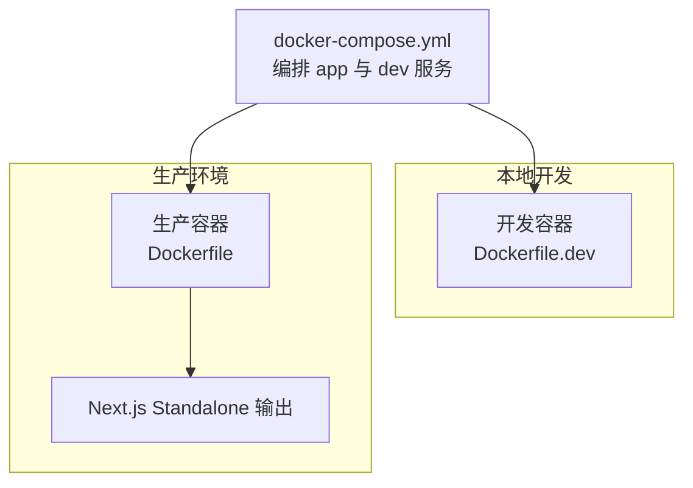
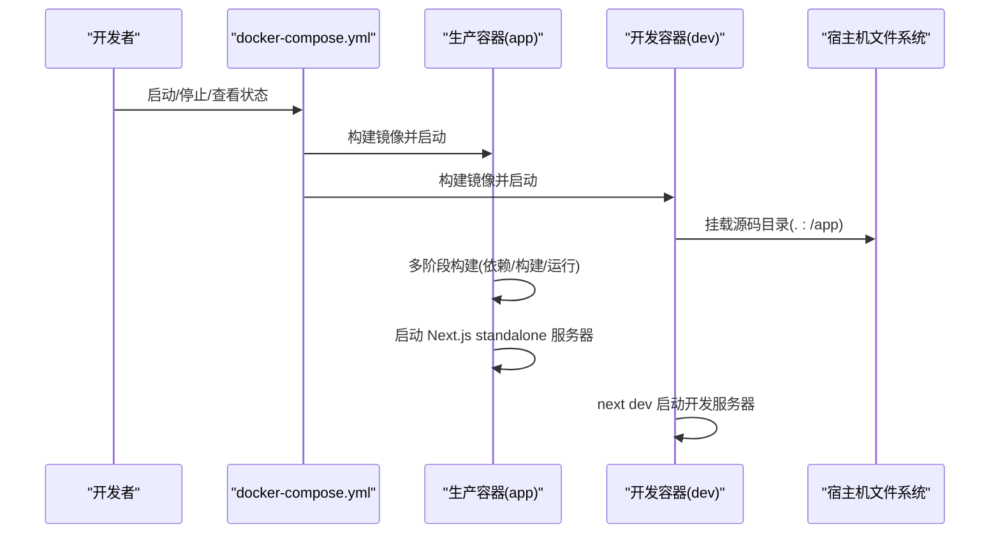
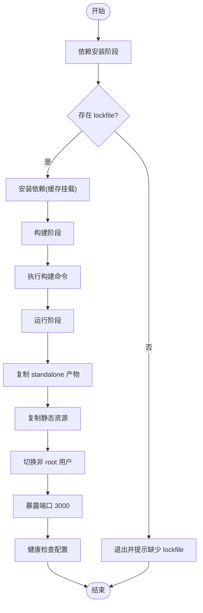
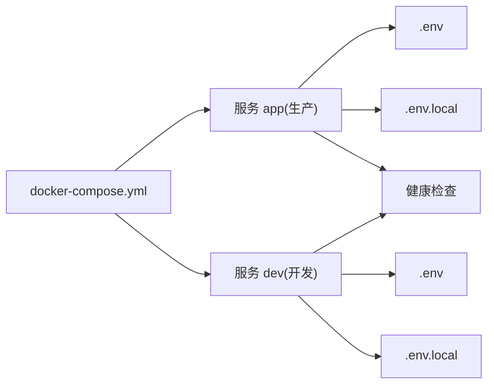
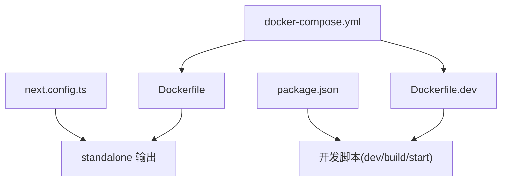

# 部署与运维

<cite>
**本文引用的文件**
- [Dockerfile](file://Dockerfile)
- [Dockerfile.dev](file://Dockerfile.dev)
- [docker-compose.yml](file://docker-compose.yml)
- [.dockerignore](file://.dockerignore)
- [.gitignore](file://.gitignore)
- [package.json](file://package.json)
- [next.config.ts](file://next.config.ts)
- [tsconfig.json](file://tsconfig.json)
</cite>

## 目录
1. [简介](#简介)
2. [项目结构](#项目结构)
3. [核心组件](#核心组件)
4. [架构总览](#架构总览)
5. [详细组件分析](#详细组件分析)
6. [依赖关系分析](#依赖关系分析)
7. [性能考量](#性能考量)
8. [故障排查指南](#故障排查指南)
9. [结论](#结论)
10. [附录](#附录)

## 简介
本指南面向运维与开发团队，系统性说明蓝辉轻改网站在本地开发、测试与生产环境中的容器化部署与运维实践。内容涵盖：
- Docker 多阶段构建与镜像优化
- docker-compose 编排与多服务协调
- CI/CD 设计思路与自动化部署策略
- 环境变量管理、配置分离与敏感信息保护
- 性能监控、日志管理与故障排查
- 静态资源优化与 CDN 集成建议
- 不同部署环境的配置差异与注意事项

## 项目结构
该仓库采用 Next.js 16 应用，结合 Docker 与 docker-compose 实现本地与生产环境的一致化运行。关键文件与职责如下：
- 构建与运行镜像：Dockerfile（生产）、Dockerfile.dev（开发）
- 编排与服务定义：docker-compose.yml
- 运行时配置：next.config.ts（输出模式为 standalone）
- 包与脚本：package.json（含开发/构建/启动脚本）
- 构建缓存与忽略规则：.dockerignore、.gitignore
- 类型配置：tsconfig.json

图表来源
- [docker-compose.yml:1-54](file://docker-compose.yml#L1-L54)
- [Dockerfile.dev:1-16](file://Dockerfile.dev#L1-L16)
- [Dockerfile:1-114](file://Dockerfile#L1-L114)
- [next.config.ts:1-9](file://next.config.ts#L1-L9)

章节来源
- [docker-compose.yml:1-54](file://docker-compose.yml#L1-L54)
- [Dockerfile:1-114](file://Dockerfile#L1-L114)
- [Dockerfile.dev:1-16](file://Dockerfile.dev#L1-L16)
- [next.config.ts:1-9](file://next.config.ts#L1-L9)
- [package.json:1-60](file://package.json#L1-L60)
- [.dockerignore:1-61](file://.dockerignore#L1-L61)
- [.gitignore:1-50](file://.gitignore#L1-L50)
- [tsconfig.json:1-35](file://tsconfig.json#L1-L35)

## 核心组件
- 生产镜像（Dockerfile）
  - 多阶段构建：依赖安装、应用构建、运行时裁剪
  - 使用 Node.js 官方镜像，固定 Node 版本 ARG，确保可重复构建
  - 启用 Next.js standalone 输出，减少运行时依赖
  - 设置非 root 用户运行，暴露端口 3000，设置健康检查
- 开发镜像（Dockerfile.dev）
  - 基于 alpine 的轻量镜像，安装依赖后以开发模式启动
  - 挂载源码目录实现热重载，排除 node_modules 与 .next 目录
- 编排（docker-compose.yml）
  - 定义 app（生产）与 dev（开发）两个服务
  - 支持环境变量注入与 env_file 引入
  - 提供健康检查与重启策略
- 运行时配置
  - next.config.ts 将 output 设为 standalone，配合 Docker 多阶段裁剪
  - package.json 提供 dev/build/start 脚本，支持本地开发与构建
  - tsconfig.json 采用 bundler 解析与严格类型检查

章节来源
- [Dockerfile:1-114](file://Dockerfile#L1-L114)
- [Dockerfile.dev:1-16](file://Dockerfile.dev#L1-L16)
- [docker-compose.yml:1-54](file://docker-compose.yml#L1-L54)
- [next.config.ts:1-9](file://next.config.ts#L1-L9)
- [package.json:1-60](file://package.json#L1-L60)
- [tsconfig.json:1-35](file://tsconfig.json#L1-L35)

## 架构总览
下图展示从源码到容器运行的整体流程，以及 docker-compose 如何编排生产与开发服务。

图表来源
- [docker-compose.yml:1-54](file://docker-compose.yml#L1-L54)
- [Dockerfile:1-114](file://Dockerfile#L1-L114)
- [Dockerfile.dev:1-16](file://Dockerfile.dev#L1-L16)
- [next.config.ts:1-9](file://next.config.ts#L1-L9)

## 详细组件分析

### 生产镜像（Dockerfile）
- 多阶段设计
  - 依赖安装阶段：优先使用 lockfile（npm/yarn/pnpm），启用缓存挂载提升构建速度
  - 构建阶段：复制依赖，执行构建命令；根据包管理器选择对应构建流程
  - 运行阶段：仅拷贝 standalone 产物与静态资源，设置非 root 用户与端口暴露
- 关键优化点
  - 使用 Next.js standalone 输出，减少运行时依赖
  - 输出追踪裁剪，仅复制必要文件
  - 可选持久化 fetch 缓存以加速启动
- 安全与合规
  - 固定 Node 版本 ARG，便于版本升级与审计
  - 非 root 用户运行，降低权限风险

图表来源
- [Dockerfile:1-114](file://Dockerfile#L1-L114)

章节来源
- [Dockerfile:1-114](file://Dockerfile#L1-L114)

### 开发镜像（Dockerfile.dev）
- 特点
  - 基于 alpine，体积小，适合本地开发
  - 挂载源码目录，容器内运行 next dev，支持热重载
  - 排除 node_modules 与 .next，避免缓存污染
- 端口映射
  - 默认映射宿主 3001 到容器 3000，可通过环境变量覆盖

章节来源
- [Dockerfile.dev:1-16](file://Dockerfile.dev#L1-L16)
- [docker-compose.yml:27-54](file://docker-compose.yml#L27-L54)

### docker-compose 编排与多服务协调
- 服务定义
  - app：生产镜像，绑定端口、注入环境变量、引入 env_file、健康检查
  - dev：开发镜像，挂载源码、排除 node_modules 与 .next、健康检查
- 环境变量与配置
  - 通过 environment 注入基础变量
  - 通过 env_file 引入 .env 与 .env.local（可选）
- 健康检查
  - 使用 wget 访问根路径进行存活探测，设定间隔、超时与重试

图表来源
- [docker-compose.yml:1-54](file://docker-compose.yml#L1-L54)

章节来源
- [docker-compose.yml:1-54](file://docker-compose.yml#L1-L54)

### 环境变量管理与配置分离
- .env 文件
  - .env 与 .env.local 通过 env_file 注入容器
  - .dockerignore 与 .gitignore 明确排除规则，避免泄露
- 环境变量覆盖
  - docker-compose 中 environment 会覆盖 env_file 中同名变量
  - 开发/生产环境变量可通过不同 compose 文件或环境变量文件区分
- 敏感信息保护
  - 严禁提交 .env 与 .env.local 至版本库
  - 在 CI/CD 中使用受控密钥管理工具注入敏感变量

章节来源
- [docker-compose.yml:12-19](file://docker-compose.yml#L12-L19)
- [.dockerignore:17-19](file://.dockerignore#L17-L19)
- [.gitignore:12-17](file://.gitignore#L12-L17)

### 静态资源优化与 CDN 集成
- Next.js standalone 输出
  - 由 next.config.ts 指定 output: "standalone"，利于容器裁剪与部署
- 静态资源
  - public 目录下的静态资源随构建产物打包
  - 建议在生产环境中通过 CDN 加速静态资源访问
- 图片与媒体
  - 建议使用现代格式（如 WebP）与按需加载策略
  - 对大文件启用压缩与懒加载，减少首屏负载

章节来源
- [next.config.ts:1-9](file://next.config.ts#L1-L9)
- [Dockerfile:92-101](file://Dockerfile#L92-L101)

### CI/CD 流程设计与自动化部署
- 构建阶段
  - 触发条件：分支保护、PR 合并、标签推送
  - 步骤：拉取代码 → 选择包管理器 → 多阶段构建 → 生成镜像 → 推送镜像仓库
- 测试阶段
  - 单元/类型检查/构建验证（可复用 package.json 脚本）
- 部署阶段
  - 预发布：docker-compose 拉起服务，健康检查通过后进入灰度
  - 生产：滚动更新或蓝绿发布，回滚策略基于镜像标签
- 安全与审计
  - 镜像扫描、依赖漏洞检测、密钥注入最小化

（本节为概念性设计，不直接分析具体文件）

## 依赖关系分析
- 组件耦合
  - docker-compose 依赖 Dockerfile 与 Dockerfile.dev 产出镜像
  - 生产镜像依赖 next.config.ts 的 standalone 输出配置
  - 开发镜像依赖 package.json 的 dev 脚本
- 外部依赖
  - Node.js 版本与包管理器（npm/yarn/pnpm）的选择影响构建流程
- 潜在问题
  - 忘记更新 NODE_VERSION ARG 导致镜像与本地不一致
  - .env 泄漏或未正确排除导致安全风险

图表来源
- [package.json:29-35](file://package.json#L29-L35)
- [next.config.ts:5](file://next.config.ts#L5)
- [Dockerfile:38-70](file://Dockerfile#L38-L70)
- [Dockerfile.dev:1-16](file://Dockerfile.dev#L1-L16)
- [docker-compose.yml:1-54](file://docker-compose.yml#L1-L54)

章节来源
- [package.json:29-35](file://package.json#L29-L35)
- [next.config.ts:1-9](file://next.config.ts#L1-L9)
- [Dockerfile:1-114](file://Dockerfile#L1-L114)
- [Dockerfile.dev:1-16](file://Dockerfile.dev#L1-L16)
- [docker-compose.yml:1-54](file://docker-compose.yml#L1-L54)

## 性能考量
- 构建性能
  - 多阶段构建与缓存挂载显著缩短依赖安装时间
  - 锁文件一致性保障可重复构建
- 运行性能
  - standalone 输出减少运行时依赖，降低镜像体积与启动时间
  - 非 root 用户与最小权限原则提升安全性
- 资源优化
  - 静态资源与图片优化、CDN 加速、缓存头配置
  - 合理的健康检查与重启策略避免雪崩

（本节提供通用指导，不直接分析具体文件）

## 故障排查指南
- 容器无法启动
  - 检查端口占用与映射（默认 3000/3001）
  - 查看健康检查失败原因（/health 或根路径）
- 环境变量问题
  - 确认 .env 与 .env.local 是否被正确读取
  - 检查 docker-compose 中 environment 是否覆盖了预期值
- 构建失败
  - 确认存在 package-lock.json/yarn.lock/pnpm-lock.yaml 其一
  - 检查 Node 版本与包管理器是否匹配
- 权限与文件丢失
  - 确保 .dockerignore 排除了不必要的文件
  - 检查开发容器挂载路径与排除项

章节来源
- [docker-compose.yml:10-25](file://docker-compose.yml#L10-L25)
- [docker-compose.yml:34-53](file://docker-compose.yml#L34-L53)
- [Dockerfile:21-32](file://Dockerfile#L21-L32)
- [.dockerignore:17-19](file://.dockerignore#L17-L19)

## 结论
通过多阶段 Docker 构建、standalone 输出与 docker-compose 编排，本项目实现了开发与生产的高效协同与一致化运行。配合合理的环境变量管理、静态资源优化与 CDN 集成，可进一步提升稳定性与性能。建议在 CI/CD 中固化构建与部署流程，并持续关注镜像安全与依赖漏洞。

## 附录

### 不同部署环境的配置差异与注意事项
- 本地开发
  - 使用 Dockerfile.dev，挂载源码目录，启用热重载
  - 端口映射默认 3001:3000，可通过环境变量调整
- 测试环境
  - 使用生产镜像，启用健康检查与日志采集
  - 分离 .env 与 .env.local，避免与生产配置冲突
- 生产环境
  - 固定 Node 版本 ARG，确保镜像可重复
  - 使用 standalone 输出与非 root 用户运行
  - 配置 CDN 与缓存策略，启用健康检查与自动重启

章节来源
- [Dockerfile.dev:1-16](file://Dockerfile.dev#L1-L16)
- [docker-compose.yml:1-54](file://docker-compose.yml#L1-L54)
- [Dockerfile:1-114](file://Dockerfile#L1-L114)