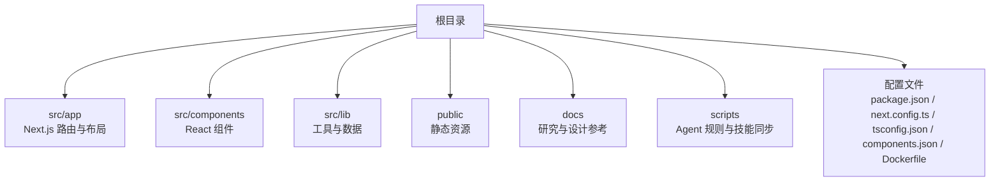
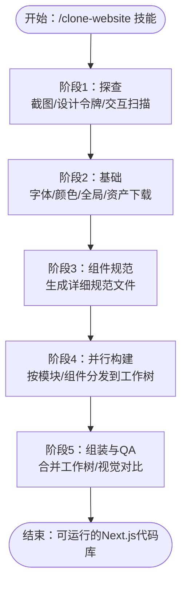
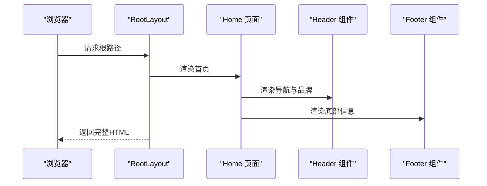
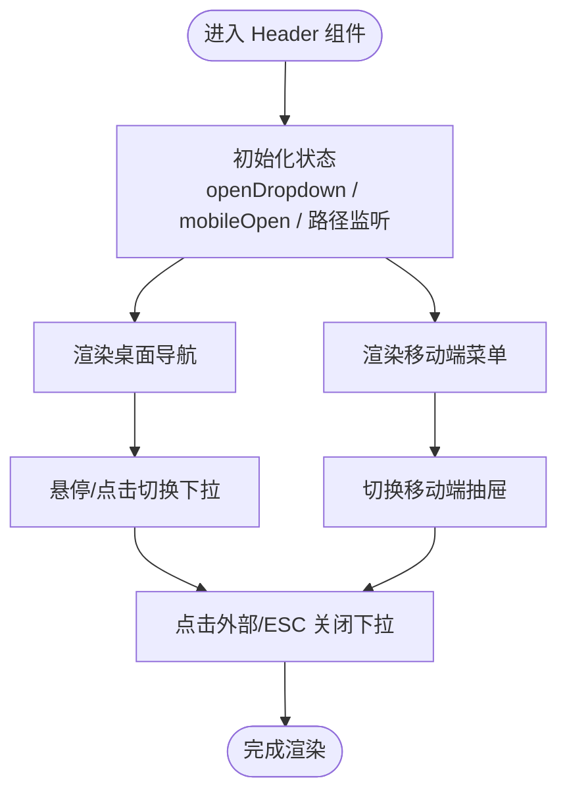
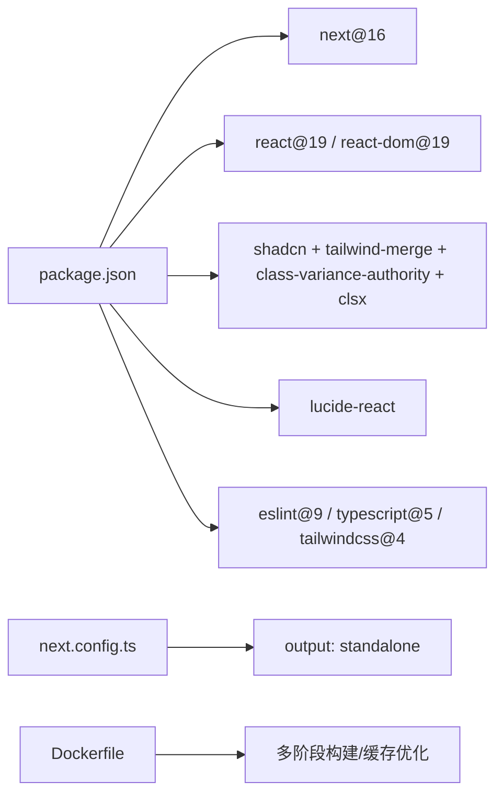

# 项目概述

<cite>
**本文引用的文件**
- [README.md](file://README.md)
- [package.json](file://package.json)
- [next.config.ts](file://next.config.ts)
- [AGENTS.md](file://AGENTS.md)
- [CLAUDE.md](file://CLAUDE.md)
- [GEMINI.md](file://GEMINI.md)
- [components.json](file://components.json)
- [tsconfig.json](file://tsconfig.json)
- [Dockerfile](file://Dockerfile)
- [src/app/layout.tsx](file://src/app/layout.tsx)
- [src/app/page.tsx](file://src/app/page.tsx)
- [src/components/Header.tsx](file://src/components/Header.tsx)
- [src/components/Footer.tsx](file://src/components/Footer.tsx)
- [src/lib/utils.ts](file://src/lib/utils.ts)
</cite>

## 目录
1. [引言](#引言)
2. [项目结构](#项目结构)
3. [核心组件](#核心组件)
4. [架构总览](#架构总览)
5. [详细组件分析](#详细组件分析)
6. [依赖关系分析](#依赖关系分析)
7. [性能考量](#性能考量)
8. [故障排除指南](#故障排除指南)
9. [结论](#结论)
10. [附录](#附录)

## 引言
本项目是一个面向“网站克隆与现代化迁移”的AI驱动模板，旨在通过多平台AI编码代理，将任意现有网站反向工程并重构为干净、现代的Next.js代码库。它适用于多种场景：平台迁移（如从WordPress/Webflow/Squarespace迁移到Next.js）、丢失源码恢复（当仓库或原开发者不可用时找回代码）、以及学习研究（通过真实生产站点代码深入理解布局、动画与响应式实现）。  
项目强调“像素级还原”与“真实内容优先”，在克隆阶段不进行主观美学改动，先保证与目标站点一致，再进行二次定制。

- 适用对象：初学者可快速上手模板与AI代理；有经验的开发者可利用其工程化脚手架与多平台Agent支持进行规模化克隆。
- 平台兼容性：支持Claude Code、Gemini CLI、GitHub Copilot、Cursor、Windsurf、Amazon Q、Augment Code、Aider等多种AI编码代理。
- 技术选型：Next.js 16（App Router）、React 19、TypeScript严格模式、Tailwind CSS v4、shadcn/ui，配合现代化构建与容器化部署能力。

**章节来源**
- [README.md:1-172](file://README.md#L1-L172)
- [AGENTS.md:1-66](file://AGENTS.md#L1-L66)

## 项目结构
项目采用“模板即框架”的组织方式，核心目录与职责如下：
- src/app：Next.js应用路由层，包含页面、布局、元数据与路由约定。
- src/components：React组件层，含UI基础组件与业务组件。
- src/lib：工具函数、品牌与产品数据等共享逻辑。
- public：下载的图片、视频与SEO资源。
- docs：研究与设计参考，包含检查清单与组件规范输出。
- scripts：自动化同步Agent规则与技能的脚本。
- 根目录配置：package.json、next.config.ts、tsconfig.json、components.json、Dockerfile等。

**图表来源**
- [README.md:110-134](file://README.md#L110-L134)

**章节来源**
- [README.md:110-134](file://README.md#L110-L134)

## 核心组件
- 布局与元数据：全局layout定义了站点语言、主题、SEO元数据与根HTML结构。
- 首页页面：组合Header、Hero、WhyChooseUs、CoreServices、ProductsQuickEntry与Footer，体现典型企业站结构。
- 头部导航：支持桌面端下拉菜单、移动端抽屉菜单、路径高亮与无障碍交互。
- 底部信息：品牌信息、快捷导航、产品中心与联系方式网格布局。
- 工具函数：cn合并类名，结合Tailwind CSS实现样式复用与覆盖。

**章节来源**
- [src/app/layout.tsx:1-32](file://src/app/layout.tsx#L1-L32)
- [src/app/page.tsx:1-22](file://src/app/page.tsx#L1-L22)
- [src/components/Header.tsx:1-292](file://src/components/Header.tsx#L1-L292)
- [src/components/Footer.tsx:1-113](file://src/components/Footer.tsx#L1-L113)
- [src/lib/utils.ts:1-7](file://src/lib/utils.ts#L1-L7)

## 架构总览
项目采用“AI代理驱动的反向工程流水线”，核心流程分为五个阶段：
1. 探查：截图、设计令牌提取、交互扫描（滚动、点击、悬停、响应式）。
2. 基础：更新字体、颜色、全局样式，下载全部资产。
3. 组件规范：生成详细规范文件（包含计算后的CSS值、状态、行为与内容）。
4. 并行构建：在独立工作树中并行构建各模块，每个构建器接收完整规范。
5. 组装与质量验收：合并工作树、连接页面、与原始站点做视觉对比。

**图表来源**
- [README.md:86-97](file://README.md#L86-L97)

**章节来源**
- [README.md:86-97](file://README.md#L86-L97)

## 详细组件分析

### 布局与页面
- 全局布局：设置站点标题、关键词、Open Graph元数据，根HTML使用中文与抗锯齿，主体背景与文字色统一。
- 首页页面：以语义化结构组织头部、主内容区与底部，主内容区采用flex布局与增长容器，确保页脚始终位于可视区底部。

**图表来源**
- [src/app/layout.tsx:1-32](file://src/app/layout.tsx#L1-L32)
- [src/app/page.tsx:1-22](file://src/app/page.tsx#L1-L22)

**章节来源**
- [src/app/layout.tsx:1-32](file://src/app/layout.tsx#L1-L32)
- [src/app/page.tsx:1-22](file://src/app/page.tsx#L1-L22)

### 导航组件（Header）
- 功能要点：桌面端固定导航栏、下拉子菜单、移动端抽屉菜单；根据当前路径高亮；支持点击外部关闭与Esc键关闭；无障碍属性完善。
- 数据来源：品牌与产品数据注入，动态生成产品子菜单。

**图表来源**
- [src/components/Header.tsx:19-42](file://src/components/Header.tsx#L19-L42)
- [src/components/Header.tsx:44-78](file://src/components/Header.tsx#L44-L78)
- [src/components/Header.tsx:80-248](file://src/components/Header.tsx#L80-L248)

**章节来源**
- [src/components/Header.tsx:1-292](file://src/components/Header.tsx#L1-L292)

### 底部组件（Footer）
- 功能要点：品牌Logo与简介、快捷导航、产品中心链接、联系方式（地址、电话、营业时间），底部版权与备案信息。
- 结构：四列栅格布局，移动端堆叠，图标与文本对齐。

**章节来源**
- [src/components/Footer.tsx:1-113](file://src/components/Footer.tsx#L1-L113)

### 工具函数（cn 合并类名）
- 作用：结合clsx与tailwind-merge实现类名合并与冲突覆盖，避免重复与冲突样式。
- 使用场景：组件内部根据状态动态拼接样式类。

**章节来源**
- [src/lib/utils.ts:1-7](file://src/lib/utils.ts#L1-L7)

## 依赖关系分析
- 运行时依赖：Next.js 16、React 19、shadcn/ui（基于Radix与Tailwind CSS v4）、Lucide React（默认图标，后续被提取SVG替换）。
- 开发依赖：ESLint 9、TypeScript 5、Tailwind CSS v4、Next.js ESLint配置。
- 构建与运行：Next.js以standalone模式输出，Dockerfile支持多包管理器锁定文件与缓存优化。

**图表来源**
- [package.json:37-58](file://package.json#L37-L58)
- [next.config.ts:3-6](file://next.config.ts#L3-L6)
- [Dockerfile:1-114](file://Dockerfile#L1-L114)

**章节来源**
- [package.json:1-60](file://package.json#L1-L60)
- [next.config.ts:1-9](file://next.config.ts#L1-L9)
- [Dockerfile:1-114](file://Dockerfile#L1-L114)

## 性能考量
- 构建输出：Next.js以standalone模式输出，便于容器化与最小化运行时体积。
- 容器优化：多阶段构建、包管理器缓存、仅复制必要产物，减少镜像大小。
- 样式合并：使用tailwind-merge避免重复类名，降低CSS体积与重绘成本。
- TypeScript严格模式：提升类型安全，减少运行时错误与调试成本。

**章节来源**
- [next.config.ts:3-6](file://next.config.ts#L3-L6)
- [Dockerfile:21-32](file://Dockerfile#L21-L32)
- [Dockerfile:56-70](file://Dockerfile#L56-L70)
- [src/lib/utils.ts:1-7](file://src/lib/utils.ts#L1-L7)

## 故障排除指南
- Node版本不匹配：确保本地Node版本满足引擎要求（>=24），容器内默认使用Node 24.x镜像。
- 锁定文件缺失：Docker构建阶段会检测package-lock.json、yarn.lock或pnpm-lock.yaml，任一存在即可安装依赖。
- Telemetry提示：如需禁用Next.js遥测，可在构建或运行时设置环境变量。
- 代理规则同步：修改AGENTS.md后，执行同步脚本以更新各平台指令文件；修改技能文件后，运行同步脚本生成跨平台技能。

**章节来源**
- [package.json:26-28](file://package.json#L26-L28)
- [Dockerfile:8-32](file://Dockerfile#L8-L32)
- [Dockerfile:51-54](file://Dockerfile#L51-L54)
- [Dockerfile:86-89](file://Dockerfile#L86-L89)
- [AGENTS.md:60-63](file://AGENTS.md#L60-L63)

## 结论
本项目以“AI代理 + 现代化Next.js模板”为核心，提供了一套可复用、可扩展的网站克隆与迁移解决方案。通过严格的工程化配置、清晰的组件分层与多平台Agent支持，既能帮助初学者快速上手，也能满足专业团队的大规模克隆需求。项目强调“像素级还原”与“真实内容优先”，在保证一致性的同时，为后续定制化开发打下坚实基础。

## 附录

### 技术栈与优势
- Next.js 16（App Router、React 19、TypeScript严格模式）：现代化路由与类型安全，提升开发效率与可维护性。
- shadcn/ui + Tailwind CSS v4：基于Radix组件与oklch设计令牌，提供一致的UI基元与可定制主题。
- 多平台AI代理：支持Claude Code、Gemini CLI、GitHub Copilot等，满足不同团队偏好与生态集成。
- 容器化与构建优化：多阶段Docker构建、包管理器缓存与standalone输出，降低部署复杂度。

**章节来源**
- [README.md:79-85](file://README.md#L79-L85)
- [AGENTS.md:12-17](file://AGENTS.md#L12-L17)

### 许可证与社区
- 许可证：MIT
- 社区支持：Discord频道
- 星标历史：可通过Star History可视化查看项目关注度趋势

**章节来源**
- [README.md:3-3](file://README.md#L3-L3)
- [README.md:165-171](file://README.md#L165-L171)

### AI代理配置与技能
- 通用Agent规则：集中于AGENTS.md，通过同步脚本生成各平台指令文件。
- Claude Code技能：自动加载.next最佳实践、缓存组件、升级指导等技能。
- Gemini CLI：通过GEMINI.md继承通用规则。

**章节来源**
- [AGENTS.md:1-6](file://AGENTS.md#L1-L6)
- [CLAUDE.md:1-18](file://CLAUDE.md#L1-L18)
- [GEMINI.md:1-2](file://GEMINI.md#L1-L2)

### 项目配置要点
- 组件别名：components、utils、ui、lib、hooks映射至@/components等路径，提升导入一致性。
- Tailwind CSS：启用CSS变量、基础色与RTL支持，配合cn工具函数实现样式复用。
- TypeScript：严格模式、路径映射与插件集成，保障类型安全与IDE体验。

**章节来源**
- [components.json:1-26](file://components.json#L1-L26)
- [tsconfig.json:1-35](file://tsconfig.json#L1-L35)