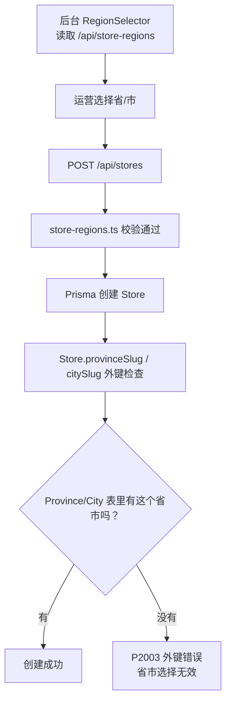
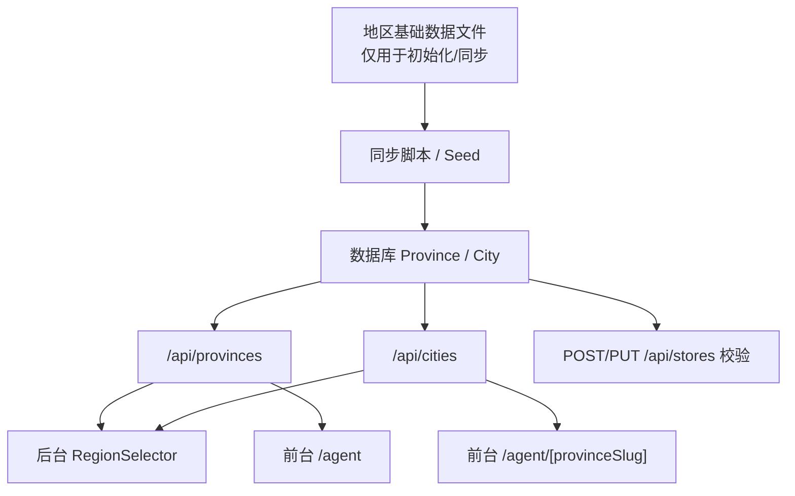
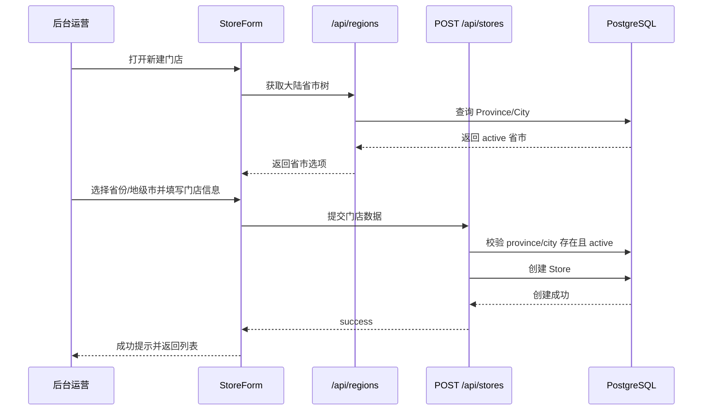
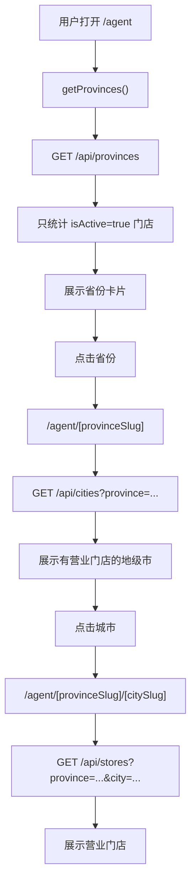
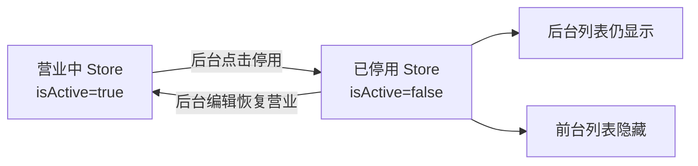

# 门店地区与门店管理全链路系统 PRD

| 项目 | 内容 |
| --- | --- |
| 模块 | 门店系统 / 地区基础库 / 后台门店管理 / 前台门店展示 |
| 日期 | 2026-06-14 |
| 阶段 | 需求定义 + 架构设计 |
| 目标使用者 | 架构师、Coder、Tester、后续 Claude Code 执行团队 |
| 优先级 | P0 |
| 当前结论 | 数据库地区表必须成为唯一真相；门店城市层只到地级市，不做区县结构化选择 |

## 1. 背景

蓝辉轻改后续会持续开新店，门店后台不能只支持当前几个示例省市。运营在后台创建门店时，应能直接选择中国大陆省级行政区和对应地级市，然后填写门店地址、电话、图片、营业状态并发布到前台。

当前流程在创建门店时会出现错误，本质原因不是某一个字段写错，而是地区数据源没有统一。

## 2. 当前根因

### 2.1 当前存在三套地区相关来源

| 来源 | 当前作用 | 问题 |
| --- | --- | --- |
| `prisma/seed.ts` | 初始化 `Province` / `City` 数据 | 只有广东、江苏、浙江和少量城市 |
| `src/lib/store-regions.ts` | 后台 `RegionSelector` 和 `POST /api/stores` 校验使用 | 与数据库独立，且不是全国完整地级市 |
| `src/lib/store.ts` | 旧静态门店/省市数据回退 | 与数据库字段和路由体系存在历史差异 |

### 2.2 当前错误链路



根因：

- 后台选择项来自 `store-regions.ts`。
- 数据库外键依赖 `Province` / `City`。
- 两者不是同一个数据源。
- 因此会出现“后台可以选，但数据库不能写”的错误。

## 3. 业务目标

### 3.1 运营目标

运营创建新店时不需要开发介入：

1. 登录后台。
2. 新建门店。
3. 选择省份。
4. 选择地级市。
5. 填写门店名称、地址、电话、营业时间、图片、状态。
6. 保存。
7. 前台省份页、城市页、门店详情页自动展示。

### 3.2 管理目标

后台能完整管理门店生命周期：

- 新建门店。
- 编辑门店。
- 上传/替换门店图片。
- 停用/下架门店。
- 恢复营业。
- 查询门店点击、电话点击和访问数据。

### 3.3 前台目标

前台门店系统自动反映后台数据：

- `/agent` 展示有营业门店的省份。
- `/agent/[provinceSlug]` 展示该省有营业门店的城市。
- `/agent/[provinceSlug]/[citySlug]` 展示该城市营业门店。
- `/agent/store/[id]` 展示门店详情。
- 已停用门店不在前台展示。

## 4. 地区范围定义

### 4.1 省级范围

后台地区基础库只包含中国大陆省级行政区：

- 4 个直辖市：北京市、天津市、上海市、重庆市。
- 22 个省。
- 5 个自治区。

不包含：

- 香港特别行政区。
- 澳门特别行政区。
- 台湾省。

### 4.2 城市层级

城市层级只到地市级行政单元：

- 地级市。
- 自治州。
- 地区。
- 盟。

直辖市处理方式：

- 直辖市本身作为一个城市节点。
- 例如省份为 `北京市`，城市也为 `北京市`。
- 不把东城区、朝阳区、浦东新区、渝北区等区县放入结构化城市选择器。

### 4.3 区县处理方式

本项目第一版不做结构化区县。

区县信息只作为地址文本或区域文本出现：

- `district` 可填写“顺德区大良”“南山区”“萧山区”等。
- `address` 填完整地址。
- 不建立 `District` 表。
- 不做区县筛选。
- 不做区县前台路由。

## 5. 数据源原则

### 5.1 唯一真相

`Province` / `City` 数据库表必须成为运行时唯一真相。

后台、API、前台都从数据库读取地区数据。



### 5.2 静态文件的定位

如果保留地区静态文件，应改为：

```text
src/lib/regions/mainland-regions.ts
```

用途：

- 作为初始化数据库的 seed 源。
- 作为测试 fixture。
- 不作为运行时校验源。
- 不直接给后台选择器使用。

不建议继续使用：

```text
src/lib/store-regions.ts
```

作为运行时真相。

## 6. 数据模型设计

### 6.1 Province

建议模型：

```prisma
model Province {
  id        String   @id @default(cuid())
  code      String   @unique
  slug      String   @unique
  label     String
  type      String
  order     Int      @default(0)
  isActive  Boolean  @default(true)
  createdAt DateTime @default(now())
  updatedAt DateTime @updatedAt

  cities    City[]
  stores    Store[]

  @@index([isActive, order])
}
```

字段说明：

| 字段 | 说明 |
| --- | --- |
| `code` | 行政区划代码，作为稳定数据标识 |
| `slug` | URL 和后台选择器使用的英文标识 |
| `label` | 中文名称 |
| `type` | province / municipality / autonomous_region |
| `isActive` | 是否在后台/前台可用 |

### 6.2 City

建议模型：

```prisma
model City {
  id           String   @id @default(cuid())
  code         String   @unique
  provinceId   String
  province     Province @relation(fields: [provinceId], references: [id], onDelete: Restrict)
  provinceSlug String
  slug         String
  label        String
  type         String
  order        Int      @default(0)
  isActive     Boolean  @default(true)
  createdAt    DateTime @default(now())
  updatedAt    DateTime @updatedAt

  stores       Store[]

  @@unique([provinceSlug, slug])
  @@index([provinceId, isActive, order])
}
```

字段说明：

| 字段 | 说明 |
| --- | --- |
| `code` | 地市级行政区划代码 |
| `provinceId` | 关联省份 |
| `provinceSlug` | 冗余字段，方便路由与查询 |
| `slug` | 城市 URL 标识 |
| `type` | prefecture_city / autonomous_prefecture / prefecture / league / municipality |

### 6.3 Store

建议模型方向：

```prisma
model Store {
  id            String   @id @default(cuid())
  name          String
  slug          String   @unique

  provinceId    String
  province      Province @relation(fields: [provinceId], references: [id], onDelete: Restrict)
  cityId        String
  city          City     @relation(fields: [cityId], references: [id], onDelete: Restrict)

  provinceSlug  String
  provinceLabel String
  citySlug      String
  cityLabel     String

  district      String?
  address       String
  phone         String
  phoneTel      String
  businessHours String?
  description   String?
  imagePath     String?
  isActive      Boolean  @default(true)
  createdAt     DateTime @default(now())
  updatedAt     DateTime @updatedAt

  @@index([provinceId])
  @@index([cityId])
  @@index([isActive])
  @@index([isActive, provinceSlug])
  @@index([isActive, provinceSlug, citySlug])
}
```

说明：

- `provinceId` / `cityId` 用于可靠外键。
- `provinceSlug` / `citySlug` 用于前台路由和查询。
- `provinceLabel` / `cityLabel` 用于展示缓存，避免每次展示都 join。
- 更新门店地区时，API 必须重新同步 slug 和 label。

### 6.4 是否必须马上改成 id 外键

当前项目已经使用 `Province.slug` / `City.slug` 作为主键和外键。第一版修复可以保守推进：

- 保留现有字段。
- 先把 `Province` / `City` 补全为大陆全量地市级数据。
- 移除运行时 `store-regions.ts` 校验。
- 让 API 回到数据库校验。

但 PRD 建议在下一次结构升级中引入 `code` 和 `id`，因为全国城市 slug 可能存在重名、拼音歧义和历史变更风险。

## 7. API 设计

### 7.1 地区 API

#### GET `/api/provinces`

用途：

- 前台省份页。
- 后台省份选择器。

默认行为：

- 返回 `isActive=true` 的大陆省级行政区。
- 不返回港澳台。
- 带 `storeCount` / `cityCount`。

#### GET `/api/cities?province=guangdong`

用途：

- 后台城市选择器。
- 前台省份下城市页。

默认行为：

- 返回该省 `isActive=true` 的地级市。
- 不返回区县。
- 带 `storeCount`。

#### GET `/api/regions`

建议新增聚合接口：

```text
GET /api/regions
```

用途：

- 后台 RegionSelector 一次性拿省市树。

返回结构：

```ts
type RegionTree = {
  slug: string;
  label: string;
  code: string;
  type: string;
  cities: {
    slug: string;
    label: string;
    code: string;
    type: string;
  }[];
}[];
```

建议逐步废弃：

```text
GET /api/store-regions
```

### 7.2 门店 API

#### GET `/api/stores`

默认：

- 公开访问只返回 `isActive=true`。

后台：

- admin 带 `?all=true` 可返回营业中 + 已停用。

筛选：

- `province`
- `city`
- `search`
- `page`
- `limit`

#### POST `/api/stores`

创建门店。

必须校验：

1. 登录且 admin。
2. `provinceSlug` 存在于数据库，且 `isActive=true`。
3. `citySlug` 存在于数据库，属于该省，且 `isActive=true`。
4. 自动同步：
   - `provinceLabel`
   - `cityLabel`
   - `phoneTel`
5. 创建成功后写 ActivityLog。

禁止：

- 使用静态 `store-regions.ts` 作为运行时校验。
- 接收客户端传入的错误 label 并直接写库。

#### GET `/api/stores/[id]`

公开：

- 默认只返回 `isActive=true`。

后台：

- admin 可通过 `?includeInactive=true` 读取已停用门店。

#### PUT `/api/stores/[id]`

更新门店。

必须支持：

- 更新基础信息。
- 更新省市。
- 更新电话。
- 更新图片路径。
- 更新 `isActive`。
- 已停用门店恢复为营业中。

#### DELETE `/api/stores/[id]`

语义：

- 当前保留为软停用。
- 不物理删除。

UI 文案：

- 不叫“删除门店”。
- 应叫“停用门店”或“下架门店”。

## 8. 后台页面设计

### 8.1 门店列表 `/admin/stores`

功能：

- 门店搜索。
- 省份筛选。
- 城市筛选。
- 状态筛选：全部 / 营业中 / 已停用。
- 显示门店名、省份、城市、电话、状态、更新时间。
- 操作：编辑、图片管理、停用、恢复营业。

### 8.2 新建门店 `/admin/stores/new`

字段：

| 字段 | 必填 | 说明 |
| --- | --- | --- |
| 门店名称 | 是 | 前台展示 |
| slug | 是 | 门店 URL 标识 |
| 省份 | 是 | 来自数据库 |
| 城市 | 是 | 来自数据库地级市 |
| 区域 | 否 | 文本，例如“顺德区大良” |
| 地址 | 是 | 完整地址 |
| 电话 | 是 | 门店页主承接 |
| 营业时间 | 否 | 前台展示 |
| 门店描述 | 否 | 前台展示 |
| 门店图片 | 否 | 可后续上传 |
| 状态 | 是 | 默认营业中 |

### 8.3 编辑门店 `/admin/stores/[id]`

必须支持：

- 编辑已停用门店。
- 将已停用门店恢复为营业中。
- 修改省市后自动同步中文 label。
- 保存成功后返回列表或显示成功状态。

### 8.4 图片管理 `/admin/stores/[id]/image`

必须支持：

- 已停用门店也可管理图片。
- 上传、替换、删除图片。
- 图片路径写入 `imagePath`。

## 9. 前台展示设计

### 9.1 全国门店 `/agent`

展示：

- 有营业中门店的省份。
- 每个省份显示营业中门店数量、城市数量。

不展示：

- 没有营业门店的省份。
- 已停用门店。

### 9.2 省份页 `/agent/[provinceSlug]`

展示：

- 该省有营业门店的城市。
- 该省营业门店列表。

如果省份存在但没有营业门店：

- 可以显示空态，不应 500。

### 9.3 城市页 `/agent/[provinceSlug]/[citySlug]`

展示：

- 该城市营业门店。

如果城市存在但无营业门店：

- 显示“该城市暂无已开放门店”。

### 9.4 门店详情 `/agent/store/[id]`

展示：

- 门店名称。
- 地址。
- 电话。
- 营业时间。
- 图片。
- 描述。
- 电话拨打入口。

停用门店：

- 前台不可访问或返回 404。

## 10. 数据同步策略

### 10.1 地区初始化

新增脚本：

```text
scripts/seed-mainland-regions.ts
```

或将逻辑放入 `prisma/seed.ts` 的独立函数。

要求：

- 使用 upsert。
- 不删除已有门店。
- 不删除已有省市。
- 可重复执行。
- 可记录版本号。

### 10.2 地区数据来源

以民政部门公开的行政区划代码信息或国家地名信息库为基础。民政部行政区划代码栏目说明：自 2026 年起，该栏目不再公布行政区划代码，应前往国家地名信息库查询；行政区划代码由国务院民政部门按规定发布。参考：[民政部行政区划代码栏目](https://www.mca.gov.cn/n156/n186/index.html)。

国家统计局也曾在公开答复中说明，县及县以上行政区划代码主管部门为民政部和国家标准委，统计用区划代码会在民政部变更后用于统计业务。参考：[国家统计局咨询公开](https://www.stats.gov.cn/hd/lyzx/zxgk/201910/t20191015_1702732.html)。

### 10.3 数据版本

建议增加版本记录：

```text
docs/data/mainland-regions-source.md
```

内容：

- 数据来源。
- 数据年份。
- 同步日期。
- 是否包含港澳台。
- 城市层级说明。
- 人工修正记录。

## 11. 架构流程图

### 11.1 创建门店流程



### 11.2 前台展示流程



### 11.3 停用与恢复流程



## 12. 开发循环

本模块必须按以下循环开发。


### 12.1 每阶段文档要求

| 阶段 | 文档 |
| --- | --- |
| Discover | 根因调查报告 |
| PRD | `docs/PRD/STORE_REGION_MANAGEMENT_SYSTEM_PRD_2026-06-14.md` |
| Architecture | 模型图、API 流程图、前后台流程图 |
| Plan | `docs/plans/...` |
| Execute | 代码变更清单 |
| Verify | `docs/test-reports/...` |
| Review | 风险和回归检查 |
| Ship | 最终交付说明 |

## 13. 测试矩阵

### 13.1 地区数据测试

| 编号 | 场景 | 预期 |
| --- | --- | --- |
| REG-1 | `/api/provinces` | 返回大陆省级行政区，不含港澳台。 |
| REG-2 | `/api/cities?province=guangdong` | 返回广东地级市，不含区县。 |
| REG-3 | 直辖市 | 北京市作为省份和城市节点，不返回区县。 |
| REG-4 | inactive 省市 | 不出现在后台选择器和前台展示。 |
| REG-5 | 地区数据重复执行 seed | 不重复插入，不删除门店。 |

### 13.2 后台创建测试

| 编号 | 场景 | 预期 |
| --- | --- | --- |
| ADMIN-1 | 创建广州门店 | 成功。 |
| ADMIN-2 | 创建成都门店 | 成功。 |
| ADMIN-3 | 创建北京门店 | 省份北京市、城市北京市，成功。 |
| ADMIN-4 | 城市不属于省份 | 返回 400。 |
| ADMIN-5 | 客户端传错 cityLabel | API 使用数据库 label 覆盖。 |
| ADMIN-6 | 省市不存在 | 返回 400，不触发 Prisma P2003。 |

### 13.3 后台管理测试

| 编号 | 场景 | 预期 |
| --- | --- | --- |
| MGT-1 | 编辑营业中门店 | 成功。 |
| MGT-2 | 停用门店 | 后台可见，前台隐藏。 |
| MGT-3 | 编辑已停用门店 | 可进入编辑页。 |
| MGT-4 | 恢复营业 | 前台重新展示。 |
| MGT-5 | 图片管理 | 上传、替换、删除成功。 |

### 13.4 前台展示测试

| 编号 | 场景 | 预期 |
| --- | --- | --- |
| WEB-1 | `/agent` | 展示有营业门店的省份。 |
| WEB-2 | `/agent/guangdong` | 展示广东有营业门店的城市。 |
| WEB-3 | `/agent/guangdong/guangzhou` | 展示广州营业门店。 |
| WEB-4 | 已停用门店 | 不出现在前台列表。 |
| WEB-5 | 不存在省市 | 返回 404 或空态，不 500。 |

## 14. 验收标准

| 编号 | 标准 |
| --- | --- |
| AC-1 | 后台省市选择器数据来自数据库，而不是运行时静态 `store-regions.ts`。 |
| AC-2 | 地区数据覆盖中国大陆省级行政区和地级市，不含港澳台，不含区县。 |
| AC-3 | 任意已入库地级市都可创建门店，不再出现省市外键错误。 |
| AC-4 | 创建门店时 API 校验省市属于数据库合法 active 数据。 |
| AC-5 | API 自动同步 `provinceLabel` / `cityLabel`，不信任客户端 label。 |
| AC-6 | 前台只展示营业中门店。 |
| AC-7 | 后台可以管理已停用门店并恢复营业。 |
| AC-8 | 运行地区 seed 不删除已有门店。 |
| AC-9 | 有完整架构图、测试报告、交付文档。 |

## 15. 分阶段实施建议

### Phase 1：止血与统一数据源

- 停止后台运行时使用 `store-regions.ts`。
- 用数据库 `Province/City` 驱动 RegionSelector。
- 扩展数据库到中国大陆省市地级市。
- 修复 `POST /api/stores` 的数据库校验。
- 保证创建门店不再 P2003。

### Phase 2：门店生命周期完善

- 停用/恢复营业。
- 已停用门店可编辑。
- 列表状态筛选。
- 图片管理稳定。

### Phase 3：前台自动展示与 SEO

- 前台省市页自动从数据库生成。
- sitemap 支持动态省市。
- 空态与 404 规则稳定。

### Phase 4：数据分析

- 门店详情访问。
- 电话点击。
- 热门门店排行。
- 首页企微点击与门店转化对比。

## 16. 给 Claude Code 的执行约束

1. 不要只补几个城市来“让当前案例通过”。
2. 不要继续让 `store-regions.ts` 作为运行时真相。
3. 不要把区县放进城市选择器。
4. 不要包含港澳台。
5. 不要物理删除门店。
6. 不要让 seed 删除已有门店。
7. 不要信任客户端传入的省市 label。
8. 修复必须覆盖数据库、API、后台表单、前台展示和测试。
