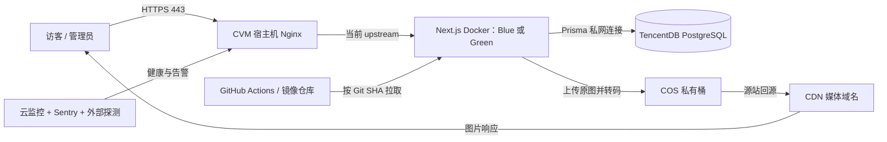
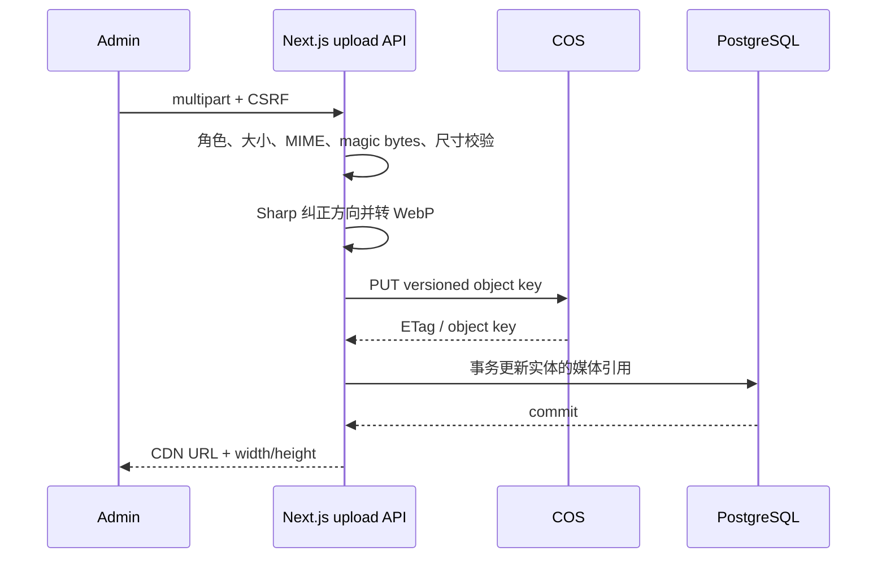
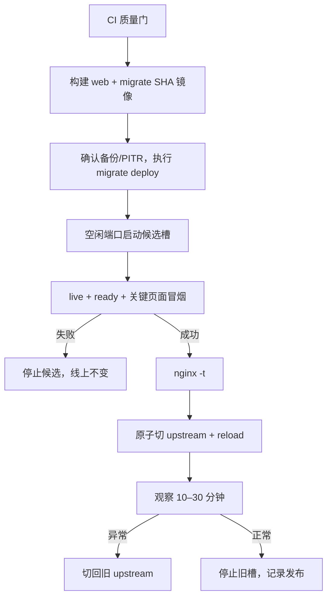

# 腾讯云轻量商用架构与运维方案

> 目标：用 **1 台 CVM + TencentDB for PostgreSQL + COS/CDN + Docker + Nginx** 部署蓝辉官网，保留低复杂度，同时做到状态外置、HTTPS、可观测、可恢复、近零停机升级与快速应用回滚。

实施计划：[`腾讯云轻量商用部署 Day 1–Day 7`](./tencent-cloud-commercial-deployment-day1-day7-plan.md)

## 1. 架构结论

这套模式适合当前公司官网。它不需要 CLB、Kubernetes、Redis、SCF 或多台 CVM，也不在生产服务器上运行 PostgreSQL 容器。



### 明确边界

- **可以做到**：容器无状态、数据库托管、图片持久化、自动备份、近零停机升级、分钟级应用回滚。
- **不能宣称**：单台 CVM 高可用。CVM、可用区或公网链路整体故障时，网站会中断，恢复时间取决于重建 CVM 和切换 DNS/IP。
- **下一阶段触发条件**：当停机损失高于第二台 CVM + CLB 成本，或稳定峰值 CPU 超过 60%、内存超过 70%，再升级双 CVM，不提前引入集群复杂度。

OMM 可下钻架构：`.omm/tencent-cloud-lean-commercial`、`.omm/lean-content-modules`、`.omm/lean-release-flow`。

## 2. 当前项目到目标架构的映射

| 模块 | 当前实现 | 生产目标 | 优先级 |
|---|---|---|---|
| Next.js 运行时 | `Dockerfile` 已使用 `output: standalone` 和非 root 用户 | CI 构建不可变镜像，CVM 只拉取运行；Blue/Green 两个端口临时并存 | P0 |
| PostgreSQL | `docker-compose.yml` 在本机启动 `postgres`，含固定密码 | 删除生产 Compose 的 PostgreSQL 服务，改用 TencentDB 私网地址、TLS 与自动备份 | P0 |
| 图片上传 | `src/app/api/upload/route.ts` 经 Sharp 后写入容器 `public/images` | 保留认证、CSRF、MIME/文件头校验和 Sharp，目标改为上传 COS；容器不保存业务文件 | P0 |
| 博客读取 | `src/lib/data.ts` 从 RSC 调用本站 `/api/public/articles`，失败后静默回退 mock | `server-only` repository 直接查询 Prisma；生产数据库异常明确报错，不回退假数据 | P0 |
| 门店读取 | `src/lib/data.ts` 从 RSC 调用本站 `/api/public/stores`，失败后静默回退 mock | 与博客相同，直读 repository；静态数据只用于 seed、fixture 或显式维护页 | P0 |
| Nginx | 容器内 HTTP 配置，HTTPS 仅占位，upstream 固定 `app:3000` | 宿主机 Nginx 终止 TLS，upstream 文件在 `127.0.0.1:3001/3002` 间原子切换 | P0 |
| Compose | 暴露 `3000`、包含开发/数据库/Nginx、硬编码生产 secret | 新建 `docker-compose.prod.yml`，只定义 web blue/green；端口仅绑定回环地址 | P0 |
| 健康检查 | Docker 用首页作为健康检查 | 分离 `/api/health/live` 和 `/api/health/ready`，发布流程使用 readiness | P0 |
| CI/CD | 已有 lint、typecheck、test、build、Playwright | 增加镜像构建/扫描/推送、迁移镜像、CVM 发布、冒烟、自动停止或回切 | P1 |
| 监控 | 已接 Sentry，应用有结构化日志基础 | 接云监控主机指标、外部 URL 探测、Sentry release；日志轮转避免打满磁盘 | P1 |

## 3. 三个业务模块怎么执行

### 3.1 博客

**事实源**：PostgreSQL 保存标题、slug、Markdown 正文、状态、发布时间、SEO 字段和封面对象键；COS 只保存媒体。

建议代码边界：

```text
src/features/articles/
├── schemas.ts                 # Zod：创建、更新、发布输入
├── types.ts                   # 领域类型
├── server/
│   ├── repository.ts          # server-only，唯一 Prisma 查询入口
│   ├── service.ts             # 权限、状态机、事务、缓存失效
│   └── cache.ts               # article:list / article:<slug> 标签
└── ui/                        # 展示组件，不接触 Prisma
```

执行规则：

1. 公开 RSC 调用 `articleRepository.listPublished()` / `findPublishedBySlug()`，不再通过 `NEXT_PUBLIC_API_BASE_URL` 请求自己的 API。
2. Admin 写接口只负责鉴权、CSRF/Origin、解析请求和返回统一响应；业务状态迁移在 service 中完成。
3. 发布事务成功后失效：文章列表、对应 slug、分类页、首页新闻块和 sitemap。
4. 生产环境不允许数据库错误时回退 `src/lib/news.ts`。否则运营会看到“发布成功但前台仍是演示数据”的假健康状态。
5. Markdown 渲染继续禁用原始 HTML，或对确需支持的 HTML 使用服务端白名单净化。

### 3.2 图片

**事实源**：COS 对象；PostgreSQL 只保存对象键、CDN URL 或媒体记录 ID。

上传顺序：



对象键禁止覆盖同名文件，建议：

```text
prod/articles/<article-id>/<sha256>.webp
prod/stores/<store-id>/<sha256>.webp
```

执行规则：

1. 改造 `src/app/api/upload/route.ts`：删除 `fs.mkdir/writeFile/rename/unlink`，抽出 `src/infrastructure/storage/cos.ts`。
2. 必须先成功上传 COS，再提交数据库引用；数据库更新失败时记录孤儿对象，定时清理，不要返回假成功。
3. 删除图片时先清空数据库引用，再异步删除对象。COS 开启版本控制后，误删仍可恢复。
4. CDN 域名加入 `next.config.ts` 的 `images.remotePatterns`。页面图片继续提供明确宽高或固定比例容器，避免 CLS。
5. COS 桶禁止公网写；优先给 CVM 绑定最小权限 CAM 角色。若使用 SecretId/SecretKey，只放服务器密钥文件，绝不使用 `NEXT_PUBLIC_*`。
6. CDN 缓存对象可设一年，因为对象键不可变；更新图片产生新键，不依赖全网 purge。
7. COS 配置生命周期：原图按合规需要保留，孤儿临时对象 7 天清理，历史版本按恢复窗口清理。

### 3.3 门店

**事实源**：PostgreSQL 保存门店状态、区域、联系方式、坐标、营业信息和图片对象键。

建议代码边界：

```text
src/features/stores/
├── schemas.ts
├── types.ts
├── server/
│   ├── repository.ts
│   ├── service.ts
│   └── cache.ts
└── ui/
```

执行规则：

1. 将 `src/lib/data.ts` 的 `getStores/getStoreById/getProvinces/getCities` 迁入 server-only repository，删除 RSC → HTTP → 同一 Next.js 进程的绕路。
2. 列表只读取可公开状态，查询字段使用明确 `select`，避免把内部审核原因带到公开页面。
3. 当前 Store 索引已覆盖 `provinceSlug`、`citySlug`、`status`、`level` 等主要入口；上线前用真实数据量执行 `EXPLAIN ANALYZE`，再决定是否增加组合索引，禁止凭感觉堆索引。
4. 门店保存成功后失效：首页推荐门店、全国门店页、省页、市页、门店详情、sitemap；不要只失效 admin 页面。
5. 门店图片引用 COS 版本键。数据库回滚时旧对象仍然存在，应用回滚不需要复制本地文件。

## 4. CVM 与网络布局

建议起步规格：2 核 4 GB、80 GB SSD；如果发布期间两个 Next.js 容器同时运行时内存紧张，直接升到 4 核 8 GB。CVM 不负担数据库和媒体存储，因此无需一开始购买大规格。

```text
公网
└── 安全组：80/443 对公网；22 仅公司固定 IP/VPN
    └── CVM
        ├── nginx.service                  监听 80/443
        ├── 127.0.0.1:3001                Blue 容器
        ├── 127.0.0.1:3002                Green 容器
        ├── /opt/lanhui/                   Compose、部署脚本、版本状态
        ├── /etc/lanhui/lanhui.env         root:root 0600
        └── Docker json-file 日志轮转

同 VPC 私网
├── TencentDB PostgreSQL                  仅 CVM 安全组可访问 5432
└── COS                                   CAM 最小权限访问
```

生产配置要点：

- `NEXTAUTH_URL=https://www.<domain>`，使用高强度随机 `NEXTAUTH_SECRET`。
- `DATABASE_URL` 使用托管数据库私网地址，并按腾讯云实例要求开启 SSL。
- 应用容器端口只绑定 `127.0.0.1`，不能暴露 `0.0.0.0:3000`。
- Nginx 负责 80 → 443、TLS 证书续期、安全头、真实 IP、请求体限制和超时。
- `/admin` 不做 CDN 页面缓存；`/_next/static` 使用 immutable；媒体图片直接走独立 CDN 域名，不再经 Next.js/Nginx 回源。
- 不将 `.env`、证书、数据库备份写入 Git 或 Docker image。

## 5. 需要新增或调整的部署文件

```text
deploy/
├── compose.prod.yml             # web-blue、web-green；无 postgres
├── nginx/
│   ├── lanhui.conf              # HTTPS server
│   ├── upstream-blue.conf       # 127.0.0.1:3001
│   └── upstream-green.conf      # 127.0.0.1:3002
├── scripts/
│   ├── deploy.sh                # 拉镜像、迁移、启候选、检查、切流
│   ├── rollback.sh              # nginx 切回旧槽
│   ├── smoke.sh                 # 关键路径检查
│   └── cleanup.sh               # 清理旧镜像和日志
└── systemd/
    └── lanhui-deploy-lock.service

Dockerfile                       # 保留 standalone web target
Dockerfile.migrate               # 同 commit 的 Prisma migrate deploy 镜像
.github/workflows/release.yml    # 构建、推送、部署与发布记录
```

生产 Compose 约束：

- 镜像必须为 `registry/.../lanhui-web:<git-sha>`，不以 `latest` 作为部署事实。
- `restart: unless-stopped`、`read_only: true`，仅 `/tmp` 需要 tmpfs。
- 设置合理 CPU/内存限制，避免单个进程拖死整机。
- 健康检查请求 `/api/health/live`。
- 使用 `env_file: /etc/lanhui/lanhui.env`，文件权限为 `0600`。
- 不挂载 `public/images`，不挂载 Node 源码，不在 CVM 执行构建。

## 6. 健康检查与可观测性

新增两个端点：

| 端点 | 检查内容 | 用途 | 失败动作 |
|---|---|---|---|
| `/api/health/live` | Node 事件循环仍可响应，不访问外部依赖 | Docker 每 30 秒检查 | 连续失败后重启容器 |
| `/api/health/ready` | 配置完整、PostgreSQL `SELECT 1` 成功 | 发布前、Nginx/外部监控 | 不切流或告警 |

注意：不要把首页当 liveness。首页依赖数据库、模板和业务数据，故障时会造成重启风暴。

最低告警集：

- 外部 HTTPS：首页与 `/api/health/ready` 连续 3 次失败。
- Nginx：5xx 比例、P95 延迟、证书剩余天数。
- CVM：CPU > 80% 10 分钟、内存 > 85%、磁盘 > 75%。
- PostgreSQL：连接数 > 70%、CPU/存储、慢查询、复制/备份异常。
- 应用：Sentry 新错误、错误率突增；Sentry release 对应 Git SHA。
- 日志：Docker `max-size=20m,max-file=5`，Nginx 日志按日轮转。

## 7. 平稳升级流程



### 发布步骤

1. PR 必须通过 `npm run lint`、`npm run typecheck`、`npm test`、`npm run build` 和 Playwright 关键流。
2. CI 构建 `web:<sha>` 与 `migrate:<sha>`，扫描后推送腾讯云容器镜像服务。
3. 部署脚本获取互斥锁，短暂禁止 CMS 写操作，防止蓝绿观察窗口产生缓存分叉。
4. 确认 TencentDB 最近备份和 PITR 状态正常，运行一次 `prisma migrate deploy`。
5. 在空闲端口启动候选容器，最多等待 90 秒 readiness。
6. 冒烟检查：首页、博客列表/详情、门店列表/详情、登录页，并检查一次数据库只读查询。
7. 写入新 upstream 临时文件，`nginx -t` 成功后再原子替换并 `systemctl reload nginx`。
8. 观察 10–30 分钟。观察期内旧槽保留，CMS 写操作仍锁定。
9. 指标正常后解锁 CMS、停止旧槽；保留最近 3 个可运行镜像和发布记录。

### 为什么需要独立 migrate 镜像

当前 standalone runner 只包含运行 Next.js 所需的追踪文件，不能假设其中存在 Prisma CLI 与完整 migrations。迁移镜像与 web 镜像必须来自同一 Git SHA，但生命周期不同：迁移任务执行一次退出，web 长期运行。

### 数据库迁移规则

使用 `expand → migrate → contract`：

1. **Expand**：先新增 nullable 列、表或兼容索引，旧代码仍可工作。
2. **Migrate**：后台回填数据，新旧代码同时兼容。
3. **Contract**：至少下一个版本才删除旧列、旧约束或旧读取路径。

禁止在一次发布中直接重命名/删除仍被旧镜像使用的列。应用回滚只切镜像，不自动执行 down migration。

## 8. 回滚与灾难恢复

| 事故 | 第一动作 | 恢复路径 | 目标 |
|---|---|---|---|
| 候选容器不健康 | 不切流 | 停止候选，保留当前槽 | 线上零影响 |
| 切流后应用异常 | Nginx 切回旧槽 | reload，保留故障容器取证 | 5 分钟内 |
| 错误内容发布 | Admin 回退内容版本 | 失效缓存标签/路径 | 10 分钟内 |
| 图片误删 | 恢复 COS 历史版本 | 恢复 DB 引用或对象版本 | 30 分钟内 |
| 数据误删/迁移事故 | 冻结写入 | TencentDB PITR 到新实例，核验后切换连接 | 按数据量演练确定 |
| CVM 整机故障 | 新建同规格 CVM | 安装 Docker/Nginx、恢复 env、拉当前镜像、绑定 EIP/DNS | 以季度演练结果为准 |

备份不是“显示成功”就算完成：

- TencentDB：每日自动备份 + WAL/PITR，建议保留 14–30 天。
- COS：开启版本控制；生命周期规则不要短于数据库恢复窗口。
- 每月恢复一份数据库到临时实例并运行只读验收。
- 每季度从空白 CVM 按文档重建一次，记录真实 RTO/RPO。
- `/etc/lanhui/lanhui.env` 和 Nginx 证书必须有加密的离机恢复副本。

## 9. 分阶段落地

### Phase 1：先消除不可商用状态

- 新建 TencentDB PostgreSQL，迁移并校验数据。
- 将图片上传从容器文件系统迁到 COS/CDN。
- 新建生产 Compose，删除生产 PostgreSQL、开发服务和硬编码 secret。
- 增加 HTTPS、live/ready、日志轮转和最小安全组。

验收：重建/删除应用容器后，文章、门店和图片无丢失；数据库不可用时 readiness 失败且不会展示 mock 数据。

### Phase 2：打通正确的数据与缓存边界

- 将博客、门店公开读取改成 server-only repository 直读 Prisma。
- 把写入、事务、审计与缓存失效收敛到 feature service。
- 为 COS CDN 域名配置 Next Image；对象键版本化。
- 补博客、门店、上传的集成测试。

验收：CMS 发布后相关页面在目标时间内更新；同一请求不再出现 RSC 自调用 HTTP；失败有结构化日志和 Sentry 事件。

### Phase 3：上线蓝绿发布与灾备演练

- CI 构建 web/migrate SHA 镜像并推送镜像仓库。
- 实现 deploy/rollback/smoke 脚本和发布锁。
- 接云监控、外部探测、Sentry release。
- 执行第一次应用回滚、数据库 PITR、空白 CVM 重建演练。

验收：候选失败不会影响线上；切流后可在 5 分钟内回到旧镜像；发布记录能关联 commit、镜像 digest、迁移和操作者。

## 10. 上线前硬门槛

- [ ] 生产 Compose 中没有 PostgreSQL、默认密码或 `production-secret-change-me`。
- [ ] 公网只开放 80/443，SSH 有来源限制，3001/3002 只监听回环地址。
- [ ] 上传后删除容器并重建，图片仍可访问。
- [ ] 停止数据库，readiness 失败，公开页面不回退演示数据。
- [ ] TLS 自动续期验证成功，安全头与真实 IP 正确。
- [ ] 数据库自动备份、PITR、COS 版本控制均已实际恢复验证。
- [ ] CI 只发布按 SHA 标记的镜像；CVM 不执行源码构建。
- [ ] 蓝绿发布、失败不切流、切流后回滚三条路径均演练通过。
- [ ] Sentry、5xx、证书、磁盘、数据库连接数告警能触达负责人。
