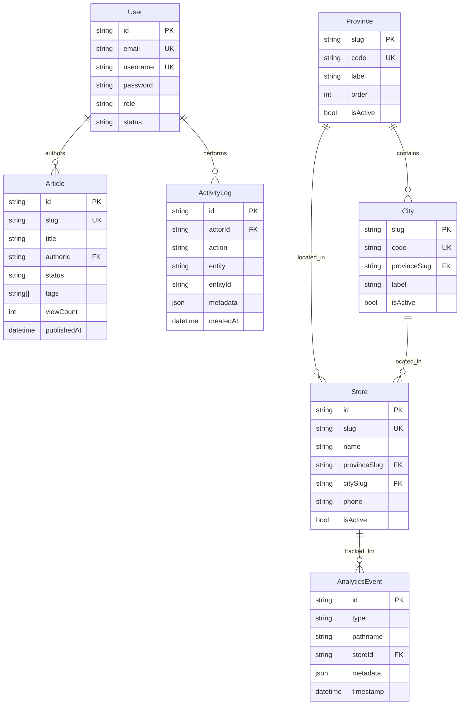
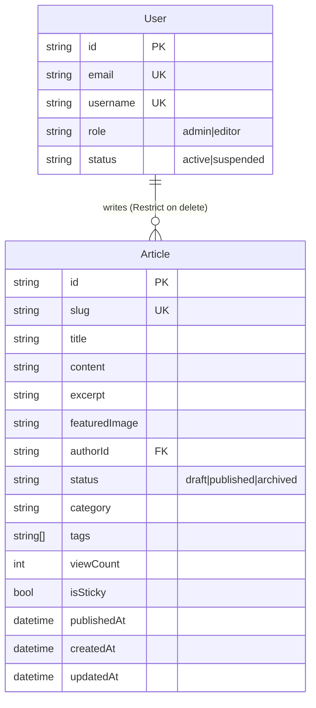
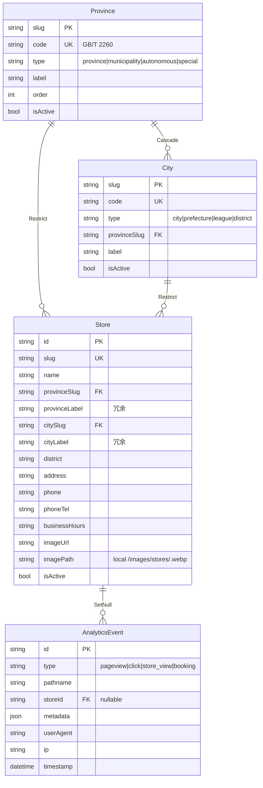
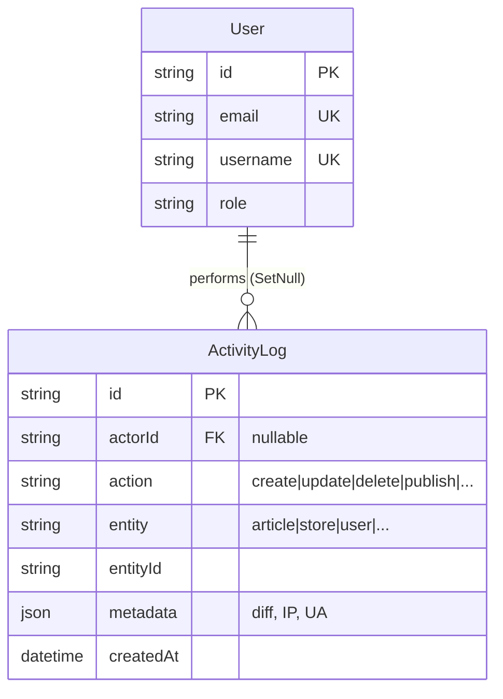

# ER 图 — 数据库关系

> Mermaid 语法,GitHub/VSCode 直接渲染。
> 4 张图:全局概览 / 内容 / 区域门店 / 审计。

---

## 1. 全局概览(7 表关系)



---

## 2. 内容域(Article ↔ User)



**关键约束**:
- `Article.author` → `User` 用 `Restrict`:不能直接删作者,需先归档其文章
- 文章生命周期: `draft` → `published` → `archived`,转换通过 `/api/articles/[id]` PATCH

**当前状态**: 8 已发布 + 1 草稿(3 条分页测试 + 1 Playwright 测试待清理,B12)

---

## 3. 区域门店域(Province → City → Store → Event)



**关键设计**:
1. **冗余字段**: `Store.provinceLabel` / `cityLabel` 存字符串,免 join,提升 `/agent` 列表性能
2. **级联差异**: City → Province 是 Cascade(省删则市必删),Store → Province/City 是 Restrict(防误删)
3. **门店图片**: 当前用本地存储(`public/images/stores/<id>.webp`),非 OSS(B2 计划加 status 字段)

**当前状态**:
- 27 省份 + 75 城市(全 seed)
- 22 门店全 `isActive=true`,无 `status` 字段(测试数据污染,P0-6)
- 0 个 `store_view` 事件(待埋点,P1-13)

---

## 4. 审计域(ActivityLog → User)



**关键设计**:
- `actorId` 用 `SetNull`: 删 admin 账号保留审计历史
- 表名映射 `@@map("activity_logs")`(Rails 复数风格)
- 写入覆盖: 当前 2/7 写 API 调用(B3 任务)

**应该记录但未记录的操作**:
- `/api/articles` POST/PUT/DELETE
- `/api/stores` POST/PUT/DELETE
- `/api/upload` (图片上传)
- `/admin/login` 登录失败

---

## 关系矩阵

| 子表 | 父表 | 关系 | 基数 | 级联 | 索引字段 |
|---|---|---|---|---|---|
| City | Province | belongs to | N:1 | **Cascade** | `provinceSlug` |
| Store | Province | belongs to | N:1 | **Restrict** | `provinceSlug`, `isActive+provinceSlug` |
| Store | City | belongs to | N:1 | **Restrict** | `citySlug` |
| Article | User (author) | belongs to | N:1 | **Restrict** | — |
| AnalyticsEvent | Store | belongs to (optional) | N:1 (nullable) | **SetNull** | `storeId` |
| ActivityLog | User (actor) | belongs to (optional) | N:1 (nullable) | **SetNull** | `actorId+createdAt` |

---

## 数据流图(高层)

```mermaid
flowchart LR
    subgraph 写入侧
        Admin[Admin 操作]
        Client[客户端浏览器]
    end

    subgraph API 层
        ArticlesAPI["/api/articles"]
        StoresAPI["/api/stores"]
        UploadAPI["/api/upload"]
        AnalyticsAPI["/api/analytics/track"]
        AuthAPI["/api/auth/*"]
    end

    subgraph DB
        User[(User)]
        Article[(Article)]
        Store[(Store)]
        Province[(Province)]
        City[(City)]
        Event[(AnalyticsEvent)]
        Log[(ActivityLog)]
    end

    Admin -->|POST/PUT/DELETE| ArticlesAPI --> Article
    Admin -->|POST/PUT/DELETE| StoresAPI --> Store
    Admin -->|POST| UploadAPI -->|更新 imagePath| Store
    Admin -->|login| AuthAPI --> User

    Client -->|pageview/click| AnalyticsAPI --> Event
    Client -->|view store| AnalyticsAPI --> Event

    ArticlesAPI -.->|写日志| Log
    StoresAPI -.->|写日志(待补)| Log
    UploadAPI -.->|写日志(待补)| Log
    AuthAPI -.->|写日志(待补)| Log
```

**关键观察**:
- 5 个写 API 中,只有 2 个(`articles` / 部分 stores)写 `ActivityLog`
- B3 任务: 全 7 写 API 统一加 `prisma.activityLog.create`

---

## 完整性约束

| 约束 | 表 | 实现 |
|---|---|---|
| `email` 唯一 | User | `@unique` |
| `username` 唯一 | User | `@unique` |
| `code` 唯一 | Province / City | `@unique`(seed 后回填) |
| `slug` 唯一 | Store / Article | `@unique` |
| `password` 加密 | User | 应用层 bcrypt(rounds=10) |
| `provinceSlug` 必存在 | City | 应用层 Zod + Prisma FK |
| `storeId` 可空 | AnalyticsEvent | `String?` |
| `viewCount` 非负 | Article | 应用层校验(规划加 check) |

---

## 相关文档

- [SCHEMA.md](./SCHEMA.md) — 详细字段规格
- [SEED_DATA.md](./SEED_DATA.md) — 种子数据
- [架构文档](../../docs/ARCHITECTURE.md)
